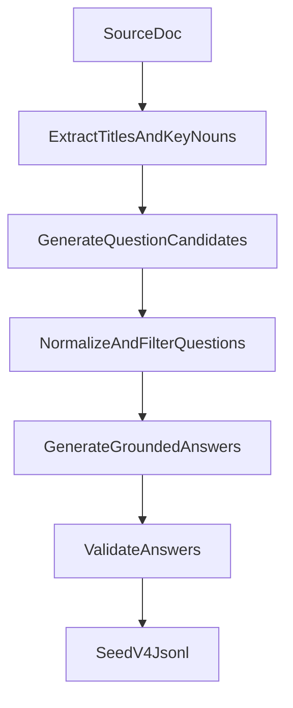

# v4 Dataset Design

## 목표

`v4` 데이터셋 생성은 `scripts/gen_dataset_v4`와 `llm_datasets/seed_v4`를 대상으로 한다.  
이번 설계의 목적은 `v2`의 단순함과 `v3`의 과잉 일반화를 피하면서, `1~2단원` 범위에서 문서 근거형 질문/답변 데이터를 자동 생성하는 것이다.

핵심 목표는 다음과 같다.

- 사용자가 키워드를 수작업으로 넣지 않는다.
- 문서 구조와 핵심 명사를 바탕으로 질문을 생성한다.
- 답변은 업로드된 문서 근거 안에서만 생성한다.
- 최종 결과는 학습 가능한 `messages + meta` JSONL 구조로 저장한다.

## 범위

- 대상 문서 범위: `1~2단원`
- 대상 위치:
  - 생성 스크립트: `scripts/gen_dataset_v4`
  - 출력 데이터셋: `llm_datasets/seed_v4`
- 비교 참고:
  - `v3`는 현재 설계 범위에서 제외한다.
  - 다만 추후 `v2/v3/v4` 품질 비교는 가능하도록 메타데이터를 남긴다.

## 설계 요약

`v4`는 질문 생성과 답변 생성을 분리한 2단계 파이프라인으로 설계한다.

1. 문서에서 `단원 제목 + 절/소절 제목 + 핵심 명사`를 추출한다.
2. 이 재료를 바탕으로 ai-api가 질문 후보를 생성한다.
3. 질문 후보를 정규화하고 품질 규칙으로 필터링한다.
4. 업로드한 문서를 근거로 ai-api가 답변을 생성한다.
5. 답변 품질 검증을 거친 뒤 `messages + meta` JSONL로 저장한다.

## 접근안 검토

### 접근안 A. 단순 직결형

- 제목/명사 재료를 바로 넣고 질문/답변을 한 번에 생성
- 장점: 구현이 단순하다.
- 단점: 질문 품질과 답변 품질을 분리해 통제하기 어렵다.

### 접근안 B. 질문-답변 분리형

- 1단계에서 질문 후보를 생성
- 2단계에서 문서 근거 답변 생성
- 장점: 질문과 답변을 각각 통제할 수 있다.
- 장점: 중복 제거, 질문 정규화, 답변 품질 관리가 쉽다.
- 단점: 구현이 한 단계 더 복잡하다.

### 접근안 C. 질문-답변-검증 확장형

- 질문 생성
- 질문 필터링
- 답변 생성
- 답변 검증/재생성까지 자동화
- 장점: 품질이 가장 좋아질 가능성이 높다.
- 단점: 초기 구현 복잡도가 가장 크다.

## 추천안

추천안은 `접근안 B`를 기본으로 하고, 답변 검증 규칙 일부를 붙인 `B+` 형태로 시작하는 것이다.

이유는 다음과 같다.

- `v2`는 질문과 답변 품질 통제가 약했다.
- `v3`는 답변이 과하게 장황하고 일반론이 섞일 위험이 보였다.
- `v4`는 질문 품질과 답변 품질을 분리해서 관리해야 한다.
- 다만 처음부터 전체 자동 재생성 루프까지 넣으면 구현 부담이 커진다.

즉, `질문 생성 분리 + 기본 검증`이 현재 단계에서 가장 균형이 좋다.

## 입력 재료 설계

질문 생성 재료는 사용자가 직접 넣는 키워드가 아니라 문서에서 추출된 정보로 제한한다.

- 단원 제목
- 절/소절 제목
- 본문 핵심 명사

질문 생성에 사용할 재료 범위는 `단원 제목 + 절/소절 제목 + 핵심 명사`로 고정한다.

예시:

- 단원 제목: `유형분류 기준`
- 절 제목: `유형생성의 기본원칙`
- 핵심 명사: `충분성`, `비교성`, `지속성`

## 데이터 흐름



## 질문 생성 규칙

질문은 짧고 단일 쟁점 중심으로 만든다.

### 기본 원칙

- 질문은 문서 범위 안에 있어야 한다.
- 질문 하나에는 핵심 쟁점 하나만 담는다.
- 질문 길이는 짧게 유지한다.
- 일반 금융상식 확장 질문은 금지한다.
- 질문 표현은 자연스럽되, 답변 범위를 문서 안으로 묶어야 한다.

### 허용 질문 유형

- 정의형: `X는 무엇인가요?`
- 기준형: `X는 어떤 기준으로 판단하나요?`
- 비교형: `X와 Y의 차이는 무엇인가요?`
- 적용형: `어떤 경우에 X를 적용하나요?`

### 금지 규칙

- 질문 하나에 핵심 명사를 과도하게 많이 넣지 않는다.
- 제목을 그대로 복사한 문장만으로 끝내지 않는다.
- 문서에 없는 배경지식, 투자조언, 일반론을 묻지 않는다.
- 지나치게 복합적인 질문은 제거한다.

## 답변 생성 규칙

답변은 업로드한 문서 근거 안에서만 생성한다.

### 기본 원칙

- 문서에 없는 기준/수치/예외를 만들지 않는다.
- 일반 금융 상식으로 확장하지 않는다.
- 출처/원문/장/절을 직접 언급하지 않는다.
- 길이는 짧고 구조적으로 유지한다.

### 권장 답변 형식

- 2~5개 불릿
- 또는 2~4문장
- 질문 유형에 따라 일정한 구조 유지

### 금지 패턴

- `문서에 따르면`, `원문에 따르면`, `자료에 따르면`
- `일반적으로는`, `보통은`, `실무상`
- 질문과 무관한 장황한 배경 설명
- 투자 조언성 표현

## 검증 및 실패 방지 규칙

### 질문 검증

다음 질문은 제거한다.

- 제목 복붙 수준 질문
- 지나치게 긴 질문
- 범위 밖 질문
- 일반론/투자조언 질문
- 의미 중복 질문

### 답변 검증

다음 답변은 재생성 또는 폐기한다.

- 문서 바깥 내용 추가
- 출처/원문/절 직접 언급
- 질문과 무관한 장황한 설명
- 문장 깨짐 또는 이상 토큰
- 답변 길이 과다

### 샘플 검토

- 단원별 생성 후 5~10개를 수동 점검한다.
- 문제 비율이 높으면 해당 배치를 재생성한다.
- 문제 비율이 낮으면 다음 배치로 진행한다.

## 출력 스키마

출력은 JSONL 한 줄당 한 QA 레코드로 저장한다.

```json
{
  "id": "zeroin.seed_v4_0001",
  "messages": [
    { "role": "system", "content": "..." },
    { "role": "user", "content": "..." },
    { "role": "assistant", "content": "..." }
  ],
  "meta": {
    "dataset_version": "v4",
    "chapter": "1. 유형분류 기준",
    "section": "1.1 유형분류 개요",
    "source_file": "Zeroin 펀드평가 방법론 - only_text.md",
    "generation_mode": "title_heading_noun_to_grounded_qa",
    "qa_type": "definition"
  }
}
```

### 권장 메타 필드

- `dataset_version`
- `chapter`
- `section`
- `source_file`
- `generation_mode`
- `qa_type`
- `seed_title`
- `seed_nouns`
- `question_template`
- `review_status`

## 출력 파일 구조

초기에는 단원별 파일 분리를 기본으로 한다.

- `llm_datasets/seed_v4/seed_v4_ch01.jsonl`
- `llm_datasets/seed_v4/seed_v4_ch02.jsonl`

이 구조를 쓰면 특정 단원만 재생성하거나 품질 비교를 하기가 쉽다.

## 오류 처리

- 문서 업로드 실패 시 해당 배치를 중단하고 오류 로그를 남긴다.
- 질문 생성 실패 시 원본 재료와 함께 실패 로그를 남긴다.
- 답변 생성 실패 시 재시도 횟수를 제한한다.
- 검증 실패가 반복되는 재료는 `manual_review` 대상으로 분리한다.

## 성공 기준

`v4`가 성공이라고 판단하려면 최소한 아래 조건을 만족해야 한다.

- 질문이 문서 범위 안에 있다.
- 답변이 문서 근거형이다.
- 답변이 `v3`보다 짧고 덜 일반론적이다.
- 중복 질문 비율이 낮다.
- 수동 샘플 검토에서 문서 밖 환각 비율이 낮다.

## 테스트 방안

- 단원별 샘플 5~10개 수동 검토
- 질문 유형별 분포 확인
- 출처 언급 금지 패턴 검사
- 장황한 답변 비율 점검
- `v2/v3/v4` 간 샘플 비교 검토

## 다음 단계

이 설계가 승인되면 다음 구현 계획의 범위는 아래로 제한한다.

- `scripts/gen_dataset_v4` 생성 파이프라인 구현
- `llm_datasets/seed_v4` 출력 구조 확정
- 질문 생성 프롬프트와 답변 생성 프롬프트 분리
- 기본 검증 규칙 적용

이번 설계 문서는 구현 전 기준 문서로 사용한다.
