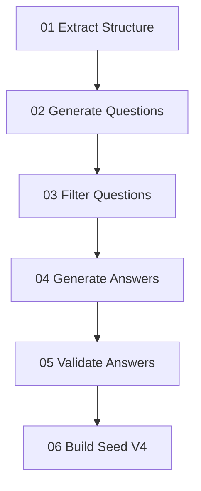

# v4 Dataset Implementation Plan

## 목적

`v4` 데이터셋 생성 파이프라인을 구현한다.

대상 경로:

- 구현 스크립트: `scripts/gen_dataset_v4/`
- 출력 데이터셋: `llm_datasets/seed_v4/`

설계 기준 문서:

- `docs/plans/2026-03-18-v4-dataset-design.md`

## 구현 범위

이번 구현 계획은 아래 범위로 제한한다.

1. 문서에서 `단원 제목 + 절/소절 제목 + 핵심 명사`를 추출하는 전처리
2. 질문 후보 생성
3. 질문 정규화 및 필터링
4. 답변 생성
5. 답변 검증
6. `messages + meta` JSONL 저장

이번 단계에서 제외:

- 자동 재생성 루프의 완전 자동화
- `v3` 데이터와의 자동 비교 리포트
- 학습/서빙 코드 직접 실행

## 참고 구현

기존 구현 참고 파일:

- `scripts/gen_dataset_v3/02_gen_questions.py`
- `scripts/gen_dataset_v3/03_gen_answers.py`

`v4`는 이 구조를 참고하되, 질문 생성 입력 재료와 검증 단계를 강화한다.

## 디렉터리 구조안

```text
scripts/gen_dataset_v4/
  01_extract_structure.py
  02_gen_questions.py
  03_filter_questions.py
  04_gen_answers.py
  05_validate_answers.py
  06_build_seed_v4.py
  state/

llm_datasets/seed_v4/
  seed_v4_ch01.jsonl
  seed_v4_ch02.jsonl
```

## 단계별 구현 계획

### 1. 구조 추출기

파일:

- `scripts/gen_dataset_v4/01_extract_structure.py`

역할:

- 대상 문서에서 `##`, `###`, `####` 구조를 읽는다.
- 단원 제목, 절/소절 제목을 추출한다.
- 각 섹션 본문에서 질문 재료가 될 핵심 명사 후보를 추출한다.
- 결과를 `state/structure.jsonl` 또는 `state/structure.json`으로 저장한다.

출력 필드 예시:

- `chapter`
- `section`
- `subsection`
- `seed_title`
- `seed_nouns`
- `section_content`

### 2. 질문 생성기

파일:

- `scripts/gen_dataset_v4/02_gen_questions.py`

역할:

- 구조 추출 결과를 입력으로 받는다.
- `단원 제목 + 절/소절 제목 + 핵심 명사`를 프롬프트 재료로 사용한다.
- ai-api로 자연스러운 질문 후보를 생성한다.
- 결과를 `state/questions_raw.jsonl`에 저장한다.

질문 생성 규칙:

- 질문은 짧고 단일 쟁점 중심
- 문서 바깥 질문 금지
- 일반론/투자조언 금지

### 3. 질문 필터기

파일:

- `scripts/gen_dataset_v4/03_filter_questions.py`

역할:

- 생성된 질문 후보를 정규화한다.
- 중복, 장황함, 범위 밖 질문을 제거한다.
- 질문 유형을 간단히 태깅한다.
- 결과를 `state/questions_filtered.jsonl`에 저장한다.

검사 항목:

- 질문 길이
- 중복 여부
- 복합 질문 여부
- 제목 복붙 여부

### 4. 답변 생성기

파일:

- `scripts/gen_dataset_v4/04_gen_answers.py`

역할:

- 필터링된 질문을 입력으로 받는다.
- 업로드 문서를 근거로 답변을 생성한다.
- 질문 생성 프롬프트와 별도 시스템/사용자 프롬프트를 사용한다.
- 결과를 `state/answers_raw.jsonl`에 저장한다.

답변 규칙:

- 문서 밖 정보 생성 금지
- 출처/원문/절 직접 언급 금지
- 짧고 구조적 답변

### 5. 답변 검증기

파일:

- `scripts/gen_dataset_v4/05_validate_answers.py`

역할:

- 생성된 답변을 품질 규칙으로 검증한다.
- 실패 항목을 기록한다.
- 통과/재생성 필요/폐기 대상을 구분한다.
- 결과를 `state/answers_validated.jsonl`과 `state/validation_report.json`으로 저장한다.

검사 항목:

- 금지 문구 포함 여부
- 길이 과다 여부
- 문장 깨짐/이상 토큰
- 질문-답변 직접 관련성

### 6. 최종 seed 빌더

파일:

- `scripts/gen_dataset_v4/06_build_seed_v4.py`

역할:

- 검증 통과 레코드를 canonical `messages + meta` 구조로 조립한다.
- 단원별 JSONL 파일로 출력한다.

출력 파일:

- `llm_datasets/seed_v4/seed_v4_ch01.jsonl`
- `llm_datasets/seed_v4/seed_v4_ch02.jsonl`

## 메타데이터 구현 계획

최종 `meta`에 최소 포함:

- `dataset_version`
- `chapter`
- `section`
- `source_file`
- `generation_mode`
- `qa_type`
- `seed_title`
- `seed_nouns`
- `review_status`

## 실행 흐름



## 우선 구현 순서

1. `01_extract_structure.py`
2. `02_gen_questions.py`
3. `03_filter_questions.py`
4. `04_gen_answers.py`
5. `06_build_seed_v4.py`
6. `05_validate_answers.py`

이 순서로 가면 가장 빨리 end-to-end 샘플을 확인할 수 있다.

## 테스트 계획

초기 테스트는 작은 범위로 제한한다.

- 1단원 일부 섹션만 입력
- 질문 후보 5~10개 생성
- 답변 5개 내외 생성
- 최종 JSONL 샘플 확인

검증 포인트:

- 질문이 자연스러운가
- 답변이 문서 근거형인가
- `v3`보다 덜 장황한가
- 메타데이터가 추적 가능하게 저장되는가

## 리스크

### 리스크 1. 질문이 너무 일반적이거나 중복됨

대응:

- 질문 필터 단계 강화
- 질문 생성 프롬프트에 단일 쟁점 규칙 명시

### 리스크 2. 답변이 `v3`처럼 길고 일반론적으로 흐름

대응:

- 답변 길이 제한
- 금지 문구 검사
- 질문 유형별 답변 형식 제한

### 리스크 3. 핵심 명사 추출 품질이 낮음

대응:

- 초기에는 단순 규칙 기반 + 보수적 필터 사용
- 필요 시 추출 규칙만 별도 개선

## 성공 기준

구현 성공 기준:

- `scripts/gen_dataset_v4`의 단계별 스크립트가 분리되어 동작한다.
- 1~2단원 기준으로 `llm_datasets/seed_v4`에 단원별 JSONL이 생성된다.
- 샘플 검토 시 질문과 답변이 문서 근거형으로 유지된다.
- `v3`보다 불필요한 일반론과 장황함이 줄어든다.

## 다음 단계

이 구현 계획에 따라 실제 코드 작업을 시작한다.
