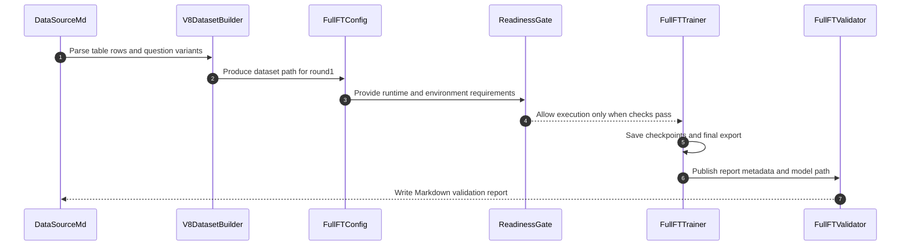

# V8 Full Fine-Tuning Implementation Plan

> **For agentic workers:** REQUIRED SUB-SKILL: Use superpowers:subagent-driven-development (recommended) or superpowers:executing-plans to implement this plan task-by-task. Steps use checkbox (`- [ ]`) syntax for tracking.

**Goal:** `scripts/data_source.md`를 기준으로 `v8 round1`용 `gpt-oss-20b` full fine-tuning 경로를 만들고, dataset 생성부터 readiness gate, 학습, 저장, 검증 리포트까지 새로운 파이프라인으로 분리한다.

**Architecture:** 기존 `v7`의 Markdown 표 기반 dataset 생성 패턴은 유지하되, `LoRA/adapter` 전제를 전부 제거한 `full_ft` 전용 builder, config, training runner, validation runner를 추가한다. 학습 실행은 `H200 x3` 환경을 전제로 하되, 실제 시작 전에 hardware/package readiness gate를 통과해야만 진행되도록 설계한다.

**Tech Stack:** Python, JSONL, Markdown table parsing, `transformers`, `torch`, `deepspeed`, pytest

**Date:** 2026-04-02

**Background:** `v7`에서는 LoRA 기반 학습을 여러 차례 진행했지만 원하는 수준의 결과가 충분히 나오지 않았다. 그래서 `v8`에서는 `gpt-oss-20b` 전체 가중치를 업데이트하는 full fine-tuning 경로를 새로 만들고, `scripts/data_source.md`를 기준 데이터 소스로 사용해 동일한 질문 변형 확장 패턴을 유지하면서 더 강한 학습 실험을 진행한다.

---

## Execution Flow


1. `scripts/data_source.md`에서 표 행과 `<br>` 질문 변형을 읽는다.
2. builder가 `seed_v8_round1_full_ft.jsonl`을 생성하고 config가 그 경로를 참조한다.
3. readiness gate가 GPU, VRAM, 디스크, `bf16`, 패키지 스택을 확인한다.
4. gate를 통과한 경우에만 trainer가 checkpoint와 `final-export/`를 저장한다.
5. validator가 저장된 모델이나 checkpoint를 다시 로드해 Markdown 리포트를 만든다.

### Task 1: `v8` full fine-tuning 계약 테스트 추가

**Files:**
- Create: `/home/work/dev_data/fine-tuning/.worktrees/feature-gen-dataset-v8/tests/test_v8_full_ft_training.py`
- Test: `/home/work/dev_data/fine-tuning/.worktrees/feature-gen-dataset-v8/tests/test_v8_full_ft_training.py`

- [ ] **Step 1: Write the failing test**

Add contract tests for:
- dataset output path naming under `llm_datasets/seed_v8/`
- full model output path naming under `llm_model_full/`
- config required keys and validation rules
- validation input contract using `model_path` or `checkpoint_path`, never `adapter_path`

- [ ] **Step 2: Run test to verify it fails**

Run: `pytest /home/work/dev_data/fine-tuning/.worktrees/feature-gen-dataset-v8/tests/test_v8_full_ft_training.py -q`
Expected: FAIL because the `v8` full fine-tuning files do not exist yet.

- [ ] **Step 3: Write minimal implementation scaffolding**

Create the minimum files and helper constants needed so the contract tests can import expected paths and config shapes.

- [ ] **Step 4: Run test to verify it passes**

Run: `pytest /home/work/dev_data/fine-tuning/.worktrees/feature-gen-dataset-v8/tests/test_v8_full_ft_training.py -q`
Expected: PASS for the initial contract-only assertions.

- [ ] **Step 5: Commit**

```bash
git add tests/test_v8_full_ft_training.py
git commit -m "test: add v8 full fine-tuning contracts"
```

### Task 2: `data_source.md` 기반 `v8` dataset builder 추가

**Files:**
- Create: `/home/work/dev_data/fine-tuning/.worktrees/feature-gen-dataset-v8/scripts/build_v8_round1_full_ft_dataset.py`
- Create: `/home/work/dev_data/fine-tuning/.worktrees/feature-gen-dataset-v8/llm_datasets/seed_v8/seed_v8_round1_full_ft.jsonl`
- Modify: `/home/work/dev_data/fine-tuning/.worktrees/feature-gen-dataset-v8/tests/test_v8_full_ft_training.py`
- Test: `/home/work/dev_data/fine-tuning/.worktrees/feature-gen-dataset-v8/tests/test_v8_full_ft_training.py`

- [ ] **Step 1: Write the failing test**

Add tests that assert:
- `scripts/data_source.md` is parsed as `user | assistant`
- each table row becomes one answer group
- each `<br>` question variant becomes one JSONL record
- every record uses `system + user + assistant` message format
- the generated dataset path is exactly `llm_datasets/seed_v8/seed_v8_round1_full_ft.jsonl`

- [ ] **Step 2: Run test to verify it fails**

Run: `pytest /home/work/dev_data/fine-tuning/.worktrees/feature-gen-dataset-v8/tests/test_v8_full_ft_training.py -q`
Expected: FAIL because the builder does not exist or the generated dataset is missing.

- [ ] **Step 3: Write minimal implementation**

Implement `build_v8_round1_full_ft_dataset.py` so it:
- reads `scripts/data_source.md`
- expands `<br>` questions
- writes deterministic record ids
- includes the fixed system prompt already used in the repository
- stores metadata such as round name, group id, and training mode
- produces the exact file that `prompt_source_path` will also reuse for round1 validation prompts

- [ ] **Step 4: Run test to verify it passes**

Run: `pytest /home/work/dev_data/fine-tuning/.worktrees/feature-gen-dataset-v8/tests/test_v8_full_ft_training.py -q`
Expected: PASS for dataset-builder assertions.

- [ ] **Step 5: Run the builder CLI directly**

Run: `python /home/work/dev_data/fine-tuning/.worktrees/feature-gen-dataset-v8/scripts/build_v8_round1_full_ft_dataset.py`
Expected: `llm_datasets/seed_v8/seed_v8_round1_full_ft.jsonl` is created or refreshed without errors.

- [ ] **Step 6: Commit**

```bash
git add scripts/build_v8_round1_full_ft_dataset.py llm_datasets/seed_v8/seed_v8_round1_full_ft.jsonl tests/test_v8_full_ft_training.py
git commit -m "feat: add v8 round1 full-ft dataset builder"
```

### Task 3: DeepSpeed 설정과 `v8 round1` config 추가

**Files:**
- Create: `/home/work/dev_data/fine-tuning/.worktrees/feature-gen-dataset-v8/configs/deepspeed/gpt_oss_20b_zero3_bf16.json`
- Create: `/home/work/dev_data/fine-tuning/.worktrees/feature-gen-dataset-v8/configs/gpt_oss_20b_seed_v8_round1_full_ft.json`
- Modify: `/home/work/dev_data/fine-tuning/.worktrees/feature-gen-dataset-v8/tests/test_v8_full_ft_training.py`
- Test: `/home/work/dev_data/fine-tuning/.worktrees/feature-gen-dataset-v8/tests/test_v8_full_ft_training.py`

- [ ] **Step 1: Write the failing test**

Add tests that assert:
- required config keys exist
- `resume_mode` validation rules are enforced
- `validation_model_path` and `validation_checkpoint_path` cannot both be set
- `deepspeed_config_path` points to `configs/deepspeed/gpt_oss_20b_zero3_bf16.json`

- [ ] **Step 2: Run test to verify it fails**

Run: `pytest /home/work/dev_data/fine-tuning/.worktrees/feature-gen-dataset-v8/tests/test_v8_full_ft_training.py -q`
Expected: FAIL because the config files and validation helpers do not exist yet.

- [ ] **Step 3: Write minimal implementation**

Create:
- a conservative ZeRO-3 `bf16` DeepSpeed config for the first bring-up
- a `v8 round1` full fine-tuning config with exact dataset/output/report paths
- `prompt_source_path` pointing to `/home/work/dev_data/fine-tuning/.worktrees/feature-gen-dataset-v8/llm_datasets/seed_v8/seed_v8_round1_full_ft.jsonl`
- helper functions for config validation if the tests require importable logic

- [ ] **Step 4: Run test to verify it passes**

Run: `pytest /home/work/dev_data/fine-tuning/.worktrees/feature-gen-dataset-v8/tests/test_v8_full_ft_training.py -q`
Expected: PASS for config contract assertions.

- [ ] **Step 5: Run config sanity check via CLI import path**

Run: `python -c "import json, pathlib; p = pathlib.Path('/home/work/dev_data/fine-tuning/.worktrees/feature-gen-dataset-v8/configs/gpt_oss_20b_seed_v8_round1_full_ft.json'); cfg = json.loads(p.read_text()); print(cfg['prompt_source_path']); print(cfg['deepspeed_config_path'])"`
Expected: prints the round1 dataset path and DeepSpeed config path exactly.

- [ ] **Step 6: Commit**

```bash
git add configs/deepspeed/gpt_oss_20b_zero3_bf16.json configs/gpt_oss_20b_seed_v8_round1_full_ft.json tests/test_v8_full_ft_training.py
git commit -m "feat: add v8 full-ft configs"
```

### Task 4: readiness gate와 dry-run training runner 구현

**Files:**
- Create: `/home/work/dev_data/fine-tuning/.worktrees/feature-gen-dataset-v8/scripts/run_full_ft_gpt_oss_20b.py`
- Modify: `/home/work/dev_data/fine-tuning/.worktrees/feature-gen-dataset-v8/tests/test_v8_full_ft_training.py`
- Test: `/home/work/dev_data/fine-tuning/.worktrees/feature-gen-dataset-v8/tests/test_v8_full_ft_training.py`

- [ ] **Step 1: Write the failing test**

Add tests that assert:
- readiness gate reports GPU count, VRAM, disk, `bf16`, and package versions
- readiness gate fails fast when mocked hardware facts are below threshold
- `resume_mode` handling resolves the correct checkpoint behavior
- the runner writes a structured `train_result.json` shape even in dry-run mode

- [ ] **Step 2: Run test to verify it fails**

Run: `pytest /home/work/dev_data/fine-tuning/.worktrees/feature-gen-dataset-v8/tests/test_v8_full_ft_training.py -q`
Expected: FAIL because the training runner and gate logic do not exist yet.

- [ ] **Step 3: Write minimal implementation**

Implement `run_full_ft_gpt_oss_20b.py` with:
- config loading and validation
- dataset existence checks
- readiness gate helpers
- `--dry-run` mode
- report serialization for pass/fail outcomes
- CLI argument parsing that accepts `--config` and `--dry-run`

- [ ] **Step 4: Run test to verify it passes**

Run: `pytest /home/work/dev_data/fine-tuning/.worktrees/feature-gen-dataset-v8/tests/test_v8_full_ft_training.py -q`
Expected: PASS for gate and dry-run report assertions.

- [ ] **Step 5: Run the dry-run CLI directly**

Run: `python /home/work/dev_data/fine-tuning/.worktrees/feature-gen-dataset-v8/scripts/run_full_ft_gpt_oss_20b.py --config /home/work/dev_data/fine-tuning/.worktrees/feature-gen-dataset-v8/configs/gpt_oss_20b_seed_v8_round1_full_ft.json --dry-run`
Expected: exits cleanly with a readiness report or an explicit blocked status, and writes a structured `train_result.json` payload shape without starting full training.

- [ ] **Step 6: Commit**

```bash
git add scripts/run_full_ft_gpt_oss_20b.py tests/test_v8_full_ft_training.py
git commit -m "feat: add v8 full-ft runner and readiness gate"
```

### Task 5: 실제 full fine-tuning loop와 export 경로 구현

**Files:**
- Modify: `/home/work/dev_data/fine-tuning/.worktrees/feature-gen-dataset-v8/scripts/run_full_ft_gpt_oss_20b.py`
- Modify: `/home/work/dev_data/fine-tuning/.worktrees/feature-gen-dataset-v8/tests/test_v8_full_ft_training.py`
- Test: `/home/work/dev_data/fine-tuning/.worktrees/feature-gen-dataset-v8/tests/test_v8_full_ft_training.py`

- [ ] **Step 1: Write the failing test**

Add tests that assert:
- non-dry-run mode resolves distributed init path
- checkpoint output path follows `checkpoint-*`
- `final-export/` path is produced on successful completion
- `train_result.json` distinguishes `success`, `failed`, and `validation_failed`

- [ ] **Step 2: Run test to verify it fails**

Run: `pytest /home/work/dev_data/fine-tuning/.worktrees/feature-gen-dataset-v8/tests/test_v8_full_ft_training.py -q`
Expected: FAIL because the real training path and artifact handling are not implemented yet.

- [ ] **Step 3: Write minimal implementation**

Extend `run_full_ft_gpt_oss_20b.py` so non-dry-run mode performs:
- distributed initialization
- base model and tokenizer load
- dataset load
- training loop wiring
- checkpoint save
- `final-export/` save
- success/failure status recording into `train_result.json`

- [ ] **Step 4: Run test to verify it passes**

Run: `pytest /home/work/dev_data/fine-tuning/.worktrees/feature-gen-dataset-v8/tests/test_v8_full_ft_training.py -q`
Expected: PASS for artifact-contract assertions using mocked or lightweight paths.

- [ ] **Step 5: Run the non-dry-run CLI in a guarded smoke mode**

Run: `python /home/work/dev_data/fine-tuning/.worktrees/feature-gen-dataset-v8/scripts/run_full_ft_gpt_oss_20b.py --config /home/work/dev_data/fine-tuning/.worktrees/feature-gen-dataset-v8/configs/gpt_oss_20b_seed_v8_round1_full_ft.json`
Expected: either starts the real run after passing readiness checks, or exits early with an explicit blocking reason before model load on unsupported environments.

- [ ] **Step 6: Commit**

```bash
git add scripts/run_full_ft_gpt_oss_20b.py tests/test_v8_full_ft_training.py
git commit -m "feat: implement v8 full-ft training flow"
```

### Task 6: full-model validation 스크립트와 Markdown 리포트 구현

**Files:**
- Create: `/home/work/dev_data/fine-tuning/.worktrees/feature-gen-dataset-v8/scripts/check_gpt_oss_full_ft_output.py`
- Modify: `/home/work/dev_data/fine-tuning/.worktrees/feature-gen-dataset-v8/tests/test_v8_full_ft_training.py`
- Test: `/home/work/dev_data/fine-tuning/.worktrees/feature-gen-dataset-v8/tests/test_v8_full_ft_training.py`

- [ ] **Step 1: Write the failing test**

Add tests that assert:
- validator accepts `--model-path` or `--checkpoint-path`
- prompt loading uses `prompt_source_path`
- Markdown report includes run status, resolved model path, generation settings, prompt text, and generated final answer
- empty generations cause a non-zero failure result

- [ ] **Step 2: Run test to verify it fails**

Run: `pytest /home/work/dev_data/fine-tuning/.worktrees/feature-gen-dataset-v8/tests/test_v8_full_ft_training.py -q`
Expected: FAIL because the validation script and report rendering helpers do not exist yet.

- [ ] **Step 3: Write minimal implementation**

Implement `check_gpt_oss_full_ft_output.py` with:
- path resolution priority
- deterministic generation defaults
- Markdown rendering
- explicit failure on load or generation errors
- `prompt_source_path` reuse from `llm_datasets/seed_v8/seed_v8_round1_full_ft.jsonl` unless an explicit override is given later

- [ ] **Step 4: Run test to verify it passes**

Run: `pytest /home/work/dev_data/fine-tuning/.worktrees/feature-gen-dataset-v8/tests/test_v8_full_ft_training.py -q`
Expected: PASS for validator contract assertions.

- [ ] **Step 5: Run the validator CLI directly**

Run: `python /home/work/dev_data/fine-tuning/.worktrees/feature-gen-dataset-v8/scripts/check_gpt_oss_full_ft_output.py --config /home/work/dev_data/fine-tuning/.worktrees/feature-gen-dataset-v8/configs/gpt_oss_20b_seed_v8_round1_full_ft.json`
Expected: resolves `final-export/` or an explicit checkpoint path, then writes a Markdown report or exits non-zero with a clear reason.

- [ ] **Step 6: Commit**

```bash
git add scripts/check_gpt_oss_full_ft_output.py tests/test_v8_full_ft_training.py
git commit -m "feat: add v8 full-ft validation report"
```

### Task 7: `v8` 학습 문서와 운영 문구 업데이트

**Files:**
- Modify: `/home/work/dev_data/fine-tuning/.worktrees/feature-gen-dataset-v8/docs/v7_single_qa_training.md`
- Modify: `/home/work/dev_data/fine-tuning/.worktrees/feature-gen-dataset-v8/docs/v8_preparation.md`
- Modify: `/home/work/dev_data/fine-tuning/.worktrees/feature-gen-dataset-v8/docs/context-log.md`

- [ ] **Step 1: Write the failing documentation expectation test or checklist**

Define the minimum doc updates:
- mention `full_ft` path
- mention `scripts/data_source.md` as round1 source
- mention `llm_model_full/` output family
- mention readiness gate and validation flow

- [ ] **Step 2: Run the smallest verification**

Run: `pytest /home/work/dev_data/fine-tuning/.worktrees/feature-gen-dataset-v8/tests/test_v8_full_ft_training.py -q`
Expected: Existing tests stay green after doc-adjacent code changes.

- [ ] **Step 3: Write minimal implementation**

Update docs so operators understand:
- how `v8` differs from `v7`
- where generated dataset and outputs live
- how to run dry-run and real training
- how to run post-training validation

- [ ] **Step 4: Re-run verification**

Run: `pytest /home/work/dev_data/fine-tuning/.worktrees/feature-gen-dataset-v8/tests/test_v8_full_ft_training.py -q`
Expected: PASS

- [ ] **Step 5: Commit**

```bash
git add docs/v7_single_qa_training.md docs/v8_preparation.md docs/context-log.md
git commit -m "docs: describe v8 full fine-tuning workflow"
```

### Task 8: 실제 실행 전 운영 점검과 수동 검증 절차 정리

**Files:**
- Modify: `/home/work/dev_data/fine-tuning/.worktrees/feature-gen-dataset-v8/docs/v8_preparation.md`
- Test: `/home/work/dev_data/fine-tuning/.worktrees/feature-gen-dataset-v8/tests/test_v8_full_ft_training.py`

- [ ] **Step 1: Add operator checklist**

Document the exact preflight sequence:
- build dataset
- run config validation
- run `--dry-run`
- inspect readiness report
- start real full fine-tuning only if gate passes

- [ ] **Step 2: Add exact commands**

Document commands such as:
- `python scripts/build_v8_round1_full_ft_dataset.py`
- `python scripts/run_full_ft_gpt_oss_20b.py --config configs/gpt_oss_20b_seed_v8_round1_full_ft.json --dry-run`
- `python scripts/run_full_ft_gpt_oss_20b.py --config configs/gpt_oss_20b_seed_v8_round1_full_ft.json`
- `python scripts/check_gpt_oss_full_ft_output.py --config configs/gpt_oss_20b_seed_v8_round1_full_ft.json`

- [ ] **Step 3: Re-run verification**

Run: `pytest /home/work/dev_data/fine-tuning/.worktrees/feature-gen-dataset-v8/tests/test_v8_full_ft_training.py -q`
Expected: PASS

- [ ] **Step 4: Commit**

```bash
git add docs/v8_preparation.md
git commit -m "docs: add v8 full-ft operator checklist"
```

### Task 9: 최소 end-to-end 검증

**Files:**
- Test: `/home/work/dev_data/fine-tuning/.worktrees/feature-gen-dataset-v8/tests/test_v8_full_ft_training.py`
- Output: `/home/work/dev_data/fine-tuning/.worktrees/feature-gen-dataset-v8/llm_datasets/seed_v8/seed_v8_round1_full_ft.jsonl`
- Output: `/home/work/dev_data/fine-tuning/.worktrees/feature-gen-dataset-v8/llm_model_full/gpt-oss-20b-seed-v8-round1-full-ft/train_result.json`

- [ ] **Step 1: Run contract tests**

Run: `pytest /home/work/dev_data/fine-tuning/.worktrees/feature-gen-dataset-v8/tests/test_v8_full_ft_training.py -q`
Expected: PASS

- [ ] **Step 2: Run dataset build**

Run: `python /home/work/dev_data/fine-tuning/.worktrees/feature-gen-dataset-v8/scripts/build_v8_round1_full_ft_dataset.py`
Expected: dataset file is written successfully.

- [ ] **Step 3: Run training dry-run**

Run: `python /home/work/dev_data/fine-tuning/.worktrees/feature-gen-dataset-v8/scripts/run_full_ft_gpt_oss_20b.py --config /home/work/dev_data/fine-tuning/.worktrees/feature-gen-dataset-v8/configs/gpt_oss_20b_seed_v8_round1_full_ft.json --dry-run`
Expected: readiness and report path wiring succeed.

- [ ] **Step 4: Run validator path resolution**

Run: `python /home/work/dev_data/fine-tuning/.worktrees/feature-gen-dataset-v8/scripts/check_gpt_oss_full_ft_output.py --config /home/work/dev_data/fine-tuning/.worktrees/feature-gen-dataset-v8/configs/gpt_oss_20b_seed_v8_round1_full_ft.json`
Expected: path resolution and error messaging are explicit even if no trained export exists yet.

- [ ] **Step 5: Summarize remaining run-time risks**

Report:
- whether readiness gate blocks or allows the real run
- whether export and validation paths are wired correctly
- what still depends on actual `H200 x3` execution
