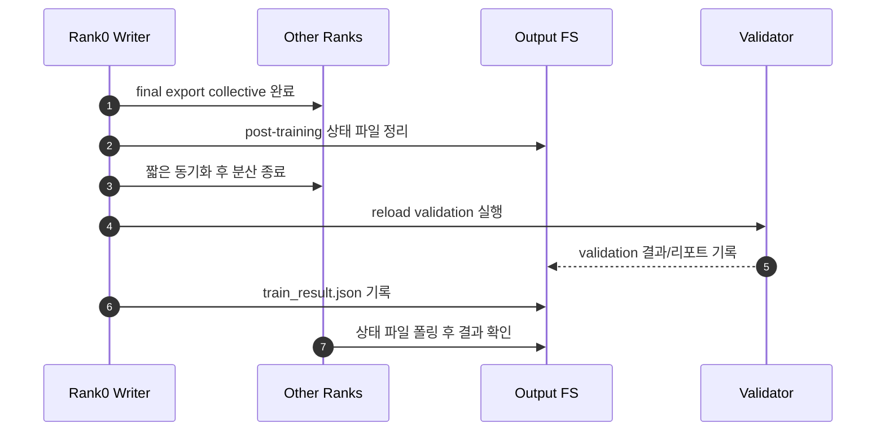

# v8 Post-Training Writer Phase Fix Plan

문서 작성일: 2026-04-09

계획 원인/배경: `round2` 실학습은 `final-export`까지 성공했지만, `reload validation`과 `train result report`가 writer-only barrier 구조에 묶여 `NCCL collective timeout`으로 실패 처리되었다. 따라서 후처리 단계를 분산 학습 종료 뒤의 writer phase로 분리해야 한다.

> **For agentic workers:** REQUIRED SUB-SKILL: Use superpowers:subagent-driven-development (recommended) or superpowers:executing-plans to implement this plan task-by-task. Steps use checkbox (`- [ ]`) syntax for tracking.

**Goal:** `final-export` 이후 validation/report를 NCCL 없는 후처리 단계로 분리해 종료부 timeout을 없앤다.

**Architecture:** `final export`는 collective로 유지하고, 그 직후 stale 상태 파일 정리와 분산 종료를 수행한다. 이후 `reload validation`과 `train result report`는 writer가 상태 파일을 쓰고 non-writer는 파일만 기다리는 local writer phase로 처리한다.

**Tech Stack:** Python, torch distributed, pytest, JSON status files

---


1. final export 완료: 모든 rank가 export collective를 정상 마친다.
2. 상태 파일 정리: writer가 이전 validation/report 상태 파일을 제거한다.
3. 분산 종료: validation 전에 NCCL process group을 닫는다.
4. reload validation: writer만 모델 재로딩 검증을 수행한다.
5. 결과 기록: writer가 최종 report를 남긴다.
6. non-writer 확인: 다른 rank는 파일 결과만 확인하고 종료한다.

### Task 1: 테스트로 종료 순서 고정

**Files:**
- Modify: `tests/test_v8_full_ft_training.py`

- [ ] **Step 1: Write the failing test**

```python
assert ("finalize_distributed", "0|1|True") in runtime.calls
assert runtime.calls.index(("finalize_distributed", "0|1|True")) < runtime.calls.index(
    ("validate_outputs", "checkpoint-10|final-export")
)
```

- [ ] **Step 2: Run test to verify it fails**

Run: `pytest tests/test_v8_full_ft_training.py -k "non_dry_run_wires_runtime_and_writes_success_report" -v`
Expected: FAIL because `finalize_distributed` still happens after validation.

- [ ] **Step 3: Write minimal implementation**

```python
finalize = getattr(runtime, "finalize_distributed", None)
if callable(finalize):
    finalize(distributed_info)
mark_distributed_finalized(distributed_info)
```

- [ ] **Step 4: Run test to verify it passes**

Run: `pytest tests/test_v8_full_ft_training.py -k "non_dry_run_wires_runtime_and_writes_success_report" -v`
Expected: PASS

### Task 2: NCCL 없는 post-training writer phase 추가

**Files:**
- Modify: `scripts/run_full_ft_gpt_oss_20b.py`
- Modify: `tests/test_v8_full_ft_training.py`

- [ ] **Step 1: Write the failing test**

```python
runner.coordinated_post_training_writer_phase = fake_coordinated_post_training_writer_phase
assert post_training_writer_phases == [
    ("reload validation", 1),
    ("train result report", 1),
]
```

- [ ] **Step 2: Run test to verify it fails**

Run: `pytest tests/test_v8_full_ft_training.py -k "non_writer_rank_participates_in_final_export_collective_then_waits_on_post_training_writer_phase" -v`
Expected: FAIL because the runner still calls the old writer phase.

- [ ] **Step 3: Write minimal implementation**

```python
def coordinated_post_training_writer_phase(...):
    if should_write_side_effects(distributed_info):
        action()
        write_json(status_path, {"status": "ok"})
    else:
        while not status_path.exists():
            time.sleep(1.0)
```

- [ ] **Step 4: Run test to verify it passes**

Run: `pytest tests/test_v8_full_ft_training.py -k "non_writer_rank_participates_in_final_export_collective_then_waits_on_post_training_writer_phase" -v`
Expected: PASS

### Task 3: 회귀 검증과 품질 평가

**Files:**
- Modify: `docs/context-log.md`
- Create: `tests/log/v8_round2_full_ft_final_export_quality_evaluation.md`

- [ ] **Step 1: Run regression checks**

Run: `python -m py_compile scripts/run_full_ft_gpt_oss_20b.py tests/test_v8_full_ft_training.py`
Expected: no output, exit code 0

- [ ] **Step 2: Reuse current final-export for quality review**

Run: `python scripts/check_gpt_oss_full_ft_output.py --config configs/gpt_oss_20b_seed_v8_round2_full_ft_resume1.json --model-path llm_model_full/gpt-oss-20b-seed-v8-round2-full-ft/final-export --report-path tests/log/v8_round2_full_ft_final_export_report.md`
Expected: `validation status: success`

- [ ] **Step 3: Record evaluation**

```markdown
- final-export 재로딩 성공
- 512 토큰 기준 답변 잘림 없음
- final 채널 추출 정상
- paraphrase prompt 간 답변 골격은 매우 유사
```
