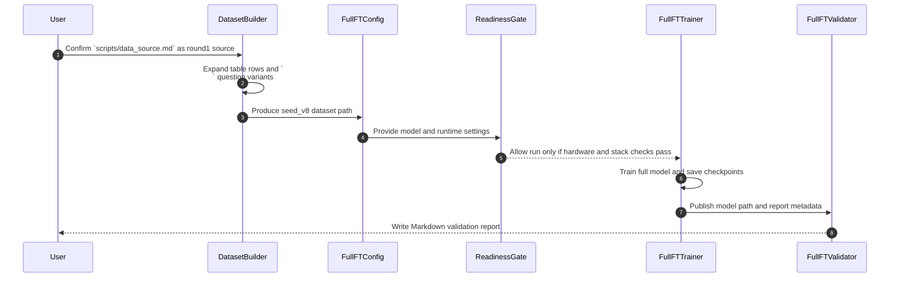

# V8 Full Fine-Tuning Design

**Date:** 2026-04-02

**Background:** `feature-gen-dataset-v8` starts from the cleaned `feature-gen-dataset-v7` worktree, but the motivation for `v8` is not just to continue the same LoRA cycle. In `v7`, multiple LoRA-based training rounds were run, yet the results still did not reach the desired quality level, which suggests a quality ceiling for adapter-only updates in this experiment line. Because of that, the next experiment needs a stronger training path that updates the full `gpt-oss-20b` weights rather than attaching another adapter. Before choosing this direction, the feasibility of training `gpt-oss-20b` on an `H200 x3` environment was reviewed and judged to be viable, with the expectation that a first bring-up run would use `bf16`, gradient checkpointing, and a distributed training stack rather than a naive single-device setup. That is why `v8` moves forward as a full fine-tuning track. The existing `v7` flow already covers dataset generation, config-driven training, reporting, and smoke validation, so the design should preserve that workflow shape while removing adapter-specific assumptions.

**Goal:** Build a `v8 round1` path that fine-tunes the full `gpt-oss-20b` model, keeps the existing dataset production pattern, and replaces LoRA-specific training and validation with full-model save and reload validation.

**Initial training source:** `v8 round1` uses `/home/work/dev_data/fine-tuning/.worktrees/feature-gen-dataset-v8/scripts/data_source.md` as the authoritative source document for dataset generation.

## Scope

- Keep the current `data_source -> dataset jsonl -> config -> train -> report -> validation log` workflow shape.
- Add a new full fine-tuning training path for `gpt-oss-20b`.
- Separate full fine-tuning outputs from existing `llm_model_lora/` artifacts.
- Validate trained outputs by reloading a saved full model or checkpoint and generating sample answers.
- Gate execution on hardware and package-stack readiness before the actual training run.
- Treat `scripts/data_source.md` as the canonical round1 source and derive the training dataset from it rather than hand-writing standalone JSONL first.

## Non-Goals

- Do not convert existing `v7` LoRA runs to full fine-tuning retroactively.
- Do not merge full fine-tuning outputs back into the LoRA directory structure.
- Do not redesign the domain dataset format unless `v8` data-source requirements later require it.

## Approaches Considered

### Approach 1: Add a dedicated DeepSpeed full fine-tuning path

Create a separate `full_ft` training script, config, and validation path while keeping the current dataset builder shape. Use DeepSpeed for the realistic `gpt-oss-20b` execution path and treat hardware readiness as a hard gate.

**Pros**

- Best fit for `20b` full fine-tuning.
- Keeps current repository workflow recognizable.
- Avoids mixing LoRA-only assumptions into the new path.

**Cons**

- Adds another training stack to maintain.
- Requires explicit environment and hardware checks.

### Approach 2: Extend the current `trl` smoke runner into full fine-tuning

Reuse the current `scripts/run_smoke_gpt_oss_20b.py` structure and gradually remove PEFT assumptions.

**Pros**

- Superficially smaller code change.

**Cons**

- Leaves adapter-oriented assumptions in a path that should be full-model oriented.
- Becomes harder to reason about when save/reload, distributed setup, and memory strategy diverge.

### Approach 3: Use `accelerate` or `FSDP` first and postpone DeepSpeed

Adopt a more standard PyTorch-distributed path immediately and avoid DeepSpeed-specific configs.

**Pros**

- Cleaner standard-library alignment.

**Cons**

- Higher design and stabilization cost for this repository right now.
- Lower confidence for the first `20b` full fine-tuning bring-up.

## Recommendation

Use **Approach 1**. Preserve the existing dataset and report conventions, but add a clearly separated `full_ft` training and validation path. This gives `v8` a realistic route to `gpt-oss-20b` full fine-tuning without overloading the current LoRA smoke runner.

## Architecture

`v8` should keep the current round-oriented pipeline shape while replacing the model-training layer.

1. A dataset builder reads `scripts/data_source.md` and produces `seed_v8` JSONL records using the existing message-oriented training format.
2. A new full fine-tuning config points at the `seed_v8` dataset and a dedicated `llm_model_full/` output path.
3. A dedicated training runner initializes the distributed stack, loads the base model, trains the full model, and writes full-model checkpoints and a structured `train_result.json`.
4. A new validation script reloads the trained model or a chosen checkpoint and generates sample answers into a Markdown report under `tests/log/`.
5. Hardware and package readiness are checked before training starts; if the gate fails, the run stops before expensive work begins.

## Source Data Contract

The initial `v8` training source is the Markdown table in `scripts/data_source.md`.

- Table schema: `user | assistant`
- `user` cell: multiple question variants separated by ` `
- `assistant` cell: the canonical answer text for that question group
- One table row becomes one answer group
- Each ` `-separated user question becomes one training record sharing the row's assistant answer

This keeps the source editable in Markdown while preserving the multi-question expansion pattern already used in the repository.

## Components

### `scripts/run_full_ft_gpt_oss_20b.py`

- Main training entrypoint for `v8 round1`.
- Responsible for config parsing, readiness checks, tokenizer/model loading, dataset loading, distributed initialization, training, checkpoint saving, and report writing.
- Must not depend on `peft`, `LoraConfig`, `PeftModel`, or adapter-only terminology.

### Artifact Contract

The full fine-tuning path must distinguish between **resume artifacts** and **validation artifacts**.

- Resume artifact: DeepSpeed or trainer checkpoint directories saved during training under `checkpoint-*`.
- Validation artifact: one exported Hugging Face-compatible final model directory saved under `final-export/` after training completes successfully.
- Validation script default target: `final-export/`
- Fallback validation target: an explicitly requested checkpoint path

This keeps restart mechanics and post-training reload behavior separate.

### `configs/gpt_oss_20b_seed_v8_round1_full_ft.json`

- Full fine-tuning config for the first `v8` round.
- Keeps core fields such as `model_name`, `cache_dir`, `dataset_path`, `output_dir`, and `report_path`.
- Replaces LoRA-only fields with full fine-tuning fields such as distributed backend settings, gradient checkpointing, resume options, and DeepSpeed config references.

**Required fields**

- `model_name`
- `cache_dir`
- `dataset_path`
- `output_dir`
- `report_path`
- `max_length`
- `per_device_train_batch_size`
- `gradient_accumulation_steps`
- `max_steps`
- `learning_rate`
- `logging_steps`
- `save_steps`
- `save_total_limit`
- `seed`
- `bf16`
- `gradient_checkpointing`
- `deepspeed_config_path`
- `prompt_source_path`
- `sample_prompt_count`
- `resume_mode`

**Optional fields**

- `resume_from_checkpoint`
- `warmup_steps`
- `lr_scheduler_type`
- `weight_decay`
- `save_final_export`
- `validation_model_path`
- `validation_checkpoint_path`

**Validation rules**

- `resume_mode=resume_from_path` requires `resume_from_checkpoint`.
- `validation_model_path` and `validation_checkpoint_path` are mutually exclusive.
- `save_steps` must be less than or equal to `max_steps`.
- `per_device_train_batch_size` and `gradient_accumulation_steps` must both be positive integers.
- `sample_prompt_count` must be positive.

### `configs/deepspeed/*.json`

- Isolate DeepSpeed strategy from the training run config.
- Allows future tuning of ZeRO stage, optimizer offload, and checkpoint behavior without changing the semantic `v8` round config.
- Initial naming rule: `configs/deepspeed/gpt_oss_20b_zero3_bf16.json`

### `scripts/check_gpt_oss_full_ft_output.py`

- Reloads a saved full model or target checkpoint.
- Runs sample generation against representative prompts.
- Writes a readable Markdown report under `tests/log/`.

**Validation contract**

- Input source priority:
  1. `--model-path`
  2. `--checkpoint-path`
  3. `final-export/` inferred from the round config
- Prompt source: required JSONL or JSON file referenced by `prompt_source_path`
- Sample selection: first `sample_prompt_count` prompts in deterministic order
- Generation defaults:
  - `do_sample=false`
  - `max_new_tokens=256`
  - `temperature=1.0`
  - `top_p=1.0`
- Report schema:
  - run status
  - resolved model path
  - prompt source path
  - generation settings
  - per-sample prompt and generated final answer
- Exit with non-zero status when model loading fails, prompt loading fails, or every sampled generation is empty

### `tests/test_v8_full_ft_training.py`

- Covers path conventions, config contract, validation input contract, and report expectations.
- Focuses on pipeline contracts rather than trying to run a real `20b` training job in tests.

## Data Flow

1. 사용자는 `scripts/data_source.md`를 `v8 round1`의 기준 데이터 소스로 확정한다.
2. 데이터 빌더는 Markdown 표의 각 행과 ` ` 질문 변형을 풀어 `seed_v8` JSONL 학습 입력을 만든다.
3. 설정 파일은 데이터 경로와 분산학습 설정을 묶어 readiness gate에 전달한다.
4. readiness gate를 통과한 경우에만 학습기가 전체 모델 학습을 시작한다.
5. 학습이 끝나면 저장된 모델이나 체크포인트를 검증 스크립트가 다시 로드해 리포트를 남긴다.

## Directory and Naming Rules

- Dataset path: `llm_datasets/seed_v8/seed_v8_round1_full_ft.jsonl`
- Model output path: `llm_model_full/gpt-oss-20b-seed-v8-round1-full-ft/`
- Train report path: `llm_model_full/gpt-oss-20b-seed-v8-round1-full-ft/train_result.json`
- Final export path: `llm_model_full/gpt-oss-20b-seed-v8-round1-full-ft/final-export/`
- Validation report path: `tests/log/v8_round1_full_ft_<run_id>_report.md`
- Checkpoint path pattern: `llm_model_full/gpt-oss-20b-seed-v8-round1-full-ft/checkpoint-*`

These paths intentionally keep full fine-tuning outputs out of `llm_model_lora/`.

## Error Handling

- Fail before training if `dataset_path` is missing or empty.
- Fail before training if the required DeepSpeed config or distributed settings are missing.
- Fail before training if the environment cannot support the selected `gpt-oss-20b` full fine-tuning path.
- Require explicit resume behavior if `output_dir` already contains prior checkpoints.
- Record failure state, last known checkpoint, and the most actionable reason in `train_result.json`.
- Treat reload-validation failure as a run failure even if training itself completed.

### Resume modes

- `fail`: stop if `output_dir` already contains checkpoints or exports
- `resume_latest`: auto-select the newest checkpoint under `output_dir`
- `resume_from_path`: resume only from `resume_from_checkpoint`
- `overwrite_empty_only`: allow reuse only when the directory exists but contains no checkpoints or export artifacts

CLI arguments override config only for explicit operator intervention. Otherwise, config values are the source of truth.

### Validation failure policy

- Keep checkpoints and `final-export/` on disk for inspection.
- Mark `train_result.json` as `validation_failed` rather than `success`.
- Treat artifacts as non-promotable until a later validation pass succeeds.

## Testing Strategy

### Contract tests

- Check required config fields and path conventions.
- Check that validation accepts `model_path` or `checkpoint_path`, not `adapter_path`.
- Check that report rendering produces readable Markdown output.

### Lightweight execution checks

- Add a dry-run or minimal-step path that validates config parsing, dataset loading, and startup flow without claiming a production full fine-tuning run.
- Keep repository tests lightweight and deterministic.
- Include readiness-gate unit tests that verify pass/fail decisions from mocked hardware facts and config inputs.

### Manual heavy-run validation

- Use actual `gpt-oss-20b` hardware only after readiness checks pass.
- Run post-training generation validation with representative prompts and inspect the Markdown report.

## Operational Gate

Before the first real `v8 round1` run, the workflow must confirm:

- available GPU count
- per-GPU VRAM
- usable disk space for checkpoints
- `bf16` support
- compatibility across `torch`, `transformers`, `accelerate`, and `deepspeed`

If those checks do not support `gpt-oss-20b` full fine-tuning, the run must stop and report the blocking reason instead of falling through to a likely OOM or partial run.

### Initial readiness policy

| Check | Minimum pass condition | Failure behavior |
| --- | --- | --- |
| node shape | single node with at least 2 visible GPUs | stop before model load |
| per-GPU VRAM | each visible training GPU reports at least 40 GiB | stop before model load |
| disk free space | at least 1.5 TiB free on the filesystem containing `output_dir` | stop before first checkpoint |
| precision support | `bf16` available on target GPUs | stop before model load |
| package stack | import and version check passes for `torch`, `transformers`, `accelerate`, `deepspeed` | stop before distributed init |

These are intentionally conservative first-run gates. The implementation may later relax them only after a successful `v8` full fine-tuning run establishes a lower safe baseline.

### Readiness report fields

The gate must emit:

- detected GPU count
- per-GPU VRAM summary
- filesystem free space summary
- `bf16` support result
- package versions
- final gate status
- blocking reason when failed

## Success Criteria

- `v8` has a dedicated full fine-tuning training path that does not depend on LoRA constructs.
- Full fine-tuning outputs are written under `llm_model_full/`.
- Validation reloads a saved full model or checkpoint and produces a Markdown report.
- The workflow stops early when hardware or package readiness is insufficient.
- Existing dataset-generation patterns remain reusable for `v8 round1`.
