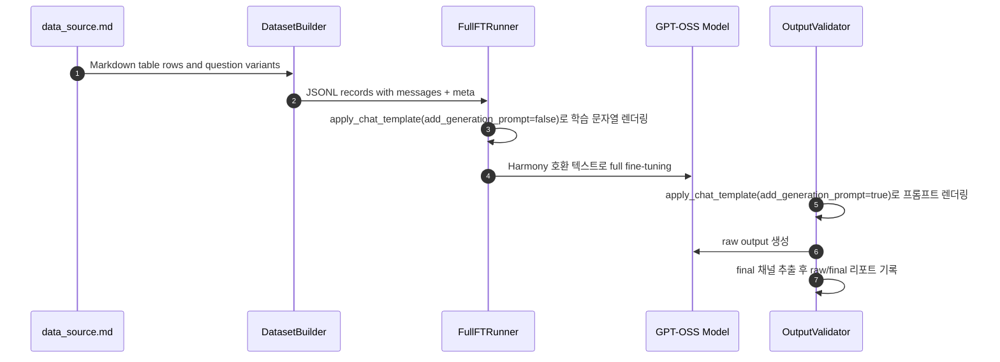

# V8 Full Fine-Tuning Harmony 재설계

**Date:** 2026-04-03

**Background:** `H200 x3`에서 수행한 첫 번째 `v8 round1` 풀 파인튜닝 실런은 학습 스택, 체크포인트 저장, 수동 `final-export` 복구까지는 끝까지 도달할 수 있음을 보여주었지만, 복구된 모델 출력에서 더 근본적인 포맷 문제가 드러났다. 생성 결과에는 사용자에게 보여줘야 할 최종 답변 대신 `analysis`, tool-call commentary, 불완전한 assistant channel marker가 섞여 나왔다. 저장소 내부 코드 점검과 외부 `gpt-oss` 가이드가 가리키는 원인은 동일하다. 현재 `full_ft` 경로는 학습 시 `role: content` 형태의 평문 문자열로 데이터를 렌더링하지만, 베이스 모델은 Harmony 스타일의 구조화된 대화 형식을 전제로 학습되었다. 검증 경로 역시 raw generation을 그대로 decode하고 있어 `final` 채널을 분리하지 못한다. `gpt-oss`는 명시적으로 Harmony 호환 프롬프트를 기대하고, raw chain-of-thought는 사용자에게 노출하면 안 되므로, 이후 라운드를 신뢰하기 전에 `v8` 풀 파인튜닝 경로는 포맷 기준 자체를 다시 설계해야 한다.

**Goal:** `v8 full_ft` 학습 및 검증 경로를 Harmony 호환 chat rendering 기준으로 다시 설계해 `gpt-oss`에 맞는 입력 형식을 사용하고, 사용자에게 보여줄 `final` 출력만 보존하며, 학습 후 검증 결과가 내부 채널이 아니라 실제 assistant 답변을 반영하도록 만든다.

## Scope

- `full_ft` 러너에서 현재 사용 중인 평문 `messages -> text` 학습 렌더링을 `gpt-oss` 호환 chat-template 렌더링으로 교체한다.
- 검증 프롬프트도 학습과 동일한 렌더링 전략에 맞춘다.
- 생성 결과에서 `final` 채널을 명시적으로 추출하고, raw/filtered 텍스트를 모두 검증 산출물에 기록한다.
- 기존 데이터 소스 계약인 `scripts/data_source.md -> messages + meta JSONL` 구조는 유지한다.
- 현재 환경에 `openai_harmony`와 `unsloth_zoo`가 없으므로, 우선 설치된 tokenizer의 chat template를 재사용한다.

## Non-Goals

- 이번 단계에서 `scripts/data_source.md`나 `seed_v8` 데이터셋 스키마 자체를 바꾸지 않는다.
- 이번 단계에서 새로운 외부 Harmony 의존성을 도입하지 않는다.
- validator 수정만으로 기존 `checkpoint-1000`이 고품질 모델이 되었다고 판단하지 않는다. 이번 재설계의 목적은 평가를 올바르게 만드는 것이다.

## Approaches Considered

### Approach 1: 현재 학습 포맷은 유지하고 validator에서만 `analysis`를 제거

생성 후 validator에서 reasoning/tool-call marker만 지우는 방식이다.

**Pros**

- 코드 변경량이 가장 작다.
- 리포트 품질은 가장 빨리 개선된다.

**Cons**

- 학습 목표 자체는 여전히 `gpt-oss`와 어긋난다.
- 실제 포맷 불일치를 고치지 않고 숨기는 방향이 될 수 있다.

### Approach 2: 학습과 검증을 모두 tokenizer chat-template 렌더링으로 전환

풀 파인튜닝 학습 문자열도 `tokenizer.apply_chat_template()`로 만들고, 검증도 같은 계열의 프롬프트 렌더링과 명시적 `final` 추출을 사용한다.

**Pros**

- 저장소 내에서 이미 동작이 검증된 `run_smoke_gpt_oss_20b.py` 패턴과 맞는다.
- 새 의존성 설치가 필요 없다.
- 학습 표면형과 평가 표면형을 함께 바로잡을 수 있다.

**Cons**

- runner, validator, test를 함께 수정해야 한다.
- standalone Harmony renderer가 아니라 설치된 tokenizer template에 의존한다.

### Approach 3: standalone Harmony renderer를 즉시 도입

`openai_harmony` 같은 renderer를 설치하고 학습/파싱 모두 그 기준으로 맞춘다.

**Pros**

- 공식 `gpt-oss` 권장 방식과 가장 가깝다.
- 장기적으로는 가장 높은 정합성을 기대할 수 있다.

**Cons**

- 민감한 학습 환경에 새 의존성과 통합 작업이 추가된다.
- 실험 복구 단계에서 리스크가 가장 크다.

## Recommendation

지금은 **Approach 2**를 채택한다. 현재 저장소와 환경에 이미 있는 도구만으로 알려진 포맷 불일치를 바로잡을 수 있고, `run_smoke_gpt_oss_20b.py`에서 이미 사용 중인 패턴을 재사용할 수 있으며, 필요하면 이후 단계에서 standalone Harmony renderer로 확장할 수 있는 여지도 남긴다.

## Architecture

이번 재설계에서도 canonical dataset 형식은 계속 `messages`를 유지하되, 렌더링이 일어나는 위치를 바꾼다.

1. 데이터셋 빌더는 계속 `scripts/data_source.md`에서 구조화된 `messages` 레코드를 생성한다.
2. `full_ft` 러너는 각 레코드를 tokenization 전에 `tokenizer.apply_chat_template(..., add_generation_prompt=False)`로 렌더링하며, 더 이상 `role: content` 평문을 만들지 않는다.
3. validator는 prompt messages를 `add_generation_prompt=True`로 렌더링하고, 필요 시 명시적인 `final` channel prefix를 붙이며, raw output과 filtered output을 모두 decode한다.
4. filtered validation answer는 `final` channel 본문만 남기고 `<|return|>` 및 이후 채널 토큰을 제거해 만든다.

## Components

### `scripts/run_full_ft_gpt_oss_20b.py`

- `render_messages_as_text()`를 chat-template 기반 렌더링 helper로 교체한다.
- 학습용 레코드는 원본 `messages` 목록을 그대로 받아 `gpt-oss` chat formatting에 맞게 렌더링한다.
- 새 렌더링 helper 때문에 꼭 필요한 경우가 아니면 나머지 tokenization과 `Trainer` wiring은 유지한다.

### `scripts/check_gpt_oss_full_ft_output.py`

- 더 이상 bare `user` 문자열만으로 프롬프트를 만들지 않는다.
- 원본 dataset record에서 정답 `assistant` 메시지만 제외하고 `system + user`를 유지한 prompt messages를 다시 구성한다.
- smoke script의 `FINAL_CHANNEL_PREFIX` 동작과 맞는 `build_prompt_text()` helper를 추가한다.
- report가 다음 둘을 구분할 수 있도록 `extract_final_text()` helper를 추가한다.
  - `raw_generation`
  - `final_answer`
- raw generation이 있어도 `final_answer`가 비어 있으면 validation 실패로 간주한다.

### `tests/test_v8_full_ft_training.py`

- `full_ft` 러너가 더 이상 `role: content` 문자열 결합을 쓰지 않고 `apply_chat_template()`를 사용한다는 회귀 테스트를 추가한다.
- validator 쪽에는 다음을 검증하는 테스트를 추가한다.
  - prompt rendering이 non-assistant messages를 유지하는가
  - `final` channel extraction이 `analysis` / `commentary`를 제거하는가
  - report가 raw output과 filtered output을 모두 기록하는가

## Data Flow

1. 데이터 소스는 계속 Markdown 표를 유지한다.
2. 데이터셋은 계속 `messages + meta` 구조로 저장한다.
3. 학습 시점에만 chat template로 Harmony 호환 텍스트를 렌더링한다.
4. 검증 시에도 같은 메시지 구조를 다시 프롬프트로 렌더링한다.
5. 생성 결과는 raw와 final을 분리해 기록한다.

## Error Handling

- tokenizer가 `apply_chat_template()`를 지원하지 않으면 format-support error로 즉시 실패시킨다.
- raw generation은 존재하지만 `final` channel을 추출하지 못하면, raw output을 포함한 report를 남기고 validation 실패로 처리한다.
- 복구된 export나 새 export가 로드는 되더라도 `analysis`/tool-call content만 내보내면 evaluation success가 아니라 evaluation failed로 판단한다.

## Testing Strategy

- 단위 테스트는 실제 20B 학습이 아니라 렌더링 계약과 출력 파싱 계약에 집중한다.
- 저장소 안에서 이미 동작하는 smoke script를 working reference로 재사용한다.
- 구현 후 검증은 다음 순서로 진행한다.
  - 새 렌더링/추출 회귀 테스트에 대한 targeted `pytest`
  - 복구된 `final-export`를 대상으로 한 fresh validation run
  - validator가 출력 가시성은 바로잡았지만 품질이 여전히 나쁘다면, 기존 checkpoint를 신뢰하지 말고 Harmony 정렬 학습으로 새 round를 다시 돌릴지 판단한다

## Success Criteria

- `full_ft` 학습 경로가 더 이상 `role: content` 평문 결합으로 학습 문자열을 만들지 않는다.
- validator report가 raw generation과 사용자용 final answer를 명확히 분리한다.
- validation 결과가 더 이상 raw `analysis`나 tool-call 텍스트를 최종 답변처럼 기록하지 않는다.
- 기존 checkpoint 품질이 여전히 낮더라도, 저장소가 Harmony 기준으로 `v8 round1`을 다시 실행할 수 있는 명확한 경로를 갖게 된다.

