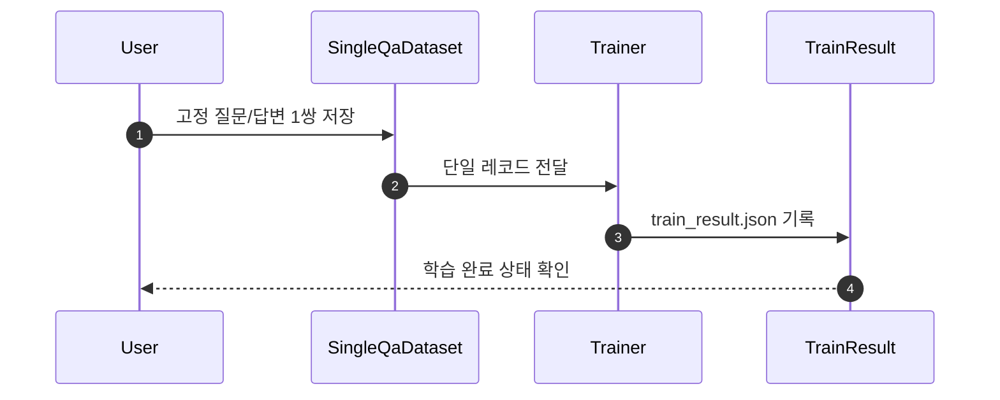

# v7 Single Q/A Training

## Scope

- `v7`는 외부 API 호출 없이 로컬 학습만 수행한다.
- 학습 데이터는 질문 1개와 답변 1개로 고정한다.
- 후속 judge, smoke 생성 검증, vector store 연결은 기본 실행 경로에 넣지 않는다.

## Fixed Input

- dataset path: `llm_datasets/seed_v7/seed_v7_single_qa.jsonl`
- config path: `configs/gpt_oss_20b_seed_v7_single_qa.json`
- run script: `scripts/run_smoke_gpt_oss_20b.py`
- smoke config path: `tests/smoke_v7_single_qa_config.json`
- smoke script path: `tests/run_v7_single_qa_smoke.py`
- smoke log path: `tests/log/v7_single_qa_smoke_report.md`

## Run Flow



1. 질문 1개와 답변 1개를 `jsonl` 1레코드로 고정한다.
2. 학습 스크립트는 `messages`를 바로 학습 문자열로 렌더링해 사용한다.
3. `max_steps=960`으로 같은 레코드를 반복 학습한다.
4. 기본 산출물은 `train_result.json`이다.

## Optional Smoke Check

`v7` 기본 경로는 여전히 학습 완료 확인만 다룬다. 대신 실제 생성 확인이 필요할 때는 아래 스모크 스크립트를 별도로 실행한다.

```bash
python tests/run_v7_single_qa_smoke.py --config tests/smoke_v7_single_qa_config.json
```

이 실행은 단일 질문으로 어댑터 추론을 수행하고, 보기 쉬운 Markdown 로그를 `tests/log/v7_single_qa_smoke_report.md`에 남긴다.

## Round3 Multi Question Variant

- `round3`는 같은 답변을 공유하는 질문 변형 11개를 학습 데이터로 사용한다.
- dataset path: `llm_datasets/seed_v7/seed_v7_single_qa_round3.jsonl`
- config path: `configs/gpt_oss_20b_seed_v7_single_qa_round3.json`
- output dir: `llm_model_lora/gpt-oss-20b-seed-v7-single-qa-round3`
- 조기 종료 조건은 `loss < 1.0` 그리고 `mean_token_accuracy >= 0.98`이다.

## Round4 Multi Group Variant

- `round4`는 6개 Q/A 묶음과 각 11개 질문 변형을 합친 총 66개 레코드를 사용한다.
- 모든 레코드는 `system + user + assistant` 3턴 구조를 유지하고, 베이스 모델에서 새 LoRA 학습을 시작한다.
- dataset path: `llm_datasets/seed_v7/seed_v7_single_qa_round4.jsonl`
- config path: `configs/gpt_oss_20b_seed_v7_single_qa_round4.json`
- output dir: `llm_model_lora/gpt-oss-20b-seed-v7-single-qa-round4`
- 조기 종료 조건은 `loss < 1.0` 그리고 `mean_token_accuracy >= 0.98`이다.

## Round5 Markdown Table Expansion Variant

- `round5`는 현재 `scripts/data_source.md` 표를 그대로 읽어, 5개 Q/A 묶음과 각 30개 질문 변형을 합친 총 150개 레코드를 사용한다.
- 라운드 산출물 생성은 `scripts/build_v7_round_from_data_source.py`가 맡으며, 각 표 행을 하나의 answer group으로 보고 `<br>` 구분 질문을 개별 학습 레코드로 확장한다.
- 모든 레코드는 고정 시스템 프롬프트 `당신은 제로인 펀드평가 방법론에 근거해 답변하는 도메인 어시스턴트입니다.`를 포함한 `system + user + assistant` 3턴 구조를 유지한다.
- dataset path: `llm_datasets/seed_v7/seed_v7_single_qa_round5.jsonl`
- config path: `configs/gpt_oss_20b_seed_v7_single_qa_round5.json`
- smoke config path: `tests/smoke_v7_single_qa_round5_config.json`
- output dir: `llm_model_lora/gpt-oss-20b-seed-v7-single-qa-round5`
- smoke log path: `tests/log/v7_single_qa_round5_all_questions_report.md`
- 조기 종료 조건은 `loss < 1.0` 그리고 `mean_token_accuracy >= 0.98`이다.
- 실제 학습은 베이스 모델 `unsloth/gpt-oss-20b-BF16`에서 시작해 `step 115`, `loss 0.1100`, `mean_token_accuracy 0.9804`에서 조기 종료되었다.
