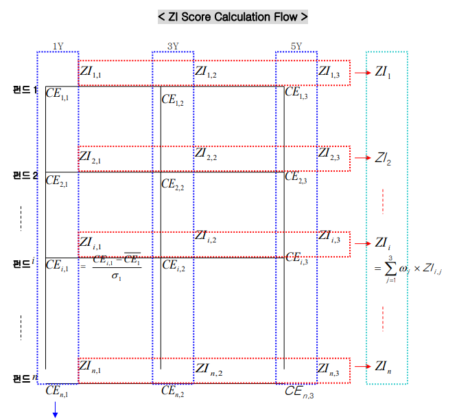
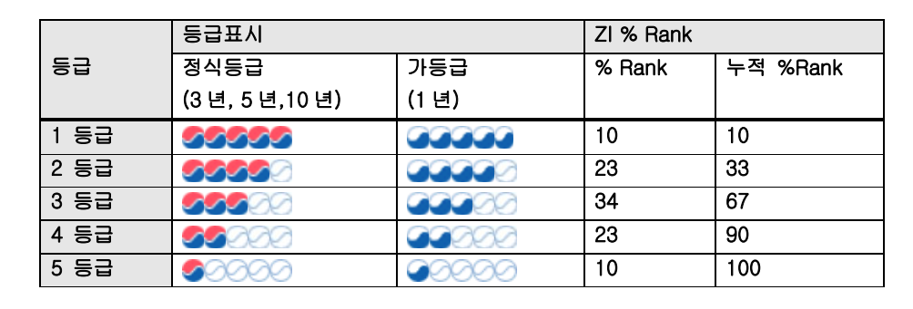
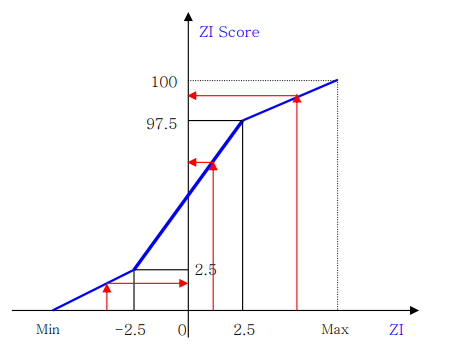
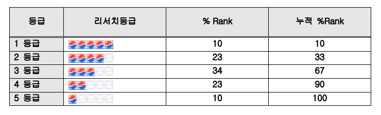
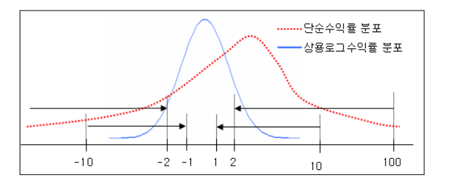

# 제로인 유형분류 및 펀드평가 방법론

**외부유출금지**  
**사내 직원교육 및 열람용**

2023. 08. 개정

㈜KG 제로인 레이팅팀

---

## 목차

1. 유형분류 기준
1.1. 유형분류 개요
1.2. 유형별 벤치마크
1.3. 유형분류 기준

2. 펀드평가 방법론
2.1. 제로인 펀드평가 대상 선정 기준
2.2. 제로인 펀드등급
2.3. ESG 펀드 스코어링 방법론 (신규 추가)
2.4. 수익률 평가방법

3. 위험지표 및 위험조정 성과지표 방법론
3.1. 위험지표
3.2. 위험조정 성과지표
3.3. 기타지표

4. 펀드의 스타일분류
4.1. 주식 포트폴리오의 스타일
4.2. 채권 포트폴리오의 스타일

5. 펀드의 성과요인 분석
5.1. BM 대비 성과요인 분석
5.2. 주식부분 성과요인분석
5.3. 채권부분 성과요인분석

6. 포트폴리오 분석
6.1. 회전율 분석
6.2. 추정 주식회전율 분석
6.3. 동결 주식포트폴리오 분석
6.4. 주식의 매매가격 효율성
6.5. 주식 포트폴리오의 VaR

7. 제공 자료의 종류

8. 평가 자료의 공시

X1. 기타
X.1. 펀드의 실질자금 순유출입
X.2. 기간별 투자비용
X.3. 보수 및 운용규모의 등급화
X.4. 주식 포트폴리오의 시가배당률
X.5. 원화환산 BM 지수의 산출
X.6. KRW Hedged 지수 산출
X.7. 유사펀드 측정 (2009.09 추가)

---

## 개정사항

**[2019년 내부 문서 대비 업데이트 사항]**
2019년 12월 이후의 개정 이력을 추가하여 최신화했습니다.

|     |     |     |     |
| --- | --- | --- | --- |
| **No** | **변경시행일** | **변경사항** | **관련근거** |
| 1   | 2011.08.01 | 펀드%순위 최소금액 기준 및 펀드등급 기준의 변경<br>운용사%순위 부여 대상의 최소금액 기준 변경 및 운용사 등급 신설 | 2011.06.24 펀드 평가위원회 의결 |
| 2   | 2014.02.24 | 리서치등급의 산출 | <br> |
| 3   | 2014.03.24 | 10년 성과 산출 및 10년 펀드성과등급의 추가 산출 | 2014.03.19 펀드 평가위원회 의결 |
| 4   | 2015.12.21 | 배당형 BM의 변경, KODI -> 코스피 고배당 50 | 2015.12.17 펀드 평가위원회 의결 |
| 5   | 2016.03.02 | KP, 부동산NPL 유형신설 | 2016.02.26 펀드 평가위원회 의결 |
| 6   | 2017.12.01 | 신규유형 신설 및 인도주식형 BM적용일 변경 | 2017.4.17 펀드평가위원회 의결 |
| 7   | 2018.01.01 | 채권 유형 BM 변경, KIS -> KAP | 2017.11.27 펀드 평가위원회 의결 |
| 8   | 2019.08.01 | 부동산 유형 BM 변경, 대안투자기대수익지수 1Y->5Y | 2019.07.19 펀드 평가위원회 의결 |
| 9   | 2021.04.01 | 국내 채권혼합형 및 일부 해외혼합형 채권 BM 변경<br>KAP 종합채권1년 → 제로인 종합채권지수(1-2Y) | 2021.03.22 펀드 평가위원회 의결 |
| 10  | 2022.10.04 | MMF BM 변경<br>MMI CALL → 제로인 MMF 지수 | 2022.09.23 펀드 평가위원회 의결 |

### 주요 개정사항 상세

#### 1) 2011.08.01 주요 개정사항

**펀드평가 개정사항**

|     |     |     |
| --- | --- | --- |
| **현재** | **구분** | **변경내용** |
| **제한조건 없음** | 일수익률 | 좌동  |
| 1\. 기간 내 성과의 단절이 없는 모든 펀드 (모펀드, 종류형 펀드 포함)<br>2. 금액 제한 없음<br>3. CDS펀드 | 기간수익률 및 펀드지표 | 좌동  |
| 1\. 평가대상 펀드(모펀드, 종류형펀드 제외)<br>2. 설정후 1개월 이후<br>3. 기간 내 성과의 단절이 없는 펀드<br>4. 기간 내 월별로 설정액이 모두<br> 4.1 주식, 혼합, 절대수익 등 : 10억 이상<br> 4.2 채권, MMF : 50억 이상<br>5. 개별 클래스 단위로 측정<br>6. 유형내 5운위 대상 최소 펀드수 : 없음<br>7. 자펀드에 대한 특별한 조건 없음 | 기간수익률 및 펀드지표의 %순위 | 1\. 좌동<br>2. 설정후 **2주 이후**<br>3. 좌동<br>4. **유형과 관계없이 기간내 월별 순자산액 10억 이상**<br>5. 클라스들의 **월별 순자산액에 10억 이상**<br>6. **운용펀드 기준으로 유형내 최소 3개 이상**<br>7. 자펀드의 최소금액 기준 설정(신설)<br> 7.1 즉 자펀드의 순자산액이 10억원 이상이거나<br> 7.2 통 자펀드가 투자하는 모펀드를 통해서<br> 7.2.1 주식형, 혼합형 관련 자펀드는 주식형, 혹은 혼합형 모펀드 중 1개의 모펀드가 기간내 10억이상<br> 7.2.2 채권형(MMF형) 관련 자펀드는 채권형 모펀드 중 1개의 모펀드가 기간내 10억이상 |
| 1\. 각 기간의 지표 %순위가 생성되는 펀드<br>2. 기간 종료월의 설정액이<br> 2.1 주식, 혼합, 절대 수익 등 : 100억 이상<br> 2.2 채권, MMF : 200억 이상<br>3. 유형내 등급대상 최소 펀드 수 : 10개 | 제로인 펀드등급 | 1\. 변경전 지표 %순위(CE순위) 산출 대상 펀드<br>2. 기간 종료월의 순자산액 기준 적용<br> 2.1 즉, 기간 내 월간 순자산액이 10억 이상<br>3. 운용펀드 기준으로 유형내 최소 **5개 이상** |

**운용사평가 개정사항**

|     |     |     |
| --- | --- | --- |
| **현재** | **구분** | **변경내용** |
| 1\. 설정후 1개월부터 포함 대상<br> 1.1 클래스펀드는 클래스펀드별 설정일<br>2. 그룹수익률 평가 대상 펀드<br>3. 당월 설정액이,<br> 3.1 주식, 혼합, 절대수익 등 : 10억 이상<br> 3.2 채권, MMF : 50억 이상인 펀드<br>4. 개별 클래스 단위로 설정액 제한 적용<br>5. 자펀드에 대한 특별한 조건을 두지 않음 | 일수익률 | 1\. 설정후 2주 후부터 포함 대상<br> 1.1 좌동<br>2. 좌동<br>3. 유형과 관계없이 해당일의 순자산액 10억 이상<br>4. 클래스별의 합계 순자산액이 10억 이상<br>5. 자펀드의 최소금액 기준 선정(선형)<br> 5.1 등 자펀드의 순자산액이 10억원 이상이거나<br> 5.2 등 자펀드가 투자하는 모펀드들 총합시<br> 5.2.1 주식형, 혼합형 관련 자펀드는 주식형, 혹은 혼합형 모펀드 중 1개의 모펀드가 기간내 10억이상<br> 5.2.2 채권형(MMF형) 관련 자펀드는 채권형 모펀드 중 1개의 모펀드가 기간내 10억이상 |
| 1\. 월간 성과 측정 후, 기간 내 단점이 없을 것<br> 1.1 주식, 혼합, 절대수익 등 : 10억 이상<br> 1.2 채권, MMF : 50억 이상 | 기간수익률 및 펀드지표 | 1\. 월간 성과 측정 후, 기간 내 단점이 없을 것<br> 1.1 설정일과 관계없이 기간내 일별 순자산액 10억 이상(클래스, 지펀 변경적용) |
| 1\. 기간 종료일의 설정액 합계가 300억 이상<br>2. 성과 달력이 없는 운용사/유형<br>3. 유형내 변순위 대상 최소 운용사수 : 없음 | 기간수익률 및 펀드지표 %순위 | 1\. 기간 종료일의 순자산액 제한 없음<br> 1.1 ☞ 기간 내 월간 순자산액이 10억 이상<br>2. 좌동<br>3. 유형내 최소 5개 운용사 이상 |
| 1\. 등급 미산출 | 제로인 등급 | 1\. 등급 산출<br>2. 변경일 지표 %순위(CE) 산출 대상 운용사<br>3. 기간 종료일의 순자산액 제한 없음<br> 3.1 ☞ 기간 내 월간 순자산액이 10억 이상<br>4. 유형내 최소 5개 이상 운용사 |
| 1\. 기타인덱스형 : KOSPI200지수 외 패시브운용 주식펀드<br>2. 테마주식형 : 특정 섹터주 등 액티브펀드 | 유형 통합 | 1\. 기타주식형 : 기타인덱스형 + 테마주식형 |
| 1\. 운용사 2개이상, 펀드 5개이상 | 유형의 생성 기준 | 1\. 운용펀드 기준으로 운용사 2개 이상 |

#### 2) 2014.03.24 개정사항

- 기간 및 구간 수익률에 10년 성과를 추가하고 펀드성과등급 (제로인펀드등급)에도 10년 등급을 추가
- 10년 펀드성과등급의 산출방법은 최근 10년, 5년, 1년의 수익률과 표준편차를 이용하여 기존 5년 및 3년 등급 산출방법론과 동일하게 산출

#### 3) 2015.12.21 개정사항

- 기존 배당형의 BM 이였던 KODI(KOREA DIVIDEND INDEX)의 중단에 따라 코스피 고배당 50 으로 변경

#### 4) 2016.03.02 개정사항

- 장기 미분류펀드 중 KP(코리안페이퍼) 및 부동산 NPL 유형의 신설

#### 5) 2017.12.01 개정사항

- 신규유형 신설(국내/해외 특별자산, 헤지펀드) 및 인도주식형 BM 적용일 변경

#### 6) 2018.01.01 개정사항

- 채권 유형 벤치마크를 KIS 채권지수에서 KAP 채권지수로 일괄 수정

#### 7) 2021.7.1 개정사항

- 해외채권형내 글로벌채권 유형의 벤치마크를 'JP Morgan GBI Global(KRW Hedged)90%'에서 'Barclays Global Aggregate(KRW Hedged)90%'로 일괄 변경

#### 8) 2023.07.13 개정사항

- 신규유형 신설(해외펀드 내 외화 MMF-달러표시 MMF) 및 해당 유형 신규 BM 적용

---

## 1\. 유형분류 기준

집합투자기구(이하 펀드)를 평가함에 있어 가장 기본적이고 중요한 것이 펀드 유형의 분류라 할 수 있습니다. 펀드평가사는 각각의 기준을 세워 펀드의 유형분류를 하고 있으며, 이에 유형분류의 기준은 각 펀드평가사의 철학과 노하우 및 방향을 함축적으로 담고 있습니다.

제로인은 펀드 유형을 분류할 때 먼저 투자설명서상의 투자목적과 투자전략에 따라 펀드 유형을 분류합니다.

### 1.1 유형분류 개요

제로인은 펀드 유형을 분류할 때 먼저 투자설명서상의 투자목적과 투자전략에 따라 펀드의 유형을 분류하며, 국내투자펀드와 해외투자펀드의 판단 기준은 약간 다릅니다.

#### 국내/국외 유형분류 기준

- **국내투자 펀드** : 자산유형 → 운용전략, 스타일
- **국외투자 펀드** : 자산유형 → 투자지역, 투자섹터

#### 유형생성의 기본원칙

- **충분성** : 대상펀드수(5개 이상 → 운용펀드 2개 이상. 2011.08.01 개정), 운용사수(2개 이상), 운용규모 등을 고려
- **비교성** : 사회적 통념을 기준으로 판단
- **지속성** : 단기적 시장의 유행이 아닌 유형의 장기 생존 가능성

#### 국내펀드

|     |     |
| --- | --- |
| **대유형** | **소유형** |
| **주식형** | 일반주식(순수주식, 자산배분주식), 중소형주식, 배당주식, 테마주식, KOSPI200인덱스, 기타인덱스 |
| **주식혼합형** | 일반주식혼합, 공격적자산배분 |
| **채권혼합형** | 일반채권혼합, 보수적자산배분 |
| **채권형** | 일반채권, 초단기채권, 중기채권, 우량채권, 하이일드채권 |
| **MMF형** | MMF |
| **부동산형** | 부동산개발, 부동산임대, 부동산대출채권, 부동산NPL |
| **절대수익추구형** | 채권알파, 시장중립, 공모주하이일드 |
| **특별자산** | 특별자산, ELF, PI, 메자닌, ILS |
| **헤지** | 롱숏, IPO, 이벤트드리븐, 멀티스트레티지 |
| **기타** | 라이프스타일, 베어마켓, 단기매칭, 장기매칭, 단기미분류, 장기미분류, 영구미분류, KP |

#### 해외펀드

|     |     |
| --- | --- |
| **대유형** | **소유형** |
| **해외주식형** | 글로벌주식, 유럽주식, 북미주식, 아시아태평양주식, 아시아태평양주식(ex J), 동남아주식, 글로벌신흥국주식, 아시아신흥국주식, 유럽신흥국주식, 남미신흥국주식, 프론티어마켓주식, 기타신흥국주식, 일본주식, 중국주식, 인도주식, 말레이시아주식, 브라질주식, 러시아주식, 호주주식, 독일주식, 타이완주식, 베트남주식, 기타국가주식, 에너지섹터, 기초소재섹터, 일반산업섹터, 소비재섹터, 헬스케어섹터, 금융섹터, 정보기술섹터, 공공서비스섹터, 멀티섹터 |
| **해외주식혼합형** | 글로벌주식혼합, 신흥국주식혼합, 아태주식혼합(ex J), 일본주식혼합, 유럽주식혼합, 북미주식혼합, 아시아신흥국주식혼합, 유럽신흥국주식혼합, 남미주식혼합, 기타이머징주식혼합, 아태주식혼합, 글로벌공격적자산배분 |
| **해외채권혼합형** | 글로벌채권혼합, 신흥국채권혼합, 아태채권혼합(ex J), 일본채권혼합, 유럽채권혼합, 북미채권혼합, 아시아신흥국채권혼합, 유럽신흥국채권혼합, 남미채권혼합, 기타이머징채권혼합, 아태채권혼합, 글로벌보수적자산배분 |
| **커머디티형** | 커머디티 |
| **해외채권형** | 글로벌채권, 유럽채권, 북미채권, 신흥국채권, 아시아채권(ex J), 남미신흥국채권, 글로벌하이일드채권 |
| **외화MMF형** | 달러표시MMF |
| **해외부동산형** | 글로벌리츠재간접, 일본리츠재간접, 아-태 리츠재간접, 글로벌부동산 |
| **해외특별자산** | 글로벌실물자산, 글로벌PI, 글로벌메자닌, 글로벌ILS |
| **해외헤지** | 글로벌롱숏, 글로벌IPO, 글로벌매크로 |
| **해외기타** | 글로벌단기주식미분류, 글로벌단기채권미분류, 글로벌장기미분류, 글로벌라이프싸이클 |

_기울임꼴 유형은 현재(2015.07) 등록된 펀드 없음._

### 1.2 유형별 벤치마크

펀드의 성과평가(fund performance evaluation)는 일정기간 동안 펀드자산의 운용을 통해 얻어진 펀드 수익률을 기초로 자산운용의 효율성을 평가하는 것을 말합니다. 따라서 펀드가 일정기간 얻은 수익률의 크기가 어느 정도 수준인가를 평가하기 위한 기준(benchmark)을 필요로 합니다. 펀드의 수익률을 상대적인 기준에서 비교하기 위해서는 단순히 펀드의 수익률뿐 아니라 운용한 펀드에 대한 위험의 크기가 필요합니다. 펀드의 수익률과 위험의 평가에 사용되는 일반적인 기준은 시장 전체의 움직임(수익률)을 나타내는 지표이며, 국내주식에 대해서는 주가지수(예 KOSPI200), 채권에 대해서는 채권지수가 사용됩니다.

제로인에서는 시장 전체의 움직임과 비교, 위험을 고려한 성과평가, 유형 내 펀드간 비교가 가능하도록 벤치마크를 설정하고 있습니다. 국내의 주식, 채권지수 이외에도 MSCI지수, FTSE지수, Barclays 채권지수(구, Lehman Brothers), JP Morgan 채권지수 및 각국의 거래소 지수 등을 보유하고 있으며, 필요 시에는 제로인 복합지수 및 수익자 특수지수(Hedged 지수 등)를 산출하여 적용함으로써, 보다 정교한 상대적인 성과측정 비교를 가능하게 합니다.

제로인에서는 시장 전체의 움직임과 비교, 위험을 고려한 성과평가, 유형 내 펀드간 비교가 가능하도록 벤치마크를 설정하고 있습니다.

**[2019년 내부 문서 대비 업데이트 사항]**

MMF 등 주요 유형의 벤치마크가 최신 시장 상황을 반영하여 아래와 같이 변경되었습니다.

#### 국내펀드의 유형별 BM

|     |     |     |
| --- | --- | --- |
| **대유형** | **소유형** | **소유형 BM** |
| 주식형 | 일반주식(순수,자산배분) | KOSPI200 |
| <br> | 중소형주식 | 중소형지수 |
| <br> | 배당주식 | 코스피 고배당 50 |
| 주식혼합형 | 일반주식혼합 | KOSPI200 50% + 제로인 종합채권지수(1-2Y) 50% |
| 채권혼합형 | 일반채권혼합 | KOSPI200 25% + 제로인 종합채권지수(1-2Y) 75% |
| 채권형 | 일반채권 | KAP 종합채권2년 90% |
| <br> | 초단기채권 | KAP CD 6개월 90% |
| MMF | MMF | 제로인 MMF 지수 |
| 부동산형 | 부동산개발, 임대 등 | 제로인 대안투자기대수익지수 5Y |

#### 해외펀드의 유형별 BM

|     |     |     |
| --- | --- | --- |
| **대유형** | **소유형** | **소유형 BM** |
| 해외주식형 | 글로벌주식 | MSCI ACWI |
| <br> | 유럽주식 | MSCI EUROPE |
| <br> | 중국주식 | MSCI CHINA |
| 해외채권형 | 글로벌채권 | Bloomberg Barclays Global Aggregate (KRW Hedged) 90% |
| <br> | 신흥국채권 | JP Morgan GBI-EM Global Diversified 90% |
| 해외부동산형 | 글로벌리츠 | 재간접DWGRTT 90% |

#### 1) BM의 설정기준 세부적용 방법

##### 가) 유형 BM, 펀드 BM의 별도 적용

- **국내펀드** : 테마펀드, 기타인덱스를 제외하고는 별도의 펀드 BM을 적용하지 않고 **유형 BM을 적용**
- **해외펀드** : **펀드 BM을 별도 적용**
    - 설정 당시, 운용사가 희망하는 BM을 펀드 BM으로 적용
    - 제로인이 보유하지 않은 경우는 희망 BM과 가장 유사한 BM을 적용
    - BM이 없거나, 제로인이 보유한 지수 중 유사한 BM이 존재하지 않은 경우는 유형 BM을 적용

##### 나) 환헷지 구분: 해외펀드

- **환헷지를 하는 경우**: 로컬지수 적용
- **환헷지를 하지 않는 경우**: 원화환산 지수 적용(단, 적극적으로 밝힌 경우만 인정)

> 예 1) 투자설명서상, '필요한 경우 환헷지를 할 수 있다' → 환헷지를 하는 경우로 인정
> 
> 예 2) 투자설명서상, '지금은 환헷지 수단이 없지만, 후에 환헷지 수단이 생기는 경우 환헷지를 할 수 있다'
> 
> → 투자하는 지역의 통화 및 상황에 따라 판단.
> 
> - 투자하는 지역이 "인도” 인 경우 → 현재 환헷지 할 수 없음
> - 투자하는 지역이 "러시아"인 경우 → 현재 환헷지 할 수 있음 (러시아 주식 거래가 USD로 이루어지고 있음)
> - 투자하는 지역이 "브라질"인 경우 → ADR에 주로 투자하면, USD 와 환헷지 하는 것으로 인정(단, USD 와 BRL 간의 환헷지는 안됨)
> 
> → 브라질 Local 에 투자하면, 환헷지 할 수 없음

##### 다) BM의 적용일 구분

- BM 적용일의 기본

국내 펀드의 공시되는 기준가는 판매 기준가(Reporting Date)로 가격 평가일(Evaluation Date)과 차이가 있습니다. 즉, 기준가의 기준일이 2009년 3월 2일(월요일)이라면, 이는 2009년 2월 27일(금요일)에 운용된 결과를 종가 기준으로 보유한 자산의 가치를 평가한 결과라 할 수 있습니다.

또한 보유한 자산에 채권이나 예금 등이 있다면, 이 자산들에 대한 휴일(토, 일)의 이자분까지 반영하여 2009년 3월 2일의 기준가를 산출하게 됩니다.

반면, 시장의 BM(KOSPI 지수 및 채권지수 등)의 일자는 당일 종가의 일자로 표시됩니다. 이로 인해, 펀드 기준가의 기준일과 시장 BM의 일자를 그대로 일치 시킬 수 없습니다. 이에 기본적으로 다음과 같이 펀드 기준일과 시장 BM의 일자를 적용합니다.
>    - 펀드 기준일의 BM 적용일 = 펀드 기준일 - 1일
>    - 펀드 적용 BM의 일 수익률 = (펀드 기준일 - 1일)의 BM 지수 / (펀드 기준일)의 전영업일 BM 지수 - 1
>
> ※ 분모를 (펀드 기준일 - 1일)로 한 이유: 채권지수의 경우, 휴일에 무관하게 지수를 산출. 즉, 휴일에 반영되는 이자분까지 반영. 펀드의 기준가 역시 휴일 다음 영업일 기준가는 휴일에 발생할 이자분까지 반영하여 기준가를 산출함. 제로인에서는 365일 BM의 지수를 관리하고 있음. 주식의 경우, 휴일의 종가 및 지수는 전영업일의 값과 같음

- 지역별 BM 적용일의 기본

해외펀드에 적용되는 BM은 시차상의 문제로 국내펀드의 적용일자가 달리 적용될 수 있습니다. 또한 투자되는 지역이 같을지라도 운용사의 평가위원회의 방침에 따라 다르게 적용될 수 있습니다. 제로인에서는 일반적으로 인지되는 시차를 고려하여 다음과 같이 투자지역별로 적용되는 BM의 적용일을 달리하고 있습니다.
>    - 국내 FoFs: 당일-1(국내 적용일의 전영업일 기준)
>    - 중국 ~ 일본, 호주 : 당일(국내 적용과 동일)
>        - 단. FoFs 위의 기준에서 국내기준 1영업일 Delay
>        - 인도는 오후 5시 30분 기준으로 종가형성이 되지 않으므로 당일 -1(국내 적용일의 전영업일 기준)으로 적용(2017년 3월)
>
>    - 이외 지역 : 당일-1(국내 적용일의 전영업일 기준)
>        - 단, FoFs 위의 기준에서 국내기준 1영업일 Delay

- **자산별 적용지수**
>    - 주식: Capital Return 지수
>    - 채권: Total Return 지수(BM 수익률의 90% 적용)

※ 채권자산에 대한 BM 수익률을 90%만 적용하는 이유는 주식 부문과의 공정성을 위한 것임. 주식 자산에 대한 BM이 Total Return 이 아니라 Capital Return 이므로 주식 자산을 운용하는 펀드는 배당수익이 별도로 발생하게 되어 BM을 Outperform할 가능성이 높음. 이에 반해 채권자산의 BM은 기본적으로 Total Return 이므로 추가로 발생할 수 있는 수익이 없음. 따라서 채권 자산의 BM은 BM수익률의 90%만 반영함으로써 주식 자산과의 형평성을 맞춤.

##### 라) 펀드 BM의 적용 (2017/3/16 보완)

- 국내 펀드

국내에 투자하는 펀드는 기본적으로 유형BM을 펀드BM으로 설정함.

단, 테마 및 기타 유형은 투자설명서 혹은 규약의 비교지수를 펀드 BM으로 설정함. 이 경우, 투자설명서 또는 규약에 명시된 비교지수가 없으면 유형BM으로 설정함.

- 해외펀드

해외에 투자하는 펀드는 투자설명서 또는 규약에 명시된 비교지수를 펀드 BM으로 설정함. 단, 투자설명서 또는 규약에 명시된 비교지수가 없는 경우, 펀드의 투자전략과 가장 유사한 BM으로 설정하되, 적합한 BM이 없거나 확신하기 힘든 경우 유형 BM으로 설정함.

- PASSIVE 펀드

패시브 펀드의 BM은 투자설명서 또는 규약에 명시된 추종지수를 BM으로 설정함, 액티브 펀드의 BM를 비교지수로 설정하여 평가할 수 있으나, 패시브 펀드는 투자 전략상 추종지수를 기본으로 BM을 설정하되, 명확하지 않은 경우 비교지수를 BM으로 설정함. 단, 비교지수를 BM으로 설정할 경우, 비교지수에 추가된 유동성은 제외한 지수를 BM으로 설정함.

#### 2) 국내펀드의 유형별 BM

|     |     |     |
| --- | --- | --- |
| **대유형** | **소유형** | **소유형 BM** |
| **주식형** | 일반주식(순수, 자산배분) | KOSPI200 |
| <br> | 중소형주식 | 중소형지수 |
| <br> | 배당주식 | 코스피 고배당 50 |
| <br> | 테마주식 | KOSPI200 |
| <br> | K200 인덱스 | KOSPI200 |
| <br> | 기타인덱스 | KOSPI200 |
| **주식혼합형** | 일반주식혼합 | KOSPI200 50% + 매경 BP 종합채권 1년 50% |
| <br> | 공격적자산배분 | KOSPI200 50% + 매경 BP 종합채권 1년 50% |
| **채권혼합형** | 일반채권혼합 | KOSPI200 25% + 매경 BP 종합채권 1년 75% |
| <br> | 보수적자산배분 | KOSPI200 25% + 매경 BP 종합채권 1년 75% |
| **채권형** | 일반채권 | 매경 BP 종합채권 2년 90% |
| <br> | 초단기채권 | KAP CD 6 개월 90% |
| <br> | 중기채권 | 매경 BP 종합채권 3년 90% |
| <br> | 우량채권 | 매경 BP 국공채 2년 90% |
| <br> | 하이일드채권 | 매경 BP 회사채 I-BBB 종합 2년 |
| **MMF** | MMF | MMI CALL |
| **절대수익추구형** | 채권알파 | KOSPI200 10% + 매경 BP 종합채권 1년 90% |
| <br> | 시장중립 | KOSPI200 5% + 매경 BP 종합채권 1년 95% |
| <br> | 공모주하이일드 | KOSPI200 5% + 매경 BP 회사채 I-BBB 종합 2년 95% |
| **부동산형** | 부동산개발 | 제로인 대안투자기대수익지수 |
| <br> | 부동산임대 | 제로인 대안투자기대수익지수 |
| <br> | 부동산대출채권 | 제로인 대안투자기대수익지수 |
| <br> | 부동산 NPL | 제로인 대안투자기대수익지수 |
| **특별자산** | 실물자산 | 제로인 대안투자기대수익지수 |
| <br> | ELF | 매경 BP 종합채권 2Y |
| <br> | PI  | 매경 BP 종합채권 2Y |
| <br> | 메자닌 | 매경 BP 종합채권 2Y |
| <br> | ILS | 매경 BP 종합채권 2Y |
| **헤지펀드** | 롱숏  | KOSPI200 10% + 매경 BP 종합채권 01Y 90% |
| <br> | IPO | KOSPI200 10% + 매경 BP 종합채권 01Y 90% |
| <br> | 이벤트드리븐 | KOSPI200 10% + 매경 BP 종합채권 01Y 90% |
| <br> | 멀티스트래티지 | 제로인 대안투자기대수익지수 |
| **기타** | 단기매칭 | 매경 BP 종합채권 3개월~1년 |
| <br> | 장기매칭 | 매경 BP 종합채권 3년~5년 |
| <br> | 라이프싸이클 | KOSPI200 50% + 매경 BP 종합채권 1년 50% |
| <br> | 베어마켓 | KOSPI200 리버스 |
| <br> | 단기미분류 | 매경 BP 종합채권 1~2년 |
| <br> | 장기미분류 | 매경 BP 종합채권 1~2년 |
| <br> | 영구미분류 | 매경 BP 종합채권 1~2년 |
| <br> | 신규설정펀드 | 매경 BP 종합채권 1~2년 |

※ 볼드체 BM은 해당 소유형이 속한 대유형의 BM과 동일

※ 2018.01.01일부터 채권 유형 벤치마크를 KIS채권지수에서 KAP채권지수로 일괄 수정

#### 3) 해외펀드의 유형별 BM

|     |     |     |
| --- | --- | --- |
| **대유형** | **소유형** | **소유형 BM** |
| **해외주식형** | 글로벌주식 | MSCI ACWI |
| <br> | 유럽주식 | MSCI EUROPE |
| <br> | 북미주식 | MSCI NORTH AMERICA |
| <br> | 아시아태평양주식 | MSCI AC ASIA PACIFIC |
| <br> | 아시아태평양주식(ex J) | MSCI AC ASIA PACIFIC ex JAPAN |
| <br> | 동북아주식 | KOSPI200 33.3% + ΝΙΚKKEI225 CR 33.3% + MSCI CHINA CR 33.3% |
| <br> | 동남아주식 | 동남아 6개국 합성지수(싱가폴지수 MSCI 교체) |
| <br> | 글로벌신흥국주식 | MSCI EM (EMERGING MARKETS) |
| <br> | 아시아신흥국주식 | MSCI EM ASIA |
| <br> | 유럽신흥국주식 | MSCI EM EUROPE |
| <br> | 남미신흥국주식 | MSCI EM LATIN AMERICA |
| <br> | 일본주식 | MSCI JAPAN |
| <br> | 중국주식 | MSCI CHINA |
| <br> | 인도주식 | MSCI INDIA |
| <br> | 말레이시아주식 | MSCI MALAYSIA |
| <br> | 베트남주식 | 베트남 호치민(LOCAL) |
| <br> | 에너지섹터 | MSCI ACWI Energy |
| <br> | 기초소재섹터 | MSCI ACWI Materials |
| <br> | 일반산업섹터 | MSCI ACWI Industrials |
| <br> | 소비재섹터 | MSCI ACWI Consumer Discretionary CR 50% + MSCI ACWI Consumer Staple CR 50% |
| <br> | 헬스케어섹터 | MSCI ACWI Health Care |
| <br> | 금융섹터 | MSCI ACWI Financials |
| <br> | 정보기술섹터 | MSCI ACWI Information Technology |
| <br> | 공공서비스섹터 | MSCI ACWI Utilities |
| <br> | 원자재섹터 | DJAIG Commidity TR 90% |
| <br> | 멀티섹터 | MSCI ACWI |
| <br> | 브라질주식 | MSCI BRAZIL |
| <br> | 러시아주식 | MSCI RUSSIA |
| <br> | 호주주식 | MSCI AUSTRALIA |
| <br> | 독일주식 | MSCI GERMANY |
| <br> | 기타국가주식 | MSCI ACWI |
| <br> | 기타신흥국주식 | MSCI EM (EMERGING MARKETS) |
| <br> | 타이완주식 | MSCI TAIWAN |
| <br> | 프론티어마켓주식 | MSCI FM (FRONTIER MARKETS) |
| **해외주식혼합형** | 글로벌주식혼합 | MSCI ACWI CR 50% + 매경 BP 종합채권 01Y 50% |
| <br> | 신흥국주식혼합 | MSCI EM CR 50% + 매경 BP 종합채권 01Y 50% |
| <br> | 아태주식혼합(ex J) | MSCI AC ASIA PACIFIC ex JAPAN CR 50% + 매경 BP 종합채권 01Υ 50% |
| <br> | 일본주식혼합 | MSCI JAPAN CR 50% + 매경 BP 종합채권 01Y 50% |
| <br> | 중국주식혼합 | MSCI CHINA CR 50% + 매경 BP 국공채 01Y 50% |
| <br> | 베트남주식혼합 | 베트남 호치민 CR 50% + 매경 BP 국공채 01Y 50% |
| <br> | 브라질주식혼합 | MSCI BRAZIL CR 50% + 국공채 01Y 50% |
| <br> | 러시아주식혼합 | MSCI RUSSIA CR 50% + 국공채 01Y 50% |
| <br> | 유럽주식혼합 | MSCI EUROPE CR 50% + 매경 BP 종합채권 01Y 50% |
| <br> | 북미주식혼합 | MSCI NORTH AMERICA CR 50% + 매경 BP 종합채권 01Y 50% |
| <br> | 아시아신흥국주식혼합 | MSCI EM ASIA CR 50% + 매경 BP 종합채권 01Y 50% |
| <br> | 유럽신흥국주식혼합 | MSCI EM EUROPE CR 50% + 매경 BP 종합채권 01Y 50% |
| <br> | 남미주식혼합 | MSCI EM LATIN AMERICA CR 50% + 매경 BP 종합채권 01Y 50% |
| <br> | 기타이머징주식혼합 | MSCI EM CR 50% + 매경 BP 종합채권 01Y 50% |
| <br> | 글로벌 공격적자산배분 | MSCI ACWI CR 75% + 매경 BP 종합채권 01Y 25% |
| <br> | 아태주식혼합 | MSCI AC ASIA PACIFIC CR 50% + 매경 BP 종합채권 01Y 50% |
| **해외채권혼합형** | 글로벌채권혼합 | MSCI ACWI CR 25% + 매경 BP 종합채권 01Y 75% |
| <br> | 신흥국채권혼합 | MSCI EM CR 25% + 매경 BP 종합채권 01Y 75% |
| <br> | 아태채권혼합(ex J) | MSCI AC ASIA PACIFIC ex JAPAN CR 25% + 매경 BP 종합채권 01Υ 75% |
| <br> | 일본채권혼합 | MSCI JAPAN CR 25% + 매경 BP 종합채권 01Y 75% |
| <br> | 중국채권혼합 | MSCI CHINA CR 25% + 매경 BP 국공채 01Y 75% |
| <br> | 베트남채권혼합 | 베트남 호치민 CR 25% + 매경 BP 국공채 01Y 75% |
| <br> | 브라질채권혼합 | MSCI BRAZIL CR 25% + 매경 BP 국공채 01Y 75% |
| <br> | 러시아채권혼합 | MSCI RUSSIA CR 25% + 매경 BP 국공채 01Y 75% |
| <br> | 유럽채권혼합 | MSCI EUROPE CR 25% + 매경 BP 종합채권 01Υ 75% |
| <br> | 북미채권혼합 | MSCI NORTH AMERICA CR 25% + 매경 BP 종합채권 01Y 75% |
| <br> | 아시아신흥국채권혼합 | MSCI EM ASIA CR 25% + 매경 BP 종합채권 01Υ 75% |
| <br> | 유럽신흥국채권혼합 | MSCI EM EUROPE CR 25%+ 매경 BP 종합채권 01Y 75% |
| <br> | 남미채권혼합 | MSCI EM LATIN AMERICA CR 25% + 매경 BP 종합채권 01Y 75% |
| <br> | 기타이머징채권혼합 | MSCI EM CR 25% + 매경 BP 종합채권 01Y 75% |
| <br> | 글로벌 보수적자산배분 | MSCI ACWI CR 25% + 매경 BP 종합채권 01Y 75% |
| <br> | 아태채권혼합 | MSCI AC ASIA PACIFIC CR 25% + 매경 BP 종합채권 01Y 75% |
| **커머더티형** | 커머더티 | Rogers International Commodity TR |
| **해외채권형** | 글로벌채권 | Barclays Global Aggregate (KRW Hedged) 90% |
| <br> | 유럽채권 | Bloomberg Barclays EURO-AGGREGATE (EUR) 90% |
| <br> | 북미채권 | Bloomberg Barclays U.S. AGGREGATE 90% |
| <br> | 신흥국채권 | JP Morgan GBI-EM Global Diversified 90% |
| <br> | 아시아채권(ex J) | JACI IG 90% |
| <br> | 남미신흥국채권 | JP Morgan EMBI+ Latin 90% |
| <br> | 글로벌하이일드채권 | Bloomberg Barclays Global High Yield (USD Hedged) 90% |
| **외화 MMF 형** | 달러표시 MMF | THREE Month T-Bill |
| **해외부동산형** | 글로벌리츠재간접 | DWGRTT 90% |
| <br> | 일본리츠재간접 | TSE REIT TR 90% |
| <br> | 아-태 리츠재간접 | TSE REIT TR 30% + DWGRTT 60% |
| <br> | 글로벌부동산 | DWGRTT 90% |
| **해외특별자산** | 글로벌실물자산 | 제로인 대안투자기대수익지수 |
| <br> | 글로벌PI | 매경 BP 종합채권2Y |
| <br> | 글로벌메자닌 | 매경 BP 종합채권2Y |
| <br> | 글로벌ILS | 매경 BP 종합채권2Y |
| **해외헤지** | 글로벌롱숏 | 제로인 대안투자기대수익지수 |
| <br> | 글로벌IPO | 제로인 대안투자기대수익지수 |
| <br> | 글로벌매크로 | 제로인 대안투자기대수익지수 |
| **해외기타** | 글로벌헤지전략 | 제로인 대안투자기대수익지수 |
| <br> | KP  | 매경 BP 종합채권 1~2년 |
| <br> | 글로벌단기주식미분류 | 매경 BP 종합채권 1~2년 |
| <br> | 글로벌단기채권미분류 | 매경 BP 종합채권 1~2년 |
| <br> | 글로벌장기미분류 | 매경 BP 종합채권 1~2년 |
| <br> | 글로벌라이프싸이클 | MSCI ACWI CR 50% + 매경 BP 종합채권 01Y 50% |

※ 볼드체 BM은 해당 소유형이 속한 대유형의 BM과 동일

※ 2018.01.01일부터 채권 유형 벤치마크를 KIS채권지수에서 KAP채권지수로 일괄 수정

※ 2021.07.01일부터 해외채권형내 글로벌채권 유형의 벤치마크를 'JP Morgan GBI Global(KRW Hedged)90%'에서 'Barclays Global Aggregate (KRW Hedged)90%'로 일괄 변경

### 1.3. 유형분류 기준

- 수익률 군집화 현상을 보이는 포트폴리오에 근거한 유형분류
- 자산 및 지역 등을 분류기준으로 삼는 글로벌표준에 부합된 해외펀드 유형의 세분화
- 대분류 소분류 체계 확립

#### 1) 국내펀드

투자설명서상 국내증권에 2/3이상 투자하도록 정해져 있거나 운용전략상 상당기간 그럴 가능성이 높은 펀드

##### 가) 주식형 : 약관상 최고 주식투자한도가 2/3초과 펀드

|     |     |     |
| --- | --- | --- |
| **대유형** | **소유형** | **설명** |
| **주식형** | 일반주식 | 약관상 최고 주식투자한도가 2/3를 넘으면서 운용중 평균주식 편입비가 2/3~100%인 펀드로서 프리스타일(액티브) 펀드 |
| <br> | ㄴ순수주식 | 일반주식 유형에 속하며 주식 편입비의 변화가 적을 것으로 예상되는 펀드 |
| <br> | ㄴ자산배분 | 일반주식 유형에 속하며 시장초과수익을 위해 주식 편입비 조절을 함께하는 펀드 |
| <br> | 중소형주식 | 주식펀드로서 투자설명서(투자목적)상 중소형주에 주식 자산의 50% 이상을 투자하는 프리스타일(액티브) 펀드 |
| <br> | 배당주식 | 주식펀드로서 투자설명서(투자목적)상 고배당주에 주식 자산의 50% 이상을 투자하는 프리스타일(액티브) 펀드 |
| <br> | 테마주식 | 주식펀드로서 코스닥 및 특정업종, 또는 특정그룹주 등 테마성 주식에 전체자산의 50% 이상을 투자하는 프리스타일(액티브) 펀드 |
| <br> | KOSPI200 인덱스 | KOSPI200지수를 100% 복제, 추종하거나 복제전략을 사용하되 소폭의 초과수익을 추구하는 패시브 주식펀드 |
| <br> | 기타인덱스 | 특정지수(KOSPI200제외)를 100% 복제, 추종하거나 복제전략을 사용하되 소폭의 초과수익을 추구하는 패시브 주식펀드 |

##### 나) 혼합형 : 약관상 주식투자한도가 10%~2/3인 펀드

|     |     |     |
| --- | --- | --- |
| **대유형** | **소유형** | **설명** |
| **주식혼합형** | 일반주식혼합 | 위험자산 40%~2/3형으로 평균주식편입비가 거의 변하지 않는 타입 |
| <br> | 공격적자산배분 | 위험자산 편입비를 0~100% 사이에서 활발히 움직여 평균주식편입비가 35~65% 수준일 것으로 추정되는 펀드 |
| **채권혼합형** | 일반채권혼합 | 위험자산 11~39% 형으로 평균주식편입비가 거의 변하지 않는 타입 |
| <br> | 보수적자산배분 | 위험자산 편입비를 0~50% 사이에서 활발히 움직여 평균주식편입비가 15~35% 수준일 것으로 추정되는 펀드 |

##### 다) 채권형 : 주식투자가 불가능하면서 채권, CP 등 채권형 자산에만 투자하는 시가평가 펀드

|     |     |     |
| --- | --- | --- |
| **대유형** | **소유형** | **설명** |
| **채권형** | 일반채권 | 투자설명서, 혹은 명시적으로 투자채권의 신용도, 타겟듀레이션을 밝히지 않거나 초단기채권과 중기채권 사이의 타겟듀레이션을 설정한 펀드 |
| <br> | 초단기채권 | 투자설명서, 혹은 명시적으로 타겟듀레이션 0.5년미만임을 밝힌 펀드 |
| <br> | 중기채권 | 투자설명서, 혹은 명시적으로 등에 타겟듀레이션 2~4년임을 밝힌 펀드 |
| <br> | 우량채권 | 타겟듀레이션 제한 없이 국공채, 신용등급 AAA 이상 등급에 투자하는 펀드 |
| <br> | 하이일드채권 | 투기등급(BB+이하) 채권에 투자가 가능한 펀드 |

※ 채권형 펀드 유형분류 우선순위는 1)크레딧 2)듀레이션 3) 섹터 순임.

##### 라) MMF: 가중평균 잔존만기가 90일이내인 채권형 자산에 투자하는 펀드

|     |     |     |
| --- | --- | --- |
| **대유형** | **소유형** | **설명** |
| **MMF형** | MMF | CP, CD, Call 등 1년미만의 단기금융상품에만 투자 |

##### 마) 부동산형 : 공개시장을 통하지 않고 협상을 통해 부동산 및 관련증권에 투자하는 펀드

|     |     |     |
| --- | --- | --- |
| **대유형** | **소유형** | **설명** |
| **부동산형** | 부동산개발 | 부동산을 개발, 매각차익을 추구하는 펀드 |
| <br> | 부동산임대 | 부동산 임대수익 및 매각차익을 추구하는 펀드 |
| <br> | 부동산대출채권 | 부동산을 기초자산으로 한 PF(Project Finance) 등 대출 채권을 편입한 펀드 |
| <br> | 부동산NPL | 부동산 부실채권(NPL)을 주 투자대상으로 편입한 펀드 |

##### 바) 절대수익형 : 투자설명서상 절대수익을 추구하는 펀드

|     |     |     |
| --- | --- | --- |
| **대유형** | **소유형** | **설명** |
| **절대수익추구형** | 채권알파 | 투자설명서상 절대수익을 추구하고, 마켓타이밍 전략을 주로 취하면서 평균주식편입비가 10% 수준일 것으로 추정되는 펀드 |
| <br> | 시장중립 | 저평가주식매수-고평가선물매도 등을 통해 시장포지션을 중립화하는 전략을 주로 취하면서 절대수익을 추구하는 펀드 |
| <br> | 공모주하이일드 | 투기등급채권에 투자 가능하면서도 공모주식에도 투자하는 펀드(공모주 우선배정권이 있었던 펀드) |

##### 사) 특별자산형 : 투자설명서상 주식이나 채권, 부동산 이외의 투자대상자산에 투자하는 펀드

|     |     |     |
| --- | --- | --- |
| **대유형** | **소유형** | **설명** |
| **특별자산형** | 실물자산 | 실물자산펀드(부동산, 커머더티 제외)로 기초자산 및 권리의 가치변동이 펀드 수익률에 직접 영향을 미치는 펀드 |
| <br> | ELF | 주가지수나 특정증권을 기초로 하는 파생상품(ELS)이나 이를 결합한 상품에 투자하거나 이를 복제하여 수익률 추구하는 펀드, 수익구조가 설정 당시 확정된 펀드 |
| <br> | PI  | 원금의 전부 또는 대부분을 보존하도록 설계된 펀드 |
| <br> | 메자닌 | 전환사채(CB), 신주인수권부사채(BW), 교환사채(EB) 등에 50% 이상 투자하는 펀드 |
| <br> | ILS | 보험사의 보험상품을 기초로 하는 보험연계증권(ILS)이나 이를 결합한 상품에 투자하거나 이를 복제하여 수익을 추구하는 펀드 |

##### 아) 헤지형 : 주식, 채권, 파생상품 등 다양한 자산에 투자하여 절대수익을 추구하는 사모펀드

|     |     |     |
| --- | --- | --- |
| **대유형** | **소유형** | **설명** |
| **헤지** | 롱숏  | 롱포지션으로 주식을 매수하고 숏포지션으로 주식차입매도 |
| <br> | IPO | 공모주 투자 |
| <br> | 이벤트드리븐 | 기업 구조조정, 인수합병 등 이벤트발생 예상 기업에 투자 |
| <br> | 멀티스트래티지 | 복수의 전략을 함께 구사 |

##### 자) 기타형: 펀드간 비교를 할 수 없어 순위를 매기는 것은 곤란하나 구분의 필요성이 존재하는 펀드

|     |     |     |
| --- | --- | --- |
| **대유형** | **소유형** | **설명** |
| **기타** | 라이프싸이클 | 기간이 경과하면서 주식편입비가 줄어드는 펀드 |
| <br> | 베어마켓 | 자산의 매도, 혹은 숏포지션 만 취하는 것을 운용전략으로 삼는 펀드 (예, KOSPI200베어마켓 펀드의 경우 KOSPI200 리버스지수를 100% 복제, 추종하거나 복제전략을 사용하되 소폭의 초과수익을 추구하는 패시브 주식펀드) |
| <br> | 단기매칭 | 3년이내의 만기에 보유채권 잔존만기를 맞춘 펀드 |
| <br> | 장기매칭 | 3년이상의 만기에 보유채권 잔존만기를 맞춘 펀드 |
| <br> | 단기미분류 | 설정 4주 후 확정유형분류 되기 전 상태 |
| <br> | 장기미분류 | 특정유형으로 분류되지 않은 채 4주를 경과한 펀드 |
| <br> | 영구미분류 | 대우채 등으로 인한 부실채권 및 장부가로 평가 및 출자 전환된 펀드 |

#### 2) 해외펀드

##### 가) 해외주식형: 약관상 주식 또는 주식펀드 투자한도가 최고 2/3를 초과하면서 투자가능 주식의 2/3이상을 해외주식(또는 해외특정지역)에 투자하는 펀드

|     |     |     |
| --- | --- | --- |
| **대유형** | **소유형** | **설명** |
| **해외주식형** | 글로벌주식 | 복수의 국가 주식에 투자하는 펀드. 단 아태는 주식 중 일본비중이 30%이상, 아태(ex J)은 일본비중이 30%미만 인 펀드 |
| <br> | 유럽주식 | <br> |
| <br> | 북미주식 | <br> |
| <br> | 아시아태평양주식 | <br> |
| <br> | 아시아태평양주식 (ex Japan) | <br> |
| <br> | 동북아주식 | <br> |
| <br> | 동남아주식 | <br> |
| <br> | 글로벌신흥국주식 | <br> |
| <br> | 아시아신흥국주식 | <br> |
| <br> | 유럽신흥국주식 | <br> |
| <br> | 남미주식 | <br> |
| <br> | 프론티어마켓주식 | <br> |
| <br> | 기타신흥국주식 | <br> |
| <br> | 일본주식 | 특정국가에 2/3이상 투자하는 해외주식펀드. 단, 특정국가 펀드를 운용하는 운용사가 2개 이상일 때 유형신설 |
| <br> | 중국주식 | <br> |
| <br> | 인도주식 | <br> |
| <br> | 말레이시아주식 | <br> |
| <br> | 브라질주식 | <br> |
| <br> | 러시아주식 | <br> |
| <br> | 호주주식 | <br> |
| <br> | 독일주식 | <br> |
| <br> | 타이완주식 | <br> |
| <br> | 베트남주식 | <br> |
| <br> | 기타국가주식 | <br> |
| <br> | 에너지섹터 | GICS (Global Industry Classification Standards) 기준 특정업종에 2/3이상 투자하는 해외펀드 |
| <br> | 기초소재섹터 | <br> |
| <br> | 일반산업섹터 | <br> |
| <br> | 소비재섹터 | <br> |
| <br> | 헬스케어섹터 | <br> |
| <br> | 금융섹터 | <br> |
| <br> | 정보기술섹터 | <br> |
| <br> | 공공서비스섹터 | <br> |
| <br> | 멀티섹터 | 둘 이상의 섹터에 투자하는 펀드 |

##### 나) 해외혼합형 : 약관상 최고 주식투자한도가 10~40%(채권혼합) 또는 40~70% (주식혼합) 이면서 투자가능 주식의 2/3이상을 해외주식에 투자하는 펀드

|     |     |     |
| --- | --- | --- |
| **대유형** | **소유형** | **설명** |
| **해외주식혼합형** | 글로벌주식혼합 | 지역구분은 추정 상관성을 감안해 결정, 복합지역 혼합형은 글로벌, 신흥국, 아시아태평양 3개만 인정하되 특정국가 형은 발생 즉시 유형신설 |
| <br> | 신흥국주식혼합 | <br> |
| <br> | 아태주식혼합(ex J) | <br> |
| <br> | 일본주식혼합 | <br> |
| <br> | 유럽주식혼합 | <br> |
| <br> | 북미주식혼합 | <br> |
| <br> | 아시아신흥국주식혼합 | <br> |
| <br> | 유럽신흥국주식혼합 | <br> |
| <br> | 남미주식혼합 | <br> |
| <br> | 기타이머징주식혼합 | <br> |
| <br> | 아태주식혼합 | <br> |
| <br> | 글로벌공격적자산배분 | 주식, 채권 등 전통적 자산외에 헤지펀드, 상품선물, 해외부동산에 병행 투자해 리스크를 극소화하고 수익을 극대화한 공격적 자산배분펀드 |
| **해외채권혼합형** | 글로벌채권혼합 | 지역구분은 추정 상관성을 감안해 결정, 복합지역 혼합형은 글로벌, 신흥국, 아시아태평양 3개만 인정하되 특정 국가형은 발생 즉시 유형신설 |
| <br> | 신흥국채권혼합 | <br> |
| <br> | 아태채권혼합(ex J) | <br> |
| <br> | 일본채권혼합 | <br> |
| <br> | 유럽채권혼합 | <br> |
| <br> | 북미채권혼합 | <br> |
| <br> | 아시아신흥국채권혼합 | <br> |
| <br> | 유럽신흥국채권혼합 | <br> |
| <br> | 남미채권혼합 | <br> |
| <br> | 기타이머징채권혼합 | <br> |
| <br> | 아태채권혼합 | <br> |
| <br> | 글로벌보수적자산배분 | 주식, 채권 등 전통적 자산외에 헤지펀드, 상품선물, 해외부동산에 병행 투자해 리스크를 극소화하고 수익을 극대화한 보수적 자산배분펀드 |

##### 다) 커머더티형 : 커머더티(실물자산)를 기초자산으로 한 장내 및 장외파생상품 인덱스를 추적하거나, 커머더티에 직접 투자하여 펀드의 주수익원이 이와 연결된 펀드

|     |     |     |
| --- | --- | --- |
| **대유형** | **소유형** | **설명** |
| **커머더티형** | 커머더티 | 개별 커머더티별로 소유형 분류는 하지 않음 |

##### 라) 해외채권형: 약관상 주식투자가 불가능한 펀드로서 2/3이상의 자산을 해외 채권형 자산에 투자하는 펀드

|     |     |     |
| --- | --- | --- |
| **대유형** | **소유형** | **설명** |
| **해외채권형** | 글로벌채권 | 특정권역 및 지역에서 발행한 채권의 2/3이상을 투자하는 채권펀드 |
| <br> | 유럽채권 | 특정국가에 주로 투자하는 채권펀드는 특정국가가 소속된 권역채권펀드로 분류 |
| <br> | 북미채권 | <br> |
| <br> | 신흥국채권 | <br> |
| <br> | 아시아채권(ex J) | <br> |
| <br> | 남미신흥국채권 | <br> |
| <br> | 글로벌하이일드채권 | 전세계의 정부, 정부기관, 국제기구 및 기업들이 발행한 채권이나 기타 고정/변동금리부 채권 중 투자자산의 2/3이상을 투자적격등급미만의 신용등급을 가진 채권에 투자하는 채권펀드 |

##### 마) 외화MMF형: 외화표시 단기금융상품에 주로 투자하며, 외화 단일 통화로 거래되는 단기금융집합투자기구

|     |     |     |
| --- | --- | --- |
| **대유형** | **소유형** | **설명** |
| **외화MMF형** | 달러표시MMF | 달러표시 단기금융 상품에 투자하는 펀드 |

##### 바) 해외부동산형: 해외소재 부동산 또는 이와 연계된 인덱스, 주식, 펀드에 자산의 2/3이상을 투자하는 펀드

|     |     |     |
| --- | --- | --- |
| **대유형** | **소유형** | **설명** |
| **해외부동산형** | 글로벌리츠재간접 | 부동산관련 펀드에 투자하는 재간접펀드로서 해당지역 비중 이 2/3이상인 펀드 |
| <br> | 일본리츠재간접 | <br> |
| <br> | 아-태리츠재간접 | <br> |
| <br> | 글로벌부동산 | 해외부동산형으로서 부동산 개발, 임대를 주목적으로 운용 되는 펀드 |

※ 글로벌리츠 : 전세계 상업용 빌딩, 백화점 등 상가, 주택 등에 투자하되 개발, 임대, 대출 등의 방법으로 자산을 운용하는 펀드

##### 사) 해외특별자산형 : 해외에 투자하는 펀드 중, 투자설명서상 주식이나 채권, 부동산 이외의 투자대상자산에 투자하는 펀드

|     |     |     |
| --- | --- | --- |
| **대유형** | **소유형** | **설명** |
| **해외특별자산형** | 글로벌실물자산 | 해외실물자산펀드(부동산, 커머더티 제외)로 기초자산 및 권리의 가치변동이 펀드 수익률에 직접 영향을 미치는 펀드 |
| <br> | 글로벌PI | 해외주식에 투자하되 원금의 전부 또는 대부분을 보존하도록 설계된 펀드 |
| <br> | 글로벌메자닌 | 해외에서 발행된 전환사채(CB), 신주인수권부사채(BW), 교환사채(EB) 등에 50% 이상 투자하는 펀드 |
| <br> | 글로벌ILS | 해외에서 발행한 보험연계증권(ILS)이나 이를 결합한 상품에 투자하거나 이를 복제하여 수익을 추구하는 펀드 |

##### 아) 해외헤지형: 해외주식, 해외채권, 해외파생상품 등 다양한 자산에 투자하여 절대수익을 추구하는 해외사모펀드

|     |     |     |
| --- | --- | --- |
| **대유형** | **소유형** | **설명** |
| **해외헤지형** | 글로벌 롱숏 | 롱숏전략을 사용하는 글로벌펀드에 투자(재간접형) |
| <br> | 글로벌 IPO | 글로벌 공모주나 신규상장기업주식에 주로 투자 |
| <br> | 글로벌매크로 | 경제 추세나 특정한 사건에 영향을 받는 시장 방향에 대한 예측을 근거로 시장 방향성에 베팅하는 전략 |

##### 자) 해외기타형: 해외에 투자하는 펀드 중, 펀드간 비교를 할 수 없어 순위를 매기는 것은 곤란하나 구분의 필요성이 존재하는 해외펀드

|     |     |     |
| --- | --- | --- |
| **대유형** | **소유형** | **설명** |
| **해외기타** | 글로벌헤지전략 | 절대수익을 추구하거나 헤지펀드 등에 투자하는 펀드 |
| <br> | KP  | 국내기업들이 발행한 외화표시채권에 투자하는 펀드 |
| <br> | 글로벌단기주식미분류 | 특정유형으로 분류되기 전단계의 해외주식펀드 |
| <br> | 글로벌단기채권미분류 | 특정유형으로 분류되기 전단계의 해외채권펀드 |
| <br> | 글로벌장기미분류 | 특정유형으로 분류되지 않은 채 4주를 경과한 펀드 |
| <br> | 글로벌라이프싸이클 | 기간이 경과하면서 주식편입비가 줄어드는 해외 펀드 |
---

## 2. 펀드평가 방법론

### 2.1. 제로인 펀드평가 대상 선정 기준

#### 1) 펀드 %순위 및 등급의 평가 선정 기준

가) 펀드 수익률 %순위 및 지표 %순위 부여 대상 기준

- 펀드 유형과 무관하게 순자산 10억원 이상인 펀드
- 종류형 운용펀드 제외, 모펀드 제외
- 클래스 펀드는, 클래스들의 순자산 합계가 10억원 이상 펀드
- 자펀드는, 동 자펀드의 순자산이 10억원 이상이거나, 동 자펀드가 투자하는 모펀드들 중에서 주식형, 주식혼합형 및 채권혼합형 관련 자펀드는, 주식형, 혹은 주식혼합 및 채권혼합 모펀드 중 1개의 모펀드가 순자산액이 10억원 이상이어야 하며, 
채권형 관련 자펀드는, 채권형 모펀드 중 1개의 모펀드 중 1개의 모펀드 순자산액이 10억원 이상

- 설정 2주후부터 측정
- 기간 내 일간 성과의 단절이 없어야 하며, 일간 순자산액 규모도 위의 조건을 만족해야 함
- 클래스인 경우, 평가대상이면서도 순자산 합계가 10억원 이상, 성과의 단절이 없더라도, 기간 내 일간 성과가 비이상적이 있었던 클래스는 %순위에서 제외(제외 대상 기준은 아직 미확립)
- 유형내 운용펀드 기준으로 대상 펀드가 3개 펀드 미만이면 %순위 산출을 하지 않음

나) 제로인 펀드등급

- 평가펀드 산출대상 펀드로 함
- 기간 종료일(등급 산출 최종 영업일)의 순자산액 제한을 두지 않음 즉, 기간 내 일간 순자산액 10억원 이상인 펀드
- 유형내 등급 산출기간의 운용펀드 기준으로 대상 펀드가 5개 이상인 경우만 산출

#### 2) 운용사/유형 %순위 및 등급의 선정 기준

가) 운용사/유형 %순위 부여 기준

- 펀드가 설정된 후, 2주 후부터 그룹수익률 대상
- 종류형 운용펀드 제외, 모펀드 제외
- 유형 무관하게 순자산액이 10억원 이상이면 그룹수익률 포함
- 클래스 펀드는, 클래스들의 순자산액 합계가 10억원 이상 펀드
- 자펀드는, 동 자펀드의 기간내 일간 순자산액이 10억원 이상이거나, 동 자펀드가 투자하는 모펀드들 중에서 주식형, 주식혼합형 및 채권혼합형 관련 자펀드는, 주식형, 혹은 주식혼합 및 채권혼합 모펀드 중 1개의 모펀드가 기간내 일간 순자산액이 10억원 이상이어야 하며, 채권형 관련 자펀드는, 채권형 모펀드 중 1개의 모펀드 중 1개의 모펀드 당일 순자산액이 10억원 이상
- 클래스인 경우, 평가대상이면서도 순자산액 합계가 10억원 이상일 지라도 일간 성과가 비이상적인 클래스는 그룹성과에서 제외

나) 운용사/유형 수익률 %순위 및 지표 %순위 부여 기준

- 운용사/유형 순자산액이 기간 내 일별 모두 10억원 이상
- 기간 내 일간 성과의 단절이 없어야 함
- 3개 운용사 이상

다) 제로인 운용사/유형 등급

- 평가펀드 산출 기간 대상 운용사/유형
- 기간 종료일(등급 산출 최종 영업일)의 순자산액 제한을 두지 않음 즉, 기간 내 일간 순자산액 10억원 이상인 운용사/유형
- 유형내 등급 산출기간의 대상 운용사가 5개 이상인 경우만 산출
- 산출된 등급은 삭제하지 않고 유지

---

### 2.2. 제로인 펀드등급

#### 1) 성과등급(Performance Rating)

제로인은 수익률과 변동성(위험)을 동시에 고려한 위험조정수익률(CE)을 바탕으로 월 1회 산출하며, 유형내 펀드별 표준화점수(ZI Score)로 제로인 펀드등급을 산출합니다. 샤프지수, 트레이너 지수 등은 각각의 장점에도 불구하고 펀드의 초과 수익률이 음의 값을 가지는 경우에는 해석할 수 없다는 문제점을 지니게 됩니다. 또한, 젠센알파는 이해하기 쉬우나 펀드의 벤치마크가 명확해야만 그 의미를 지닐 수 있습니다.

제로인에서는 이러한 문제점을 해소 할 수 있는 지표로 수익률과 위험의 관계를 나타내는 효용함수를 이용한 효용값(확실성 등가 ; CE), 즉 위험이 전혀 없는 수익률을 등급 산출에 사용하고 있습니다.

가) 등급 부여 대상 펀드

| 구분         | 등급부여                                              | 비고                                                         |
|--------------|------------------------------------------------------|--------------------------------------------------------------|
| 펀드유형     | 국내외 기타유형, 테마주식을 제외한 모든 유형          |                                                              |
| 자산규모 주1)| (유형무관) 평가대상 전기간 순자산 10억원이상         | - 적절한 운용전략 수행 가능성 고려<br>- 환매수수료에 의한 수익률 왜곡 방지 |
| 운용기간     | 1년이상                                               | - 1년(가등급), 3년, 5년, 10년                               |
| 비교대상 펀드수 주2)| 각 유형별 운용펀드기준으로 5개 이상(모펀드, 종류형 운용펀드는 제외) | - 등급의 상대성 고려                                         |
| 기타         | 사모펀드는 등급산출 하되, 공시에서 제외               |                                                              |

> 주1) %순위 최소 자산규모를 “설정액합계” 기준에서 “순자산총액합계” 기준으로 변경됨(2011.08.01)  
> 주식형, 혼합형은 “설정액 100억”이상에서 “순자산총액 10억”이상으로 변경,  
> 채권형, MMF는 “설정액 200억”이상에서 “순자산총액 10억”이상으로 변경(2011.08.01)  
> 변경사항은 2011.8.1부터 시행하며 이전 자료의 소급적용 없음

> 주2) 개별펀드(클래스 포함) 단위로 유형별 10개 이상에서 변경(2011.08.01)

등급 부여 대상을 선정할 때 운용 규모에 따른 제한을 두는 이유는 규모가 지나치게 작은 펀드의 경우 적절한 운용전략을 수행하기가 어렵고, 환매수수료 등, 운용 외적인 요소에 의해 운용성과가 왜곡될 가능성이 있어 이를 최소화하기 위한 것입니다.  
즉, 일정한 규모 이상이 되어야 분산투자를 통한 위험축소 등 적절한 운용전략을 수행할 수 있으며, 해당 기간에 대해 성과의 안정성을 확보할 수 있기 때문입니다. 또한 운용자산 규모가 급증 또는 급감하거나 지나치게 작은 경우에는 환매수수료의 펀드내 환입 등 운용성과 이외의 통제불가능 요소로 인해 성과가 왜곡될 가능성이 크므로 이를 배제하였습니다.

모펀드 및 클래스 구조, FoF 등 펀드구조 및 투자수단의 다양화로 인해 개별 펀드(클래스 포함)로는 그 운용규모가 작으나 실제 운용에 있어 매니저가 의도했던 바로 운용되고 있습니다. 이에 2011년 8월 1일부로 펀드 전체의 운용규모의 의미를 순자산 총액으로 변경하고, 최소 운용규모는 순자산 총액 10억원이상인 펀드를 대상으로 펀드 등급을 산출하고 있습니다.(그 이전에는 주식형의 경우 설정액 100억이상, 채권형의 경우 300억 이상인 펀드만을 대상)  
또한, 펀드가 투자하는 자산과 지역이 다양화 됨으로써 분류된 유형에 속한 펀드들이 적은 경우가 있습니다. 이에 2011년 8월 11일부로 최소 펀드수를 운용펀드기준으로 5개 펀드로 변경하였습니다.(그 이전에는 10개이상)

---

나) 성과 평가(ZI Score계산) 계산 절차

**Step 1** : 3 개 기간에 대한 수익률 및 표준편차를 계산한 뒤 이를 연율로 환산  
10 년 이상의 운용기간을 가진 펀드는 최근 10 년, 최근 5 년, 최근 1 년의 수익률과 표준편차를 각각 계산하며, 5 년 이상의 운용기간을 가진 펀드는 최근 5 년, 최근 3 년, 최근 1 년의 수익률과 표준편차를 각각 계산하며, 3 년 이상의 운용기간을 가진 펀드는 최근 3 년, 최근 2 년, 1 년의 수익률 및 표준편차를 각각 계산해 연율로 환산합니다. 또한 1 년 이상의 운용기간을 가진 펀드는 최근 12 개월의 수익률 및 표준편차를 각각 계산해 연율로 환산합니다.

**Step 2** : 경험적 평균위험회피계수에 따른 각 기간별 효용값을 측정합니다.

$$
CE_{i,j} = R_{i,j} - \lambda_{i,j} \times \sigma_{i,j}^2
$$

where  
$CE_{i,j}$ := 펀드 $i$의 $j$기의 효용값  
$R_{i,j}$ := 펀드 $i$의 $j$기 동안의 주간로그수익률의 평균  
$\sigma_{i,j}$ := 펀드 $i$의 $j$기 동안의 주간로그수익률의 표준편차  
$\lambda_{i,j}$ := 펀드 $i$의 $j$기 동안의 위험회피계수(Risk Aversion Factor)

**Step 3** : 평가대상 그룹별로 다음 산식에 의해 각 펀드의 기간별 ZI(Zeroin Index)를 계산합니다.

$$
ZI_{i,j} = \frac{CE_{i,j} - \overline{CE}_j}{\sigma_j}
$$

where  
$ZI_{i,j}$ := 펀드 $i$의 $j$기의 ZI  
$\overline{CE}_j$ := 펀드 $i$가 속한 Peer Group 내 펀드들의 $j$기의 효용값($CE$)의 평균  
$\sigma_j$ := 펀드 $i$가 속한 Peer Group 내 펀드들의 $j$기의 효용값($CE$)의 표준편차

> ※ 위 ZI 산식은 Normal Distribution 을 Standard Normal Distribution 으로 바꾸는 Standardization 과정과 동일합니다.

---

#### [참고 : CE 식의 유도]

**[CE 식의 유도]**

CE(Certainty Equivalence)는 제로인이 펀드등급(태극마크)를 산출하기 위한 기초값입니다. 이 CE 는 효용함수와 같은 의미로 보시면 되며, 위험조정 성과라 할 수 있습니다.

아시다시피 효용함수는 어떤 것이 맞다? 틀리다? 하는 것이 없습니다. 단지 증가함수의 형태로 나타나면 되며, 이 함수를 결정되면 효용을 결정짓는 상수를 찾아야 합니다. 이것이 위험회피계수(람다; $\lambda$)입니다.

우선, 결론적으로 제로인에서 사용하는 람다의 식은 다음과 같습니다.

$$
\lambda = \frac{E}{2 \times \sigma^2} \qquad \cdots (1)
$$

$E$ := 무위험초과기대수익,  
$\sigma$ := 무위험초과기대위험

또한, 펀드의 CE 는 앞에서 언급한 바, 다음과 같습니다.

$$
CE = \overline{R} - \lambda \times \sigma^2 \qquad \cdots (2)
$$

(1)번 식 $\lambda$를 찾기 위해선 다음의 2 가지 가정이 필요합니다.

가정 1) 투자자는 2 차곡선 형태의 효용함수를 갖는다.  
즉, $U = E - \lambda \div s$

가정 2) 투자자는 해당 유형의 벤치마크의 (기대)수익/위험을 가장 선호한다.  
위의 가정하에, 투자자가 벤치마크와 무위험자산에 각각 $X$, $1-X$ 만큼 투자한다면,

$$
E = X \times E(R_b) + (1-X) \times R_f \qquad \cdots (3)
$$

$$
S = X \times S(R_b)
$$

$E$ := 기대수익, $E(R_b)$ := BM 의 기대수익, $R_f$ := 무위험수익,  
$S$ := 기대위험, $s(R_b)$ := BM 의 기대위험

가정 1)에 (3)식을 대입하면,

$$
U = X \times E(R_b) + (1-X) \times R_f - \lambda \times X^2 \times s(R_b)^2
$$

목표는 목적함수 $U$를 최대화 해야 하는 것이므로, 수학적으로 편미분값이 0 인 값을 찾으면 됩니다.  
즉, $\frac{\partial U}{\partial X} = 0$.

$\Rightarrow \frac{\partial U}{\partial X} = E(R_b) - R_f - \lambda \times 2X \times s(R_b)^2 = 0 \qquad \cdots (4)$

$\Rightarrow$ (4)번식을 $\lambda$에 대하여 정리하면,

$$
\lambda = \frac{E(R_b) - R_f}{2X \times s(R_b)^2} \qquad \cdots (5)
$$

앞의 가정 2)로부터, $X = 1$을 도출할 수 있으며, 이를 (5)번식에 대입하면, 최종적으로 $\lambda$에 대한 식이 다음과 같이 유도될 수 있습니다.

$$
\lambda = \frac{E(R_b) - R_f}{2 \times s(R_b)^2} \qquad \cdots (6)
$$

여기서, $E(R_b) - R_f$는 “위험초과기대수익”에 해당합니다.

---

## Step 4 : 각 펀드의 기간별 ZI 를 가중 평균하여 펀드의 ZI 를 계산합니다.

$$
ZI_i = \sum_{j=1}^{n} \omega_j \times ZI_{i,j}
$$

Where  
$ZI_{i,j}$ := 펀드 $i$의 $j$기의 ZI  
$\omega_j$ := $j$기의 가중치(기간 길이에 비례함)  
1년등급인 경우, $n=1$  
3년, 5년, 10년 등급인 경우, $n=3$

---

## Step 5 : 전 펀드를 대상으로 ZI 에 대한 백분율 순위(%Rank)를 부여합니다.

---

### <ZI Score Calculation Flow>



$
\overline{CE}_j = \frac{1}{n} \sum_{i=1}^{n} CE_{i,1}, \quad\sigma_1 = \sqrt{\frac{1}{n-1} \sum_{i=1}^{n} (CE_{i,1} - \overline{CE}_1)^2}
$

---

- **Step 1** : 각 펀드 $i$의 $j$기의 효용값($CE_{i,j}$) 산정 후 $j$기의 ZI 스코어($ZI_{i,j}$: $CE_{i,j}$ 표준화)를 계산
- **Step 2** : 기간별 가중치($\omega_j$)를 반영한 각 펀드 $i$의 ZI 스코어($ZI_j$)를 계산함  
  예를 들어, 3년 등급의 경우, 최근 1년, 2년, 3년의 누적성과를 기준으로 할 경우, 각각의 기간 성과에 대하여 $1/6$, $2/6$, $3/6$의 가중치가 부여됨
- **Step 3** : 등급 대상의 전 펀드를 대상으로 유형내에서 ZI 백분율순위(%Rank)를 계산함


---

## 다) 제로인 펀드등급의 부여

위의 ZI 백분율순위(%Rank)를 기초로 펀드의 운용기간이 3년 및 5년, 10년 이상인 펀드는 정식 등급(  으로 표시), 1년인 펀드는 가등급(  으로 표시)을 부여하며, 1년 미만인 펀드는 등급을 부여하지 않고, MMF의 경우에 한해 6개월 등급에 한해 백분율순위(%Rank)만 표시합니다.



참고로 ZI값은 CE값을 표준화시켰기 때문에 그 자체의 해석이 불명확합니다. 이에 ZI값을 100점으로 환산한 값인 ZI Score를 사용합니다. ZI등급은 ZI 순위에 대한 백분율 순위를 기준으로 하지만, ZI Score는 ZI값 자체를 100점으로 환산한 값입니다. 그 방법은 아래와 같습니다.



여기서 ZI값을 $\pm2.5$로 나누는 기준은 표준정규분포(Standard Normal Distribution)에서 신뢰도 99%에 해당하는 Cutoff가 대략 $\pm2.53$ 정도가 됩니다. 다시 말해서 신뢰도 99%를 벗어나는 값을 극단값으로 처리하기 위함입니다.

---

## 라) 펀드 등급 대상 제외 펀드

| 구분 | 해당사항 | 사유 |
|------|----------|------|
| 제외유형 | 국내기타, 해외기타, 테마주식, 기타인덱스 | 유형내 상호비교가 적절하지 않음 |
| 타인덱스 | 제로인 자체 조사에 따른 비평가펀드, ~~목표달성전환~~, 자사주, M&A, ALM 등 | 운용의 자율권이 보장되지 않음 |
| 기타 | 모펀드, 종류형운용펀드 | 보수의 차감여부 등의 차이로 상호비교 불가 |

---

## 2) 리서치등급(Research Rating)

리서치등급은 운용체계 등 정성평가와 함께 과거 성과의 다양한 측면을 고려하여 평가한다. 기존에 사용한 성과등급은 과거 기간별 수익률과 위험을 고려한 효용함수를 이용해 위험대비 수익률을 평가했다. 하지만 투자의사결정시점에서 위험조정성과 지표만으로는 투자성과 제고 효과가 거의 없는 것으로 파악됨에 따라 다양한 정량 및 정성지표에 기초하여 펀드신규등급을 산출한다. 과거의 다양한 성과정보와 함께 정성평가 정보를 활용함으로써 미래 성과에 대한 예측력을 높인 것이다.

### 가) 등급 부여 대상 펀드

| 구분 | 등급부여 | 비고 |
|------|----------|------|
| 펀드유형 | 국내외 기타유형, 테마주식을 제외한 모든 유형 |  |
| 자산규모 주1) | (유형무관) 평가대상 전기간 순자산 50억원 이상 | - 적절한 운용전략 수행 가능성 고려<br>- 환매수수료에 의한 수익률 왜곡 방지 |
| 운용기간 | 1년이상 | - 1년, 2년, 3년 |
| 비교대상 펀드수 주2) | 각 유형별 운용펀드기준으로 5개 이상(모펀드, 종류형 운용펀드는 제외) | - 등급의 상대성 고려 |
| 기타 | 사모펀드는 등급산출 하되, 공시에서 제외 |  |

* 평가기준일(월말)의 순자산가치(NAV)가 50 억원 미만인 펀드 제외  
* 해당 유형내 펀드수가 10 개 미만인 유형 및 기타유형 제외

---

### 나) 평가항목

#### 평가 항목

| 구분     |        | 측정지표 |
|----------|---------------|----------|
| **정량평가** | 수익성 / 수익률 | Return |
|          | 평균수익성 / 성과의 안정성 | 3M %Rank |
|          | 원금보존성 / 원금손실률 | Lower Partial Moments |
|          | 비용효율성 / 비용 | 신탁보수율, 선취수수료율 |
| **정성평가** | 정성지표 / 운용사정성평가등급 | 운용사정성평가점수 |

---

- **수익성**  
  펀드의 성과지표로 평가 기간의 수익률이 높은 순으로 동일 유형 내에서 백분위순위점수를 부여한다.  
  수익률 및 수익률 백분위순위점수는 수익률평가방법 참조.  
  최근 주간수익률 기준으로 구간별 수익률 이용. 백분위 점수는 수익률이 낮으면 1, 높으면 100

- **평균 수익성**  
  평가 기간의 3 개월 Rolling 성과에 대해 동일 유형내 백분위 점수를 평균하여 산출한다.  
  평가 시점이 $T \sim T+3n$인 경우

| 구간 | 1 | 2 | ... | n |
|------|---|---|-----|---|
| 기간 | $T \sim T+3$ | $T+3 \sim T+6$ | ... | $T+3(n-1) \sim T+3n$ |
| 수익률 | $R_{1,3}$ | $R_{2,3}$ | ... | $R_{n,3}$ |
| 백분위 점수 | $PR_{1,3}$ | $PR_{2,3}$ | ... | $PR_{n,3}$ |

* 백분위 점수는 성과에 대해 오름차순으로 정렬하여 점수 부여(수익률이 낮으면 1, 높으면 100)

성과 안정성 $= \frac{1}{n} \sum_{i=1}^{n} PR_n$

1년 등급인 경우 $n=4$, 2년 등급인 경우 $n=8$, 3년 등급인 경우 $n=12$

---

#### 원금 보존성  
  보통의 경우, 가격이 상승하는 경우 보다 하락하는 경우가 위험도 측면에서 더 중요한 역할을 하기에 수익률 데이터에서 상승분을 제외하고 하락분만을 사용하여 위험도를 측정하였다.  
  원금보존성은 원금에 손실이 발생한 경우에 대한 평균값으로 절대값이 작을수록 높은 점수를 부여한다.

  Lower Partial Moments 에서 Lower 는 하락위험도(downside Risk)를 말하고, Partial 은 상승분을 제외한 하락분만을 사용하는 것을 의미한다.

$$
LPM = \frac{1}{k} \sum_{t=1}^{k} \max[0, (T - R_t)]^{\alpha}
$$

$k$: 관측치 수, $T$: Target return, $R$: 성과, $\alpha$: 위험회피계수

$\alpha = 0$ 이면 성과가 목표수익률을 하회할 확률을 나타내고, $\alpha = 1$이면 하락 기대값, $\alpha = 2$일 때 Relative Lower Partial Moments 와 같아진다.

원금보존성은 Lower Partial Moments 를 적용하되 Target return 을 0 으로 간주하고 $\alpha$ 를 1 로하여 실제 계산식은 아래와 같고, 이 값이 클수록(손실폭이 작을수록) 높은 백분위점수를 부여한다.

$$
LPM = \frac{1}{k} \sum_{t=1}^{k} \min[0, R_t]
$$

$R_t$는 주간수익률

## 비용효율성

비용효율성은 1 년 투자비용을 평가한다.

1 년 투자비용 = (총 신탁보수율 * 평가기간 + 선취수수료율) / 평가기간  
* 평가기간은 1 년, 2 년, 3 년

백분위순위점수는 1 년 투자비용이 낮은 순으로 높은 점수를 부여하며, 1 년 투자비용 자료가 없는 펀드의 경우 동일 유형의 평균 백분위순위점수(50 점)를 부여한다.

## 정성 지표

정성평가는 주식형과 채권형을 운용하는 운용사에 대해 운용 프로세스와 인력, 회사/문화 등을 종합적으로 평가해 점수를 부여한다. 정성평가는 절대평가로 점수를 부여하며, 매년 2 회(6 월말, 12 월말) 재평가한다.

정성 지표는 2013 년 12 월 말을 기준으로 이 전은 2013 년 12 월 정성평가점수를 적용하고, 이후는 가장 최근 평가된 정성평가점수를 적용한다.

유형별 적용 점수(국내외 유형 동일)
- A. 주식형: 주식 운용사평가점수
- B. 채권형: 채권 운용사평가점수
- C. 주식혼합형: 주식 운용사평가점수 x 0.6 + 채권 운용사평가점수 x 0.4
- D. 채권혼합형: 주식 운용사평가점수 x 0.3 + 채권 운용사평가점수 x 0.7
- E. 그 외 유형: 주식 운용사평가점수 x 0.5 + 채권 운용사평가점수 x 0.5

### 다) 리서치등급 부여

#### 기간평균 Score

정성평가점수를 제외한 기간별 평가지표에 대해 1 년, 2 년, 3 년의 평가기간별로 산출된 백분위점수를 평균하여 기간평균 Score 를 산출한다.

각 평가기간별 백분위점수를 기준으로 기간평균 Score 를 산출하므로 펀드별로 운용 기간이 다르더라도 비교가능성이 높다.

#### 정성평가 점수

정성평가점수는 기간평균을 산출하지 않고 가장 최근 시점에 근접한 정성평가점수를 반영한다.

---

## 종합점수 산출

| 평가항목         | 국내채권형 | MMF, 해외채권채권형 | 국내주식형 및 혼합형 | 채권을 제외한 해외유형, 국내 절대수익추구형 |
|------------------|:----------:|:-------------------:|:-------------------:|:------------------------------------------:|
| 정량점수         |     70     |         70          |         70          |                    70                      |
| 성과             |     30     |         30          |         20          |                    20                      |
| 안정성           |     20     |         20          |         20          |                    20                      |
| 원금손실률       |     15     |         15          |         25          |                    25                      |
| 비용             |     5      |         5           |         5           |                    5                       |
| 정성점수         |     30     |         30          |                     |                                            |
| 종합점수         |    100     |         70          |        100          |                    70                      |

#### 리서치 등급 표시

기존 성과등급 태극마크의 인지도와 연속성을 고려하여 태극마크에 금테를 두른 아이콘으로 표시한다.



---

## 3) ESG 펀드 스코어링 방법론

### 가) ESG평가란?

환경(Environment), 사회책임(Social Responsibility), 지배구조(Governance) 등 기업의 지속가능성에 영향을 미치는 요소를 평가하는 것을 말합니다.

### 나) 펀드 ESG 스코어의 산출

1. 대상 포트폴리오 자산
   - 주식종목(우선주포함)
   - 제외 : ETF(ETF 구성 종목을 배분할지 여부 결정 필요, 종목 vs 펀드)
2. 펀드 ESG 스코어 산출 절차
   1. ESG평가 결과의 수집 : ESG 모네타(한국기업지배구조원)
   2. ESG 평가 점수가 있는 종목을 대상으로 종목의 펀드내 주식비중 재산출

$$
adjESG wgt_i = \frac{Stockwgt_i}{\sum_{j=1}^{n} Stockwgt_j}
$$

$adjESG wgt_i$: $i$ 종목의 펀드내 수정비중

$Stockwgt_i$: $i$ 종목의 펀드내 주식채권비중  
$n$: 펀드내 $ESG$ 등급이 존재하는 주식채권포트폴리오의 개수

3. ESG 평가 점수가 있는 종목의 펀드내 Cover 비중 산출

$$
ESGCoverwgt_f = \frac{\sum_{i=1}^{m} StockAmt_i}{NAV_f}
$$

$ESGCoverwgt_f$: $f$ 펀드의 $ESG$ Cover 비중  
$StockAmt_i$: $i$ 종목의 펀드내 포트폴리오평가액  
$NAV_f$: $f$ 펀드의 순자산총액  
$m$: 펀드내 $ESG$점수가 존재하는 주식포트폴리오의 개수

4. 펀드 포트폴리오 ESG점수 산출

$$
PortfolioESG_f = \sum_{i=1}^{n} ESG_i \times adjESG wgt_i
$$

$PortfolioESG_f$: $f$ 펀드의 $ESG$ 점수  
$ESG_i$: $i$ 종목의 $ESG$점수  
$adjESG wgt_i$: $i$ 종목의 펀드내 수정비중

5. 펀드 포트폴리오 Sin Stock(죄악주식) 점수 산출

$$
PortfolioSin_f = \sum_{i=1}^{n} 100 \times Stockwgt_i
$$

$PortfolioSin_f$: $f$ 펀드의 $Sin\ Stock$ 점수  
$n$: 펀드내 $Sin\ Stock$ 종목 수  
$Stockwgt_i$: $i$ 종목의 펀드내 주식비중

6. 동일유형내 펀드 포트폴리오 ESG점수의 절대순위 및 %순위의 산출
   - 동일유형내의 평가대상펀드에 대해 펀드 포트폴리오 ESG점수를 오른차순으로 절대순위와 %순위 정보를 산출
   - 펀드내 Cover 비중이 50% 이상인 종목을 대상으로 산출

7. 펀드 포트폴리오 ESG 등급 산출
   - a) 유형내 상대 등급  
     동일유형내의 펀드 포트폴리오 ESG점수의 백분위 순위에 따라 아래와 같이 등급을 부여한다.(펀드성과등급 산출방법과 동일)

      #### 펀드 ESG 점수의 % 순위

      | 등급   | % Rank | 누적 %Rank |
      |--------|:------:|:----------:|
      | 1 등급 |   10   |     10     |
      | 2 등급 |   23   |     33     |
      | 3 등급 |   34   |     67     |
      | 4 등급 |   23   |     90     |
      | 5 등급 |   10   |    100     |

   - 등급 산출 대상 유형 : 대유형 및 소유형
   - ESG점수가 낮은 포트폴리오 종목만을 편입한 펀드들로만 구성된 유형의 경우 ESG투자에 대한 올바른 정보의 제공이 어려움.

   - b) 절대 등급  
     ESG모네타(한국기업지배구조원)에서 ESG등급산정 기준방식을 적용한 등급 산정 방식

| 2013년 등급 |     |      | 2014년 등급 |     |      | 2015년 등급 |     |      |
|-------------|-----|------|-------------|-----|------|-------------|-----|------|
| CGS 구간    | 등급 | ESGM등급 구간 | 등급 | CGS 구간    | 등급 | ESGM등급 구간 | 등급 | CGS 구간    | 등급 | ESGM등급 구간 | 등급 |
| 60+~100     | A+  | 80+~100     | S   | 80+~100     | S   | 80+~100     | S   |
| 60+~80      |     | 60+~80      | A+  | 60+~80      | A+  | 60+~80      | A+  |
| 50+~60      | A   | 50+~60      | A   | 50+~60      | A   | 49~39       | A   |
| 40+~50      | B+  | 40+~50      | B+  | 40+~50      | B+  | 40+~50      | B+  |
| 32~40       | B   | 32~40       | B   | 32~40       | B   | 29~20       | B   |
| 22~32       | C   | 22~32       | C   | 22~32       | C   | 22~32       | C   |
| 0~22        | D   | 0~22        | D   | 0~22        | D   | 0~22        | D   |


- 등급 산출 대상 유형:유형 구분 불필요, 유형내 순위 정보 산출
- 절대적인 수준을 보여줄 수 있으나 최상위 등급 또는 최하위 등급이 발생할 수 없다.

(3) 산출 주기
- 매월 말일자 포트폴리오를 기반으로 월 1회 산출

---

## 2.3. 수익률 평가방법

### 1) 펀드 수익률 계산

펀드의 기간 수익률은 해당 기간 동안의 기준가 등락률(결산이익분배율 감안)을 사용합니다. 이는 펀드의 기준가 산출방식인 시간가중(Time-Weighted) 성과측정법을 그대로 채택한 것입니다. 이렇게 계산된 시간가중(Time-Weighted) 성과측정법에 의한 수익률은 총 수익금을 총 투자원금으로 나누는 방식인 금액가중(Volume-Weighted) 수익률과는 다르게 계산됩니다.

#### 가) 일별 실현수익률

$$
r_{i,F} = \frac{P_i + P_0 \times D_i}{P_{i-1}} - 1
$$

Where  
$r_{i,F}$ : $i$일의 펀드 일 수익률  
$P_i$ : $i$일의 펀드 기준가  
$P_{i-1}$ : $i$일 전영업일 펀드 기준가  
$P_0$ : 펀드 최초 설정기준가(보통 1000원)  
$D_i$ : $i$일의 분배율(혹은, 상환률), 분배가 없을 경우는 0

#### 나) 기간(누적) 수익률

$$
R_{t,F} = \prod_{i=1}^{n} (1 + r_{i,F})
$$

Where  
$R_{t,F}$ : $t$ 기간 동안 펀드 기간(누적)수익률, $t=1,\ldots,n$  
$r_{i,F}$ : $t$ 기간 동안 펀드의 일별수익률

[제로인 기간, 혹은 구간 수익률 산정 적용일]

- 기간수익률(Trailing term)
  - 일별로 기간수익률 산출. 산출 기준일의 기준가에서 해당 기간 전의 기간
  - 산출 기간 : 1 주, 1 개월, 3 개월, 6 개월, 9 개월, 1 년, 1 년 6 개월, 2 년, 3 년, 5 년, 10 년, 연초이후
  - 예) 2009 년 3 월 12 일자로 1 개월 산출 기간은, 2009 년 2 월 12 일 ~ 2009 년 3 월 12 일까지의 누적수익률

- 구간수익률
  - 캘린더상의 기준으로 구간 수익률 산출
  - 매월초 기준일(1 주는 월요일)로 산출됨
  - 산출 기간 : 1 주, 1 개월, 3 개월, 6 개월, 1 년, 2 년, 3 년, 5 년, 10 년
  - 그 이후의 기간은 각 기간의 구간 수익률을 이용하여 필요시 산출 (3 년의 경우, 3 개의 1 년 수익률을 시간가중수익률로 산출)
  - 산출 기준일초, 혹은 기준일말이 휴일인 경우는 다음 영업일을 기준일로 적용

#### 다) BM 수익률

각 펀드별 BM, 혹은 유형별 BM 에 대해 일수익률을 산출하여 각 기간동안 일별 BM 수익률을 시간가중하여 산출합니다. 또한, 펀드의 기준가가 영업일 기준(Reporting Date)으로 공시되기 때문에 BM 수익률도 이와 동일한 개념으로 일자를 적용합니다.

- 펀드의 일수익률 = 기준일 기준가 / 기준일의 전영업일 기준가
- BM 의 일수익률 = (펀드의 기준일 – 1 일) 종가 / (펀드의 기준일 – 1 일)의 전영업일 종가

여기서, BM 수익률의 분자를 ‘펀드기준일의 전영업일’의 종가를 적용하지 않는 이유는, 휴일이 있는 경우, 채권형 펀드는 펀드가 보유한 채권에 대해서 휴일기간 동안 이자가 반영되어 다음 영업일의 기준가가 공시가 되기 때문입니다. 이에 채권평가사는 휴일인 경우에도 이를 반영한 채권지수를 발표하고 있습니다.(물론, 주식의 경우는 무관)

$$
r_{i, \mathrm{BM}} = \frac{J_{i-1}}{J_{i-2}} - 1
$$

Where  
$r_{i, \mathrm{F}}$ := 펀드기준 $i$일의 BM 일 수익률  
$J_{i-1}$ := $i-1$일 BM 종가지수  
$J_{i-2}$ := $i-1$일의 전영업일 BM 종가지수  

해외펀드에 적용되는 BM은 시차상의 문제로 국내펀드의 적용일자가 달리 적용될 수 있습니다. 또한 투자되는 지역이 같을지라도 운용사의 평가위원회의 방침에 따라 다르게 적용될 수 있습니다. 제로인에서는 일반적으로 인지되는 시차를 고려하여 다음과 같이 투자지역별로 적용되는 BM의 적용일을 달리하고 있습니다.

- **아시아 및 호주** : 당일(국내 적용과 동일)  
  단, FoFs 위의 기준에서 국내기준 1 영업일 Delay  
  인도는 장 마감시간이 당일 17시를 초과하여 당일-1 (국내 적용일의 전영업일 기준)
- **이외 지역** : 당일-1(국내 적용일의 전영업일 기준)  
  단, FoFs 위의 기준에서 국내기준 1영업일 Delay

### 라) 복합 BM 수익률

혼합형 펀드는 특정 자산뿐만 아니라 주식과 채권 등 사전적으로 정해진 비중에 따라 전략적 자산배분을 실시합니다. 또한, 여러 국가에 투자하는 펀드인 경우 정해진 국가별 자산배분 전략에 따라 투자 비중을 조정하기도 합니다.  
이에 제로인은 이러한 펀드들의 자산배분을 고려하여 자체적으로 각 시장 지수를 투자비중에 따라 산출한 복합지수를 산출하고 있습니다. 물론, 일부 지수는 각 지수 산출사가 이를 제공하고 있기도 하여 이를 그대로 적용하기도 합니다.(예, MSCI BRICs 지수)

복합지수의 1일 수익률  

$$
ZCI\_BM_{i} = \omega_{1} \times BM\_r_{1,i} + \omega_{2} \times BM\_r_{2,i} + \cdots + \omega_{n} \times BM\_r_{n,i}
$$

Where  
$ZCI\_BM_{i}$ := 복합지수 $i$일의 1일 수익률  
$\omega_{j}$ := 각 시장 지수BM의 비중, $j = 1, \dots, n$  

$$
\sum \omega_{j} > 0, \quad \sum \omega_{j} > 1 \ \text{일 수 있음}
$$  

$BM\_r_{j,i}$ := 시장지수 $j$에 대한 $i$일의 1일 수익률  


복합지수의 누적지수  

$$
ZCI\_BM\_I_{t} = \prod_{i=1}^{t} ZCI\_BM_{i}
$$

Where  
$ZCI\_BM\_I_{t}$ := 복합지수 $t$일까지 누적 수익률 지수, $i = 1, \dots, t$  

※ 각 복합지수의 기산일은 포함된 BM 중, 최단기간 존재하는 BM의 최초일을 기산일로 합니다.

### 마) 펀드의 실제 편입비 일수익률

- **주식형**  
  편입비 = (주식평가액 + 주식선물매수평가액 – 주식선물매도평가액) / 순자산  
  실제편입비수익률 = KOSPI200 지수수익률 $\times$ 편입비 + CD 수익률 $\times$ (1-편입비)

### 바) 펀드의 순자산 총액 산출 관련

한국의 업계에서 NAV(Net Asset Value)라 하면 순자산총액을 말하곤 합니다. 그러나, 엄밀히 말하자면 NAV는 말 그대로 ‘순자산가치’, 즉 우리가 말하는 ‘기준가’를 의미하며, Total Net Asset, 혹은 AUM(Asset Under Management)를 순자산총액이라 할 수 있습니다.  
그럼에도 오랜 업계에서 사용되는 용어이기에 여기서도 NAV를 순자산총액이라 정의하겠습니다.

- 운용 NAV := 협회 및 운용사에서 수신된 순자산총액
- 보정 NAV : 제로인 산출 순자산총액.(과거 협회에서 제공된 순자산총액의 오류를 보완하여 사용)  
  또한, 결산익일에 재투자분으로 인해 순자산총액이 감소하는 현상을 보정  
  (결산익일의 순자산총액을 보정한다 하더라도 결산 당일의 입출금 금액을 알 수 없어 정확한 보정값은 아니나, 재투자로 인한 왜곡 현상을 크게 완화할 수 있음)

---

$$
\mathrm{ANAV}_{i,j} = \mathrm{NAV}_{i,j} + S_{i,j} \times \frac{B_{i,j}}{100} \times U_{i,j} \times \frac{G_{i,j}}{GU_{i,j} \times U_{i,j}}
= \mathrm{NAV}_{i,j} + S_{i,j} \times \frac{B_{i,j}}{100} \times \frac{G_{i,j}}{GU_{i,j}}
$$

Where  
$\mathrm{ANAV}_{i,j}$ := $i$일의 $j$펀드의 보정순자산  
$\mathrm{NAV}_{i,j}$ := $i$일의 $j$펀드의 순자산총액  
$S_{i,j}$ := $i$일의 $j$펀드의 설정좌  
$B_{i,j}$ := $i$일의 $j$펀드의 분배율(%)  
$U_{i,j}$ := $i$일의 $j$펀드의 좌당가격(보통 1)  
$G_{i,j}$ := $i$일의 $j$펀드의 기준가  
$GU_{i,j}$ := $i$일의 $j$펀드의 기준가 계산단위(보통 1000)  

제로인에서 대부분 순자산 총액의 사용은 위와 같이 산출된 보정 순자산총액을 적용하고 있으며, 이하 순자산총액(NAV)는 보정 순자산을 의미합니다.

- 수정 NAV := 그룹수익률 산출시에 사용

$$
\mathrm{MDNAV}_{i,j} = \frac{\mathrm{NAV}_{i,j}}{R_{i,j}}
$$

Where  
$R_{i,j}$ := $i$일의 $j$펀드의 일수익률($:= r_{i,j} + 1$)

- 기준 NAV := 그룹의 BM 수익률 산출시에 사용

$$
\mathrm{GNAV}_{i,j} = \mathrm{MDNAV}_{i,j} \times R^{\mathrm{BM}}_{i,j}
$$

Where  
$\mathrm{MDNAV}_{i,j}$ := $i$일의 $j$펀드의 수정NAV  
$R^{\mathrm{BM}}_{i,j}$ := $i$일의 $j$펀드 BM의 일수익률($:= r^{\mathrm{BM}}_{i,j} + 1$)

---

- 실제주식편입비 NAV := 그룹의 실제편입비 수익률 산출시에 사용

$$
\mathrm{SNAV}'_{i,j} = \mathrm{MDNAV}_{i,j} \times R'_{i,j}
$$

Where  
$\mathrm{MDNAV}_{i,j}$ := $i$일의 $j$펀드의 수정NAV  
$R'_{i,j}$ := $i$일의 $j$펀드 실제편입비 일수익률($:= r'_{i,j} + 1$)

---

### 2) 그룹(Peer Group) 수익률 계산

운용사의 유형별 성과, 또는 유형평균 성과를 측정하기 위한 것으로 운용사 또는 펀드유형에 속한 펀드 전체를 하나의 펀드로 보고 수익률을 측정합니다(GIPS에서는 이를 Composite 수익률이라 표현함). 따라서 펀드의 신규설정이 있을 경우에는 해당 펀드에 신규자금이 유입된 것으로 보고 기준가를 산출하듯이 수익률을 계산합니다. 신규펀드의 경우, 설정이후 2주가 경과한 시점부터 그룹수익률 계산에 포함됩니다(2011년 8월 1일 변경, 그 이전은 1개월). 또한 유형과 무관하게 총 운용규모(순자산총액)가 10억원 미만인 펀드는 그룹수익률 대상에서 제외하며, 자펀드의 경우에는 모펀드들의 유형과 운용규모를 기반으로 그룹수익률 대상여부를 판단합니다.(2011년 8월 1일 개정)  
이외에도 그룹수익률 대상펀드의 지정에 중요한 부분은 개별펀드가 운용 재량권이 있는 경우에 한해서 그룹수익률 산출에 포함하는 것을 원칙으로 하되, 해외펀드의 경우에는 재간접펀드 또는 역외펀드를 포트폴리오로 편입하는 방식으로 설정되는 경우가 대부분이므로 운용 재량권 여부와 무관하게 판단한다.

각 그룹의 기간수익률은 해당 기간 동안의 일별 수익률을 계산한 후 일별 수익률을 곱해서 구해지는데, 산식은 다음과 같다.

#### [그룹수익률 대상 펀드]

- 최소 운용규모 : 유형과 무관하게 총운용규모(순자산총액)가 10억원 이상  
  (2011년 8월 이전에는 주식형 및 혼합형 설정액 10억 이상, 채권형 및 MMF 설정액 50억 이상)
- 운용기간 : 설정 후 2주 이상 운용 펀드  
  (2011년 8월 이전에는 설정 후 1개월 이상 운용 펀드)
- 평가여부 : 평가대상 펀드 & 그룹수익률 대상 펀드
- 대상 펀드 : 일임펀드 제외, 기타(국내, 해외)유형 제외, 테마주식 제외

---

### 나) 일별 수익률

$$
r_{i,P} = \frac{\sum_{j=1}^{n} \mathrm{NAV}_{i,j}}{\sum_{j=1}^{n} \mathrm{MDNAV}_{i,j}} - 1
$$

Where  
$r_{i,P}$ := $i$일의 $P$ 그룹의 일 수익률  
$\mathrm{NAV}_{i,j}$ := $i$일의 $P$ 그룹(유형)에 속한 $j$펀드의 순자산총액  
$\mathrm{MDNAV}_{i,j}$ := $i$일의 $P$ 그룹(유형)에 속한 $j$펀드의 수정순자산총액  

$$
\mathrm{MDNAV}_{i,j} = \frac{\mathrm{NAV}_{i,j}}{R_{i,j}}
$$

$R_{i,j}$ : $i$일의 $j$펀드의 일수익률($:= r_{i,j} + 1$)

---

### 다) 그룹의 일별 BM 수익률

$$
r^{\mathrm{BM}}_{i,P} = \frac{\sum_{j=1}^{n} \mathrm{GNAV}_{i,j}}{\sum_{j=1}^{n} \mathrm{MDNAV}_{i,j}} - 1
$$

Where  
$r^{\mathrm{BM}}_{i,P}$ := $i$일의 $P$ 그룹의 일 BM수익률  
$\mathrm{GNAV}_{i,j}$ := $i$일의 $P$ 그룹(유형)에 속한 $j$펀드의 기준NAV  
$\mathrm{MDNAV}_{i,j}$ := $i$일의 $P$ 그룹(유형)에 속한 $j$펀드의 수정순자산총액  

$$
\mathrm{MDNAV}_{i,j} = \frac{\mathrm{NAV}_{i,j}}{R_{i,j}}
$$

$R_{i,j}$ : $i$일의 $j$펀드의 일수익률($:= r_{i,j} + 1$)

### 라) 그룹의 일별 실제주식편입비 수익률

$$
r_{i,P}^{S} = \frac{\sum_{j=1}^{n} SNAV_{i,j}}{\sum_{j=1}^{n} MDNAV_{i,j}} - 1
$$

Where  
$r_{i,P}^{S}$ : $i$일의 $P$그룹의 일 실제주식편입비수익률  
$SNAV_{i,j}$ : $i$일의 $P$그룹(유형)에 속한 $j$펀드의 실제주식편입비NAV  
$MDNAV_{i,j}$ : $i$일의 $P$그룹(유형)에 속한 $j$펀드의 수정순자산총액  

$$
MDNAV_{i,j} = NAV_{i,j}
$$

$R_{i,j}$ : $i$일의 $j$펀드의 일수익률 ($:= r_{i,j} + 1$)

---

### 마) 기간(누적) 수익률

위에서 산출한 일별 그룹수익률을 해당 기간동안 시간가중(Time Weighted)하여 기간의 그룹수익률을 산출합니다. 또한 산출되는 기간 및 구간은 펀드의 경우와 동일한 기준으로 일자를 적용하게 됩니다.

$$
R_{t,P} = \prod_{i=1}^{n} (1 + r_{i,P})
$$

Where  
$R_{t,P}$ : $t$기간 동안 $P$그룹의 기간(누적)수익률, $t=1,\ldots,n$  
$r_{i,P}$ : $t$기간 동안 $P$그룹의 일별수익률

---

### 3) 평균 수익률 계산

펀드의 기간별 수익률 평균을 의미하며 제로인에서는 주간수익률, 혹은 월간수익률(월간은 사내 내부용도 및 특수용도로 산출)을 기준으로 1개월, 3개월, 6개월, 9개월, 12개월, 18개월, 24개월, 36개월, 60개월, 120개월 동안 주간수익률의 평균을 계산합니다. 다만 계산의 편의를 위하여, 주간수익률에 대한 적용시 1개월은 4주, 3개월을 13주, 6개월은 26주, 1년은 52주 등을 사용합니다. (이하 현재 공식적인 산출은 ‘주간’ 수익률을 적용하므로, 특별한 언급이 없을 시에는 주간수익률 기준으로 언급함)

평균수익률은 단순평균수익률과 로그수익률의 평균수익률, 두 가지로 산출할 수 있습니다. 단순평균수익률은 말 그대로 각 기간의 주간 실현수익률을 평균한 것입니다. 이는 직관적으로 이해하기 쉬우며, 설명하기 쉽습니다.

반면 로그수익률의 평균수익률은 각 기간의 주간 Log수익률에 대한 평균수익률을 말합니다. 로그수익률은 직관적으로 이해하기는 어려우나, 크게 두 가지의 이유로 사용됩니다.

- **계산의 편의성**  
  Log의 특성상, 각 주간 Log수익률을 합산하면 그 기간 동안의 누적 Log수익률과 일치합니다. 반면 단순 실현수익률은 각 주간 수익률을 Product해야만 누적 수익률이 산출됩니다.

- **정규성 가정의 뒷받침**  
  제로인에서는 각종 위험지표 등을 산출할 때, 이 Log수익률을 적용합니다. 대부분의 통계량은 정규성(Normalization)을 가정하게 되는데, 즉 이 정규성이 확보되지 않으면 산출된 통계값은 의미가 없어지거나 해석하기 난해할 수 있습니다.

펀드나 주식 등에서 나타나는 현상은 수익률 분포가 기울어짐(Skewed) 현상이 나타납니다. 즉, 수익률 분포가 어떤 한쪽방향으로 넓게 분포하는 현상이 두드러집니다. 반면, 블랙숄즈 모형에서는 수익률의 분포가 Log 정규성(Log Normal)을 지닌다고 가정합니다. 즉, 각 Log 수익률이 정규분포를 따른다는 것이죠.

$$
\log R \sim N(\mu, \sigma^2)
$$

where  
$R$ : 수익률

이러한 블랙숄즈 모형의 Log 정규성 가정을 생각해보면, 위에서 언급한 기울임 현상과 일맥상통한다고 볼 수 있으며, 이를 Log의 특성을 이용하여 정규화시킨 모형이라 할 수 있습니다.

예를 들어, 극단적으로 어떤 두 기간의 수익률이 각각 10%와 100%가 실현되었다고 가정해봅시다. 계산과 이해의 편의상 상용로그를 이용하여 각각 Log수익률을 산출하면, $\log(10) = 1$, $\log(100) = 2$이 됩니다.  
절대적인 두 기간수익률의 차이가 $98\ (100-2)$에서, $9\ (10-1)$로 크게 줄어 들게 됩니다.

이와 같이 Log의 특성은 큰 값을 더 큰 폭으로 축소시키는 특성을 갖게 됩니다. 이에 Skewed to the Right된 수익률 분포에서 넓게 퍼진 수익률을 평균에 가깝도록 큰 폭으로 축소시키게 되죠. 이러므로 전체적으로 수익률의 분포는 정규분포와 근사하게 됩니다.


---

$$
R_F = \frac{\sum_{i=1}^{n} R_{i,F}}{n}
$$

Where  
$R_F$ : 주간 로그수익률 평균  
$R_{i,F}$ : $i$번째 기간(주간) 수익률의 자연로그수익률  
$n$ : 총 기간의 기간(주간)의 개수 (3개월은 13주, 6개월은 26주, 1년은 52주 등)

제로인은 평균수익률 및 위험지표들을 계산하기 위해 해당 주의 최초 영업기준가(전주말 운용종가)와 직전 주의 최초 영업기준가(직전주말 운용종가)를 이용해 산출한 "주간 수익률"을 사용합니다. 다만 표시되는 기간을 고려, 주간수익률을 해당 기간으로 환산하거나 연환산(Annualized)해서 사용하고 있습니다. 이는 단순실현수익률과 위험지표들을 쉽게 비교할 수 있도록 하기 위해서입니다. 또한, 무위험수익률로는 CD91일물의 수익률을 사용하고 있습니다. (CD91물의 수익률은 금리를 이용해 제로인이 자체 산출하여 수익지수화 함)

$$
\overline{R}_F^Y = \overline{R}_F \times 52
$$

Where  
$\overline{R}_F^Y$ : 연환산 Log수익률  
$\overline{R}_F$ : 주간 로그수익률 평균

[CD91물의 수익지수화]

$$
R_t = \left(1 + \frac{CD_t}{100} \times \frac{91}{365}\right)^{\frac{1}{91}}
$$

Where  
$R_t$ : $t$일의 CD91물 1일 수익률  
$CD_t$ : $t$일의 CD91물 금리(한국은행 발표 금리 이용)  
수익지수 : 위의 일별 수익률을 Product 하여 산출

---

### 4) 실현수익률의 연환산

수익률의 비교에 있어 자주 생각할 수 있는 것이 ‘연 몇%의 수익률’ 등을 얘기할 수 있습니다. 특히 채권형 펀드의 경우, 발표되는 채권수익률 및 금리와 견주어 자주 연환산으로 수익률을 확장해서 생각할 수 있습니다.

사실, 연환산 수익률은 1년이 경과되지 않은 펀드에 대해서는 많은 오해와 왜곡을 일으킬 수 있습니다. 즉, 실현되지 않은 수익률을 현재와 성과를 기반으로 1년까지 확장한다는 것이 무리가 있기 때문이며, 과거 성과가 미래를 보장할 수 없기 때문입니다. 이러한 현상은 단기간 변동성이 심한 주식형 펀드의 경우에 더욱더 그렇습니다. 그럼에도 불구하고 채권형에 대해서는 이해와 시장금리 등과 비교할 목적으로 연환산 수익률이 필요하기도 합니다.

제로인에서는 주식형에 대해서 운용기간(기간 수익률 기간)이 1년 이상이 되지 않는 경우는 연환산 수익률을 산출하지 않습니다.

- **1년 기간 초과의 연환산 수익률 : 모든 유형의 펀드에 적용**

  $$
  1 + R = \sqrt[N]{1 + r}
  $$

- **1년 미만의 연환산 수익률 : 채권형, MMF에 적용**

  $$
  R = r \times \frac{365}{n}
  $$

  Where  
  $R$ : 연환산 수익률  
  $r$ : 단순기간 수익률  
  $n$ : 경과일수  
  $N$ : 경과일수/365

---

### 5) 수익률 %순위(백분율 순위)

%순위(백분율 순위)는 모집단의 크기를 고려할 필요 없이 특정 펀드의 성과에 대해 상대적 순위를 한 눈에 알 수 있도록 고안된 지표입니다. 예를 들어 %순위가 "5"라고 하면 전체 모집단 가운데 5%이내에 드는 성적을 의미합니다. 따라서 같은 등위의 펀드가 여러 개일 수 있습니다.

$$
\%Rank = \frac{\text{유형내절대순위} - 1}{\text{유형의 전체펀드수} - 1} \times 99 + 1
$$

---

## 3. 위험지표 및 위험조정 성과지표 방법론

### [제로인 산출 위험지표 및 위험조정 성과지표 요약]

| 구분         | 지표                | 요약설명                                                                 | 연환산 | 단위 |
|--------------|---------------------|--------------------------------------------------------------------------|--------|------|
| 위험지표     | 표준편차            | 총위험, 혹은 변동성                                                      | O      | %    |
|              | (-)표준편차         | (-)성과 부문의 위험, 혹은 변동성                                         | O      | %    |
|              | 하락편차            | 펀드수익률이 BM대비 하락한 시기의 표준편차(변동성)                       | O      | %    |
|              | 상승편차            | 펀드수익률이 BM대비 상승한 시기의 표준편차(변동성)                       | O      | %    |
|              | 베타                | 시장대비 민감도                                                          | -      | -    |
|              | 상승베타            | 벤치마크 지수가 상승할 때의 베타                                          | -      | -    |
|              | 하락베타            | 벤치마크 지수가 하락할 때의 베타                                          | -      | -    |
|              | 결정계수            | 베타의 유의성($0 < \bullet < 1$, $0 < \bullet < 100$)                    | -      | -    |
|              | 추적오차            | 지수 추적오차                                                            | O      | %    |
|              | 평균손실            | 펀드가 손실을 볼 경우, 평균적으로 한 주에 어느 정도 손실을 기록하는지 의미 | O      | %    |
|              | 평균이익            | 펀드가 이익을 볼 경우, 평균적으로 한주에 어느 정도 이익을 기록하는지 의미 | O      | %    |
|              | Maximum Drawdown    | 펀드수익률의 고점에서 다음 저점까지의 하락폭이 가장 큰 구간의 하락비율    | -      | %    |
|              | 최대손실            | 펀드가 설정된 이후 플러스 수익률을 기록한 기간 중 최악의 수익률           | -      | %    |
|              | 최대이익            | 펀드가 설정된 이후 플러스 수익률을 기록한 기간 중 최고의 수익률           | -      | %    |
|              | 기간중 음수익비중   | 전체 펀드 기간(‘주’로 환산) 중 마이너스 수익이 발생했던 기간의 비중        | -      | %    |
|              | 기간중 양수익비중   | 전체 펀드 기간(‘주’로 환산) 중 플러스 수익이 발생했던 기간의 비중          | -      | %    |
|              | Maximum Drawdown Period | 기간 동안 Maximum Drawdown이 발생한 기간(주, 월)                     | -      | -    |
|              | Recovery Period     | 기간 동안 Maximum Drawdown이 발생한 후의 잔여기간                        | -      | -    |
| 위험조정지표 | 샤프지수            | 위험 1단위에 대한 초과수익의 정도                                         | O      | -    |
|              | 수정샤프지수        | 샤프지수 보완 지수(펀드 수익률이 (–)인 경우)                             | O      | -    |
|              | 트레이너지수        | 체계적 위험 1단위에 대한 초과수익의 정도                                 | O      | -    |
|              | 젠센알파                 | 베타위험 하에서 기대수익률을 초과한 정도                                                                  | O      | %    |
|              | 정보비율                 | 초과수익률과 초과수익률 표준편차의 비율                                                                    | O      | -    |
|              | 확실성등가               | 수익률에서 위험을 차감한 결과                                                                              | O      | -    |
|              | 수익/위험비율            | 펀드 수익률을 수익률의 변동성으로 나눈 지표                                                                | O      | -    |
|              | 상대위험 조정후 수익률   | 샤프척도식에서 무위험수익률 대신 펀드전체의 평균수익률을 사용하면 상대적위험 조정후 수익률을 산출          | O      | -    |
|              | MM’s RAP                 | 펀드의 샤프비율에 BM표준편차를 곱함                                                                        | -      | -    |
|              | Sortino Ratio             | 무위험수익률을 초과하는 펀드수익률을 하방편차로 나눈 값                                                    | -      | -    |
|              | Bull/Bear Beta Ratio      | 상승베타를 하락베타로 나눈 값                                                                              | -      | -    |
|              | Calmar Ratio              | 펀드의 연복리 수익률을 Maximum Drawdown으로 나눈 비율                                                      | -      | -    |
|              | Sterling Ratio            | 펀드의 연복리 수익률을 Maximum Drawdown에서 10% 뺀 값으로 나눈 비율                                        | -      | -    |
| 기타         | 첨도                     | 펀드 수익률이 최빈값 주변에 얼마나 밀집되어 있는지를 말해주는 지표                                          | -      | -    |
|              | 왜도                     | 펀드 수익률 분포가 얼마나 한 쪽으로 치우쳤는지(대칭성)를 파악하는 척도                                      | -      | -    |

## 3.1. 위험지표

### 1) 표준편차 ; Standard Deviation

투자기간 동안 펀드수익률이 평균수익률과 대비하여 변동한 범위를 측정하기 위한 통계량으로써, 펀드의 위험 정도를 나타내는 지표로 이용되고 있습니다.  
값이 클수록 변동성이 심하므로 위험이 크고, 값이 작을수록 위험이 작다고 할 수 있습니다.

$$
\sigma^F = \sqrt{\frac{\sum_{i=1}^n (R^F_i - \overline{R^F})^2}{n-1}}
$$

연환산,  
$$
\sigma^F_A = \sigma^F \times \sqrt{52}
$$

Where  
$R^F_i$ := 펀드의 $i$번째 주의 로그수익률  
$\overline{R^F}$ := 주간 로그수익률 평균

## 2) 하락편차 ; Downside Deviation

펀드 수익률이 벤치마크(BM) 대비 하락한 시기의 표준편차(변동성)로써, 마이너스 수익률에 대한 위험지표라고 할 수 있습니다. 이 값이 클수록 BM대비 하락시점에 위험이 더 크다고 할 수 있습니다.

$$
\sigma^{F,BM}_D = \sqrt{\frac{\sum_{}^{} [\min(R^F_i - R^{BM}_i, 0)]^2}{n^{F,BM}_D - 1} \times 52}
$$
: 연환산 값

Where  
$n^{F,BM}_D$ := 기간중 펀드 수익률이 펀드BM수익률보다 낮은 기간수  
$n^{F,BM}_D = \sum \text{if}(R^F_i < R^{BM}_i \text{ then } 1, \text{ else } 0)$  
$R^F_i$ := 펀드의 $i$번째 주의 주간 log 수익률, $R^F_i = \ln(r^F_i + 1)$  
$R^{BM}_i$ := BM의 $i$번째 주의 주간 log 수익률, $R^{BM}_i = \ln(r^{BM}_i + 1)$


## 3) 상승편차 ; Upside Deviation

펀드 수익률이 벤치마크(BM) 대비 상승한 시기의 표준편차(변동성)로써, 플러스 수익률에 대한 위험지표라고 할 수 습니다. 이 값이 클수록 BM대비 상승시점에 위험이 더 크다고 할 수 있습니다.

$$
\sigma^{F,M}_U = \sqrt{\frac{\sum_{}^{} [\max(R^F_i - R^M_i, 0)]^2}{n^{F,M}_U - 1} \times 52}
$$
: 연환산 값

Where  
$n^{F,M}_U$ := 기간중 펀드 수익률이 펀드BM수익률을 초과하는 기간수  
$n^{F,M}_U = \sum \text{if}(R^F_i > R^M_i \text{ then } 1, \text{ else } 0)$  
$R^F_i$ := 펀드의 $i$번째 주의 주간 log 수익률, $R^F_i = \ln(r^F_i + 1)$  
$R^{BM}_i$ := BM의 $i$번째 주의 주간 log 수익률, $R^{BM}_i = \ln(r^{BM}_i + 1)$

## 4) 베타 ; Beta

시장변화에 대한 펀드수익률의 민감도를 나태내기 위해서 베타를 사용하며, KOSPI200지수를 시장으로 간주하고 있습니다. 베타의 크기에 따른 의미는 다음과 같습니다.
$\beta = 1$ : 시장 수익률과 동일한 민감도를 가짐  
$\beta > 1$ : 시장 수익률보다 민감하게 움직임(위험이 큼)  

즉, 시장수익률과 펀드수익률과의 상호변동관계를 나타내는 지표로 사용되는 베타는 KOSPI가 1% 변할 때 펀드수익률이 몇 % 변하는지를 나타냅니다. 베타계수가 1인 펀드는 종합주가지수와 평균적으로 동일한 방향으로 동일한 비율만큼 움직인다는 것을 의미합니다. 예를 들어, 베타계수가 1.5인 펀드는 시장수익률이 1%증가(감소)할 때 같은 방향으로 평균적으로 약 1.5% 증가(감소)한다고 할 수 있습니다.

$$
\beta^{F,M} = \frac{\sum_{i=1}^n (R^F_i - \overline{R^F})(R^M_i - \overline{R^M})}{\sum_{i=1}^n (R^M_i - \overline{R^M})^2} = \rho^{F,M} \times \frac{\sigma^F}{\sigma^M}
$$

Where  
$R^F_i$ := 펀드의 $i$번째 주의 주간 log 수익률  
$R^M_i$ := 시장의 $i$번째 주의 주간 log 수익률 (주식의 경우, 시장은 KOSPI200지수)  
$\overline{R^F}$ := 펀드 주간 로그수익률 평균  
$\overline{R^M}$ := 시장의 주간 로그수익률 평균  
$\rho^{F,M}$ := 펀드와 시장의 주간 로그수익률 상관계수  
$\sigma^F$ := 펀드의 주간 로그수익률 표준편차  
$\sigma^M$ := 시장의 주간 로그수익률 표준편차

### 5) 상승베타 ; Bull Beta

벤치마크 지수가 상승할 때의 베타를 말합니다. 일반적으로 흔히 언급되는 베타값의 속성과 달리 실제로 하나의 펀드라도 시장이 상승하는 국면과 하락하는 국면에서의 베타의 크기는 다르기 마련이다. 예를 들어 시장이 상승할 때는 시장 보다 더 높게 상승하며, 시장이 하락할 때는 시장보다 더 작게 하락하는 경우가 있을 수 있습니다. 물론 이와 반대의 경우도 있을 수 있습니다. 이 두 경우는 통상적인 베타로는 설명할 수 없는 부분입니다. 이로 인해 시장의 상승과 하락국면을 구분한 베타가 필요하게 되어 Bull Beta와 Bear Beta 값이 사용됩니다.

$$
BL\_\beta^{F,M} =
\frac{\sum if(R^F_i > R^M_i \text{ then } R^F_i, \text{ else } 0) \times if(R^F_i > R^M_i \text{ then } R^M_i, \text{ else } 0) - n^{F,M}_U \overline{R}^{F,M}_U \overline{R}^{M,F}_U}
{\sum [if(R^F_i > R^M_i \text{ then } R^F_i, \text{ else } 0)]^2 - n^{F,M}_U (\overline{R}^{F,M}_U)^2}
$$

Where  
$R^F_i$ := 펀드의 $i$번째 주의 주간 log 수익률  

$R^M_i$ := 시장의 $i$번째 주의 주간 log 수익률  

$n^{F,M}_U$ := 기간 중 펀드수익률이 시장(혹은 BM) 수익률을 초과하는 기간 수  

$$
n^{F,M}_U = \sum if(R^F_i > R^M_i \text{ then } 1, \text{ else } 0)
$$

$\overline{R}^{F,M}_U$ := 기간 중 펀드수익률이 시장(혹은 BM) 수익률을 초과하는 기간의 log 수익률 평균  

$$
\overline{R}^{F,M}_U = \frac{\sum (R^F_i > R^M_i \text{ then } R^F_i, \text{ else } 0)}{n^{F,M}_U}
$$

$\overline{R}^{M,F}_U$ := 기간 중 펀드수익률이 시장(혹은 BM) 수익률을 초과하는 기간의 시장(혹은 BM)의 log 수익률 평균  

$$
\overline{R}^{M,F}_U = \frac{\sum (R^F_i > R^M_i \text{ then } R^M_i, \text{ else } 0)}{n^{F,M}_U}
$$


---

## 6) 하락베타 ; Bear Beta

벤치마크 지수가 하락할 때의 베타를 말합니다.

$$
BR\_\beta^{F,M} =
\frac{\sum if(R^F_i < R^M_i \text{ then } R^F_i, \text{ else } 0) \times if(R^F_i < R^M_i \text{ then } R^M_i, \text{ else } 0) - n^{F,M}_D \overline{R}^{F,M}_D \overline{R}^{M,F}_D}
{\sum [if(R^F_i < R^M_i \text{ then } R^M_i, \text{ else } 0)]^2 - n^{F,M}_D (\overline{R}^{M,F}_D)^2}
$$

Where  
$R^F_i$ := 펀드의 $i$번째 주의 주간 log 수익률  

$R^M_i$ := 시장의 $i$번째 주의 주간 log 수익률  

$n^{F,M}_D$ := 기간 중 펀드수익률이 시장(혹은 BM) 수익률을 낮은 기간 수  

$$
n^{F,M}_D = \sum if(R^F_i < R^M_i \text{ then } 1, \text{ else } 0)
$$

$\overline{R}^{F,M}_D$ := 기간 중 펀드수익률이 시장(혹은 BM) 수익률을 낮은 기간의 log 수익률 평균  

$$
\overline{R}^{F,M}_D = \frac{\sum (R^F_i < R^M_i \text{ then } R^F_i, \text{ else } 0)}{n^{F,M}_D}
$$

$\overline{R}^{M,F}_D$ := 기간 중 펀드수익률이 시장(혹은 BM) 수익률을 낮은 기간의 시장(혹은 BM)의 log 수익률 평균  

$$
\overline{R}^{M,F}_D = \frac{\sum (R^F_i < R^M_i \text{ then } R^M_i, \text{ else } 0)}{n^{F,M}_D}
$$

## 7) 결정계수 ; R-Square($R^2$)

종속변수의 분산 중 독립변수(또는 설명변수)에 의해 설명되는 분산의 비율을 의미하는 통계적인 용어로, 0에서 1까지의 값을 갖습니다.(백분율로 표시할 수도 있습니다.) 결정계수가 1이라는 것은 독립변수(Ex : 시장수익률)가 종속변수(Ex : 펀드수익률)의 움직임을 완전하게 설명한다는 것을 의미합니다.

결정계수는 단일요인 모형인 시장모형(Market Model)을 이용하여 개별주식이나 펀드의 수익률을 주가지수에 대해 회귀분석(Regression Analysis) 하는 경우 기울기를 나타내는 베타 값의 정확성을 표시하는 보조지표로 이용될 수 있습니다. 회귀식의 기울기(베타)가 1이고 결정계수가 0.3이라면 주가지수가 개별 주식이나 펀드의 수익률을 30% 정도 설명하는 것으로 볼 수 있습니다. 즉, 베타계수에 대한 신뢰도가 약 30% 정도 되는 것으로 이해할 수 있습니다.

가장 간단하면서 많이 사용하는 시장모형에서는 설명변수가 시장수익률밖에 없으므로, 이 모형에서 결정계수는 포트폴리오가 가지는 전체 분산(위험)중 시장수익률이 설명하는 비중을 의미합니다. 따라서 시장모형에서의 결정계수는 포트폴리오의 위험 중 시장위험과 관련된 정도를 나타냅니다.

포트폴리오 총위험(분산) = 시장위험(분산) + 포트폴리오 고유위험(분산)

시장모형에서의 결정계수는 다음과 같이 나타낼 수 있습니다.

$$
R^{F,M^2} =
\frac{\left(\sum_{i=1}^{n} \left(R_i^F R_i^M\right) - n\,\overline{R^F}\,\overline{R^M}\right)^2}
{\left(\sum_{i=1}^{n} R_i^{F^2} - n\,\overline{R^F}^2\right)
 \left(\sum_{i=1}^{n} R_i^{M^2} - n\,\overline{R^M}^2\right)}
= \rho^{F,M^2}
$$
Where  
$R_i^F$ := 펀드의 $i$번째 주의 주간 log 수익률  
$R_i^M$ := 시장의 $i$번째 주의 주간 log 수익률  
$R^F$ := 펀드 주간 로그수익률 평균  
$R^M$ := 시장의 주간 로그수익률 평균  
$\rho_{F,M}$ := 펀드와 시장의 주간 로그수익률 상관계수  

---

### 8) 추적오차 ; Tracking Error

트래킹에러는 일반적으로 일정기간 투자한 펀드의 수익률이 이에 대응하는 지수 수익률에 비해 어느 정도의 차이를 보이는가를 측정하는 지표로 (지수)추적오차라고도 합니다. 펀드평가에서는 펀드의 기간수익률과 이에 대응하는 벤치마크 지표 수익률과의 차이에 대한 변동성을 의미합니다. 실제 자료에서 트래킹에러는 일정기간 펀드의 초과수익률(Excess Return)에 대한 표준편차로 측정하며, 제로인은 다음의 식으로 트래킹에러를 계산합니다.

$$
TE^{F,BM} = \sqrt{ \frac{ \sum_{i=1}^n \left[ (R_i^F - \overline{R^F}) - (R_i^{BM} - \overline{R^{BM}}) \right]^2 }{n-1} }
$$

Where  
$R_i^F$ := 펀드의 $i$번째 주의 주간 log 수익률  
$R_i^M$ := 시장의 $i$번째 주의 주간 log 수익률  
$\overline{R^F}$ := 펀드 주간 로그수익률 평균  
$\overline{R^{BM}}$ := 시장의 주간 로그수익률 평균  

---

### 9) 평균손실 ; Average Loss

펀드가 손실을 볼 경우에, 평균적으로 한 주에 어느 정도 손실을 기록하는지를 나타냅니다.

$$
Avg\_L^F = \frac{ \sum_{i=1}^n \min(r_i^F, 0) }{n}
$$

Where  
$r_i^F$ := 펀드의 $i$번째 주의 주간 실현수익률  

---

### 10) 평균이익 ; Average Gain

펀드가 이익을 볼 경우에, 평균적으로 한 주에 어느 정도 이익을 기록하는지를 나타냅니다.

$$
Avg\_G^F = \frac{ \sum_{i=1}^n \max(r_i^F, 0) }{n}
$$

Where  
$r_i^F$ := 펀드의 $i$번째 주의 주간 실현수익률  

---

### 11) Maximum Drawdown

펀드 수익률의 고점에서 다음 저점까지의 하락폭이 가장 큰 구간의 하락비율을 말합니다. 누적 수익률 기준으로 펀드가 과거 거래에서 발생한 최악의 수익률이라고 할 수 있습니다. 특정 투자시점에 투자한 투자자의 최대손실가능성을 의미하며, 기존의 표준편차가 놓치기 쉬운 하락위험 및 연속손실위험을 잘 보여주게 됩니다.

$$
MD = \max_{0 \le t \le n} D_t
$$

$$
D_t = \frac{\max_{0 \le s \le t} (1 + r^s_0) - (1 + r_0{}^t)}
{\max_{0 \le s \le t} (1 + r^s_0)}
$$

Where  
$r_0{}^t$ := 0기부터 $t$기까지의 기간수익률(주별)  
$D_t$ := Drawdown  
$MD$ := Maximum Drawdown

예시) 아래의 경우, Maximum Drawdown = -16.36%

| 주차   | 수익지수   | 주간수익률(1+r) | 누적수익률(1+r) | 누적수익률(r, %) |
|--------|------------|-----------------|----------------|------------------|
| 0 주차 | 100        | 1               | 1              | 0.00%            |
| 1 주차 | 92.81      | 0.9281          | 0.9281         | -7.19%           |
| 2 주차 | 93.72      | 1.009804978     | 0.9372         | -6.28%           |
| 3 주차 | 83.64      | 0.892445583     | 0.8364         | -16.36%          |
| 4 주차 | 91.53      | 1.094332855     | 0.9153         | -8.47%           |
| 5 주차 | 96.12      | 1.050147493     | 0.9612         | -3.88%           |
| 6 주차 | 89.92      | 0.935497295     | 0.8992         | -10.08%          |

---

### 12) 최대손실 ; Maximum Loss

펀드가 설정된 이후 마이너스 수익률을 기록한 기간 중 최악의 수익률

$$
Max\_L^F = \min(r_i^F, 0)
$$

Where  
$r_i^F$ := 펀드의 $i$번째 주의 주간 실현수익률  

---

### 13) 최대이익 ; Maximum Gain

펀드가 설정된 이후 플러스 수익률을 기록한 기간 중 최고의 수익률

$$
Max\_G^F = \max(r_i^F, 0)
$$

Where  
$r_i^F$ := 펀드의 $i$번째 주의 주간 실현수익률  

---

### 14) 기간중 음비중 ; Negative Periods

전체 펀드 기간(‘주’로 환산) 중 마이너스 수익이 발생했던 기간의 비중으로써, 수치가 클수록 마이너스 수익률을 기록했던 기간이 길었음을 의미합니다.

$$
NP^F = \frac{n_N^F}{n}
$$

Where  
$n_N^F$ := 기간중 펀드의 음수익 주간 수익의 수,  
$$
n_N^F = \sum if(r_i^F < 0 \text{ then } 1, \text{ else } 0)
$$
$r_i^F$ := 펀드의 $i$번째 주의 주간 실현수익률  

---

### 15) 기간중 양비중 ; Positive Periods

전체 펀드 기간(‘주’로 환산) 중 플러스 수익이 발생했던 기간의 비중으로써, 수치가 클수록 플러스 수익률을 기록했던 기간이 길었음을 의미합니다.

$$
PP^F = \frac{n_P^F}{n}
$$

Where  
$n_P^F$ := 기간중 펀드의 양수익 주간 수익의 수,  
$$
n_P^F = \sum if(r_i^F > 0 \text{ then } 1, \text{ else } 0)
$$
$r_i^F$ := 펀드의 $i$번째 주의 주간 실현수익률  

---

### 16) Maximum Drawdown Periods

기간 동안 Maximum Drawdown이 발생한 기간(주, 월)

$$
MDP^F = \text{Maximum Drawdown End Date} - \text{Maximum Drawdown Start Date}
$$

예시) 앞의, Maximum Drawdown 예시의 경우(11번), 3주차 까지의 누적수익률이 Maximum Drawdown이 발생  
즉, 이와 같은 경우, Maximum Drawdown Period = 6주 - 3주 = 3 (주)

---

### 17) Recovery Periods

기간 동안 Maximum Drawdown이 발생한 후의 잔여기간

$$
RP^F = \text{Recovery Period End Date(총기간)} - \text{Maximum Drawdown Start Date}
$$

예시) 앞의, Maximum Drawdown 예시의 경우(11번),  
총 6주까지의 측정기간 중, 3주차 까지의 누적수익률이 Maximum Drawdown이 발생  
즉, 이와 같은 경우, Recovery Period = 6주 – 3주 = 3주

---

## 3.2. 위험조정 성과지표

### 1) 샤프지수 ; Sharpe Ratio

펀드의 위험 1단위에 대한 초과수익의 정도를 나타내는 지표입니다. 다시 말해서, 1이라는 위험을 부담하는 대신 얻은 대가, 즉 초과수익이 얼마인가를 측정하는 지표입니다. 따라서 샤프지수가 높을수록 투자성과가 성공적이라고 할 수 있습니다. 단, 측정 기간과 투자에 대한 동일 유형이어야만 비교의 의미가 있습니다.

$$
S^F = \frac{\overline{R^F} - \overline{R^{rf}}}{\sigma^F}
$$

Where  
$\overline{R^F}$ := 주간 로그수익률 평균  
$\overline{R^{rf}}$ := 무위험이자율 주간 로그수익률 평균  
(제로인에서는 무위험이자율로 CD91물을 사용)  
$\sigma^F$ := 펀드의 주간 로그수익률 표준편차

무위험 초과수익률 (즉, 수익률에서 무위험 수익률을 뺀 수익률)을 사용하는 이유는 위험을 부담함으로써 얻어지는 수익에서 의미있는 것은 무위험자산(전혀 위험을 부담하지 않는 자산)에 투자해서 얻는 수익을 초과하는 것뿐이기 때문입니다.

---

### 2) 수정샤프지수 ; Modified Sharpe Ratio

샤프지수의 경우, 펀드의 초과 수익률이 음의 값을 가지는 경우에는 해석할 수 없다는 문제가 있습니다. 즉, 다른 조건이 동일한 경우 수익률은 높을수록 그리고 위험은 낮을수록 좋은 성과를 나타내는 것으로 나타나야 하는데, 초과수익률이 음의 값을 가지는 경우에는 오히려 반대로 나타나게 됩니다. 이런 문제를 보완하기 위한 지표로서 초과수익률이 (+)인 경우 샤프지수와 같은 값을 갖게 되고 반대로 (-)인 경우 수익률은 높을수록 그리고 위험은 낮을수록 좋은 성과를 나타내기 위해 초과수익률에 표준편차를 곱한 값을 사용합니다.

$$
MS^{F} = \frac{\overline{{R}^{F}} - \overline{{R}^{rf}}}{\left(\sigma^{F}\right)^{\frac{|\overline{{R}^{F}} - \overline{{R}^{rf}}|}{\overline{{R}^{F}} - \overline{{R}^{rf}}}}}
$$

Where:
* $\overline{R}^{F}$ := 주간 로그수익률 평균
* $\overline{R}^{rf}$ := 무위험이자율 주간 로그수익률 평균
    * 제안에서는 무위험이자율로 CD91물을 사용
* $\sigma^{F}$ := 펀드의 주간 로그수익률 표준편차


### 3) 트레이너지수 ; Treynor Ratio

펀드의 체계적 위험 1단위당 무위험 초과수익률을 나타내는 지표입니다. 샤프지수는 무위험 초과수익에 기여하는 펀드의 위험으로 총위험인 표준편차를 사용한 반면, 트레이너지수는 분산투자가 가능한 경우, 비체계적 위험은 투자수익에 기여할 수 없으며 체계적 위험만이 초과수익에 기여한다는 관점에서 펀드의 위험으로 체계적 위험인 베타를 사용합니다.

$$
S^F = \frac{\overline{R^F} - \overline{R^{rf}}}{\beta^{F,M}}
$$

Where  
$\overline{R^F}$ := 주간 로그수익률 평균  

$\overline{R^{rf}}$ := 무위험이자율 주간 로그수익률 평균  
제로인에서는 무위험이자율로 CD91물을 사용  

$\beta^{F,M}$ := 펀드와 시장(혹은 BM)과의 베타
# 4) 젠센알파 ; Jensen’s Alpha

젠센척도(Jensen's measure) 또는 젠센알파지수(Jensen's Alpha ratio)라고도 합니다. 특정 펀드에 대해 기대하는 수익률과 실제로 달성된 수익률과의 차이를 나타내는 지표로, 트레이너지수(Treynor ratio) 및 샤프지수(Sharpe ratio)와 함께 위험을 감안하여 펀드를 측정하는 방법으로, 두 지수와 더불어 위험조정 후 수익률지수로 통칭됩니다.  
임의의 베타계수 수준이 정해져 있을 경우 자본자산가격결정모형(capital assets pricing model)에 의거하여 평가합니다. 여기서, 자본자산가격결정모형이란 자본시장이 균형상태를 이룰 때, 자본자산의 가격과 위험과의 관계를 나타내는 모형으로,  
높을수록 펀드의 성과가 우수함을 나타내고, 마이너스를 나타내면 시장수익률보다 못함을, 0을 나타내면 특정 펀드에 대한 정확한 분석이 이루어졌음을 뜻합니다.

$$
\alpha^{F,M} = \overline{R^F} - \overline{R^{rf}} - \beta^{F,M} \times (\overline{R^M} - \overline{R^{rf}})
$$

Where  
$\overline{R^F}$ := 주간 로그수익률 평균  
$\overline{R^{rf}}$ := 무위험이자율 주간 로그수익률 평균  
  제로인에서는 무위험이자율로 CD91물을 사용  
$\beta^{F,M}$ := 펀드와 시장(혹은 BM)과의 베타  
$\overline{R^M}$ := 시장(혹은 BM)의 주간 로그수익률 평균

---

# 5) 정보비율 ; Information Ratio(IR)

적극적인 투자활동의 결과 나타나는 초과수익률과 적극적인 활동에 따른 수익률의 표준편차의 비율을 말하는데, Reward-to-Variability Ratio(RVR)라고 부르기도 합니다. 이 비율이 높을수록 더 좋은 투자활동으로 판단하게 됩니다. 펀드의 벤치마크를 가정하는 경우 IR은 다음과 같이 표시합니다.

$$
IR^{F,M} = \frac{\overline{R^F} - \overline{R^M}}{TE^{F,M}}
$$

Where  
$\overline{R^F}$ := 주간 로그수익률 평균  
$\overline{R^M}$ := 시장(혹은 BM)의 주간 로그수익률 평균  
$TE^{F,M}$ := 펀드와 시장(혹은 BM)과의 추적오차(Tracking Error)

---

# 6) 확실성등가 ; Certainty Equivalence(CE)

샤프지수, 트레이너 지수 등은 각각의 장점에도 불구하고 펀드의 초과 수익률이 음의 값을 가지는 경우에는 해석할 수 없다는 문제를 가지고 있습니다. 즉, 다른 조건이 동일한 경우 수익률은 높을수록 그리고 위험은 낮을수록 좋은 성과를 나타내는 것으로 나타나야 하는데, 이들 지표들은 초과수익률이 음의 값을 가지는 경우에는 오히려 반대로 나타나게 됩니다.  
이러한 문제점을 해소할 수 있는 지표로 수익률과 위험의 관계를 나타내는 효용함수를 이용한 효용값(확실성 등가, 위험이 전혀 없는 수익률)을 사용할 수 있습니다. 투자자의 기본적인 특성(위험회피형)을 만족시키면서 가장 간단하게 사용할 수 있는 효용함수는 다음과 같은 위험과 기대수익의 선형함수로 표현할 수 있습니다.

$$
CE^{F} = \overline{R}^{F} - \lambda^{F} \times \sigma^{F^{2}}
$$
Where  
$\overline{R^F}$ := 주간 로그수익률 평균  

$\sigma^F$ := 펀드의 주간 로그수익률 표준편차  

$\lambda^F$ := 위험회피계수(Risk Aversion Factor)  

$$
\lambda^F = \frac{\text{무위험초과기대수익률}}{2 \times (\text{위험})^2}
$$

위에서 언급한 위험회피계수에 대하여, 제로인은 유형별로 동일한 값을 적용하며, 그 위험에 대한 기준은 해당 유형의 BM의 3년간 월간 수익률의 표준편차를 기본 값으로 하고 있습니다. 예를 들어, 국내일반주식형의 경우 2008년말 기준으로 3년간 월간 수익률의 표준편차는 23%가 측정이 됩니다. 이를 위험으로 적용하며, 이 표준편차의 30%수준인 6.9%를 무위험초과 기대수익률로 적용하고 있습니다.


---

# 7) 수익/위험비율 ; Return to Risk Ratio

펀드 수익률을 수익률의 변동성으로 나눈 지표입니다.  
일반적으로 투자자들은 미래 현금흐름의 위험이 커지면 커질수록 위험 부담에 대한 대가(위험프리미엄)로 더 많은 수익을 요구하게 됩니다. 이러한 위험-수익의 상충관계를 고려한 지표로써, 이 수치가 큰 펀드일수록 같은 위험을 부담하고도 더 높은 수익률을 기록한 펀드입니다.

$$
\text{Return to Risk Ratio} = \frac{R_A^F}{\sigma_A^F}
$$

Where  
$R_A^F$ := 펀드 주간 log수익률 평균의 연환산수익률  
  $= \overline{R^F} \times 52$  
$\sigma_A^F$ := 펀드 주간 log수익률의 표준편차 연환산  
  $= \sigma^F \times \sqrt{52}$

---

# 8) 상대위험 조정후 수익률 ; Relative Risk Adjusted Return(RRAR)

샤프지수의 산출식에서 무위험수익률 대신 펀드전체의 평균수익률을 사용하면 상대적위험 조정후 수익률을 산술하게 됩니다.  
이 척도는 샤프지수가 절대적인 위험수준인 표준편차를 사용하는 문제점을 극복하기 위하여 사용되고 있는 척도입니다. 즉 펀드전체의 위험이나 수익률만큼의 부담을 기본으로 하고 그 이상의 추가적인 위험의 부담으로 달성한 수익률에 대한 보상을 평가하는 척도 입니다.

$$
RRAR = \frac{\overline{R^F} - \overline{R^P}}{\sigma^{F-P}}
$$

Where  
$\overline{R^F}$ := 펀드 주간 로그수익률 평균  

$$
\overline{R^F} = \frac{\sum_{i=1}^{n} \ln(R^F_i)}{n} \times 52
$$

$\overline{R^P}$ := 해당 펀드의 동일유형 주간 로그수익률 평균  

$$
\overline{R^P} = \frac{\sum_{i=1}^{n} \ln(R^P_i)}{n} \times 52
$$

$\sigma^{F-P}$ := 동일유형 초과수익률의 표준편차  

$$
\sigma^{F-P} = \sqrt{\frac{\sum_{i=1}^{n} \left[ \ln(R^{F-P}_i) - \overline{R^{F-P}} \right]^2}{n-1}} \times \sqrt{52}
$$

$$
R^{F-P}_i = R^F_i - R^P_i + 1
$$

$$
\overline{R^{F-P}} = \frac{\sum \ln(R^{F-P}_i)}{n}
$$


---

# 9) MM’s RAP ; Modigliani & Modigliani ‘s Risk Adjusted Performance

펀드의 샤프비율에 시장(혹은 BM)표준편차를 곱해줌으로써 CAPM에서 시장위험(BM의 위험)이 주어졌을 때의 펀드의 가상 수익률을 보여줍니다.

$$
RAP^{F,M} = \sigma^M \times \frac{\overline{r^F} - \overline{r^{rf}}}{\sigma^F}
$$

Where  
$\overline{r^F}$ := 주간 로그수익률 평균(연환산 하지 않음)  
$\overline{r^{rf}}$ := 무위험이자율 주간 로그수익률 평균(연환산 하지 않음)  
  제로인에서는 무위험이자율로 CD91물을 사용  
$\sigma^M$ := 시장(혹은 BM)의 표준편차  
$\sigma^F$ := 펀드의 표준편차

---

# 10) Sortino Ratio

무위험수익률을 초과하는 펀드 수익률을 하방편차로 나눈 값입니다.  
샤프지수(Sharpe Ratio)가 양측 표준편차를 사용하는데 비해 Sortino Ratio는 수익률이 마이너스일 경우의 하락편차만을 사용하여, 마이너스 수익률에 대한 위험만을 고려합니다. 즉, 펀드 수익률이 큰 폭으로 오를 때의 변동성은 투자자에게 유리한 것이므로 무시한 채, 하방위험 한 단위당 펀드의 초과수익률을 의미하는 것입니다. 이 수치가 큰 펀드일수록 큰 손실을 볼 위험이 적다고 할 수 있습니다.

$$
SR_D^{F,BM} = \frac{\overline{R_A^F} - \overline{R_A^{rf}}}{\sigma_D^{F,BM}}
$$

Where  
$R_A^F$ := 펀드 주간 log수익률 평균의 연환산수익률  
  $= \overline{R^F} \times 52$  
$R_A^{rf}$ := 무위험수익률(CD) log수익률 평균의 연환산수익률  
$\sigma_D^{F,BM}$ := BM대비 펀드의 하락편차(Downside Risk)  
$$
\sigma^{F,BM}_D =
\sqrt{
\frac{\sum \left[ \min\left( R^F_i - R^{BM}_i , 0 \right) \right]^2}
{n^{F,BM}_D - 1}
 \times 52}
$$


---

# 11) Bull/Bear Beta Ratio

앞에서 언급했던 Bull Beta Ratio를 Bear Beta로 나눈 것으로, 값이 클수록 상승장에서 상대적으로 변동폭이 큰 펀드이고, 값이 작을수록 하락장에서 변동폭이 큰 펀드입니다.

$$
BR^{F,M} = \frac{BL\_B^{F,M}}{BR\_B^{F,M}}
$$

Where  
$BL\_B^{F,M}$ := 펀드와 시장(혹은, BM) 수익률과 Bull Beta  

$BR\_B^{F,M}$ := 펀드와 시장(혹은, BM) 수익률과 Bear Beta


---

# 12) Calmar Ratio

펀드의 연복리수익률을 Maximum Drawdown으로 나눈 비율.  
일반적으로 펀드의 Calmar Ratio가 높을수록 Maximum Drawdown(최대 누적손실) 대비, 연간 수익률이 좋은 펀드가 됩니다. 최종 연간 수익률이 같은 펀드일지라도, 기간 중 더 큰 폭으로 손실을 기록했던 펀드가 Calmar Ratio 수치는 더 낮아지게 되는 것입니다.

$$
\text{Calmar Ratio} = \frac{\text{Annualized Rate of Return}}{|\text{Maximum Drawdown}|}
$$

Where, Annualized Rate of Return은 단순수익률의 연환산(Log수익률 사용안함)

---

# 13) Sterling Ratio

펀드의 연복리수익률을 Maximum Drawdown에서 10% 뺀 값으로 나눈 비율.  
Calmar Ratio와 마찬가지로, Sterling Ratio 또한 수치가 높은 펀드일수록 위험 대비 수익률의 측면에서 더 좋은 펀드로 볼 수 있습니다.

$$
\text{Sterling Ratio} = \frac{\text{Annualized Rate of Return}}{|\text{Average Maximum Drawdown} - 10\%|}
$$

Where, Annualized Rate of Return은 단순수익률의 연환산(Log수익률 사용안함)

---

## 3.3. 기타 지표

### 1) 첨도 ; Kurtosis

펀드 수익률이 최빈값 주변에 얼마나 밀집되어 있는지를 말해주는 지표.  
정상적인 정규분포보다 최빈값 주변에 자료가 많이 분포되어 있다면 분포곡선의 정점이 보다 뾰족한 형태를 나타낼 것이고, 그렇지 않은 경우는 정규분포 곡선 보다 평평한 형태를 나타낼 것입니다. Kurtosis 값이 0 보다 크면, 자료는 정규분포 보다 최빈값 주변에 몰려 있는 것이 되므로 분포곡선은 봉우리 부분이 뾰족하게 됩니다. Kurtosis 값이 0보다 작으면 분포곡선은 정규분포에 비해 봉우리 경사가 완만하게 됩니다.


$$
Kurtosis = \frac{n(n+1)}{(n-1)(n-2)(n-3)} \times \sum \left[ \frac{R_i^F - \overline{R^F}}{\sigma^F} \right]^4 - \frac{3(n-1)^2}{(n-2)(n-3)}
$$

Where  
$R_i^F$ := 펀드의 $i$번째 주의 주간 log 수익률  
$\overline{R}^F$ := 주간 로그수익률 평균  
$\sigma^F$ := 펀드의 주간 로그수익률 표준편차  

---

## 2) 왜도 : Skewness

펀드 수익률 분포가 얼마나 한 쪽으로 치우쳤는지(대칭성)를 파악하는 척도.  
펀드수익률 분포가 평균에 관해 대칭이면 왜도는 0입니다. 분포가 오른쪽(플러스 수익률 방향)으로 긴 꼬리를 갖는다면 ‘양의 왜도’(positive skewness)를 가지며, 반대로 왼쪽(마이너스 수익률 방향)으로 긴 꼬리를 갖는다면 ‘음의 왜도’(negative skewness)를 가집니다.

$$
Skewness = \frac{n}{(n-1)(n-2)} \times \sum \left[ \frac{R_i^F - \overline{{R}^F}}{\sigma^F} \right]^3
$$

Where  
$R_i^F$ := 펀드의 $i$번째 주의 주간 log 수익률  
$\overline{R}^F$ := 주간 로그수익률 평균  
$\sigma^F$ := 펀드의 주간 로그수익률 표준편차


# 4. 펀드의 스타일분류

사람마다 자신의 자동차 운전스타일이 다르듯이 펀드에도 펀드만의 운용스타일을 가지고 있습니다. 펀드의 운용스타일은 펀드의 약관에 의해서 사전적으로 어느 정도 규정되기도 하고 또는 운용사의 운용조직이나 펀드매니저의 투자철학에 따라 펀드의 스타일이 다르게 나타날 수 있습니다.  
이렇게 펀드의 운용스타일은 사람의 운전스타일을 말할 때 보편화되어 나타나는 양상을 몇 가지 특징적인 것으로 분류하여 지목하듯이 펀드의 운용스타일도 그 운용에 있어 드러나는 특징적인 점을 일반적으로 범주화시키는 것을 말합니다. 펀드 운용스타일을 사전에 정해놓으면 펀드 운용 및 성과평가의 벤치마크로 활용할 수 있으므로 펀드운용 스타일은 펀드의 운용상황을 가늠해 보는 중요한 정보가 됩니다.

## 4.1. 주식 포트폴리오의 스타일

주식운용스타일은 펀드매니저가 투자하여 펀드내 편입되어 있는 개별 주식종목의 특징에 따라 나뉘어 질 수 있습니다. 이러한 특징은 흔히 주식의 규모(대형주, 중형주, 소형주)나 주식의 이익지표 등을 고려한 가치특성(성장형, 혼합형, 가치형) 구분으로 3*3의 스타일을 분류하며, 또한 이를 좀더 세부적으로 5*5로 펀드의 스타일을 분류합니다.

**[5*5의 분류]**
- 규모 : 초대형, 대형, 중형, 소형, 초소형
- 가치특성 : 가치, 혼합가치, 혼합, 혼합성장, 성장

주식의 스타일을 분석하는 방법에는 아주 많은 방법이 있으며 한가지 요인 뿐만 아니라 여러가지 요인들을 분석해서 사용하기도 합니다. 예를 들어 주식의 규모를 분석하는 것도 단순히 주식의 시가총액만 이용할 수 있지만 해당 기업의 자본금 등을 동시에 고려할 수 있으며 가치ㆍ성장 스타일 분류도 PER, PBR, PCR등 다양한 분석지표들을 활용하여 특성을 분류하기도 합니다.  
제로인은 시장의 변동성이 높아 절대적인 주식 특성을 분류하기 어려운 현실을 감안하여 단순하면서도 상대적인 비교 방식을 통해 펀드의 주식운용 스타일 분석을 수행하고 있습니다.

### 1) 규모의 구분

#### 가) 개별주식의 규모구분

주식의 시가총액을 기준으로 대형주, 중형주, 소형주로 구분하며 납입자본금을 기준으로 하지 않습니다. 주식의 시가총액을 기준으로 대형주, 중형주, 소형주로 구분하며 납입자본금을 기준으로 하지 않습니다. 거래소 상장주식과 코스닥 등록주식을 모두 포함하여 (뮤추얼펀드, 우선주, 관리종목, 구조조정 대상기업제외)전체 종목을 시가총액이 큰 종목부터 나열하여, 전체 대상 종목수 중 상위 5%에 해당하는 종목을 대형주, 차순위 15%를 중형주로 구분하며, 나머지는 소형주로 구분합니다.  
여기서 대/중/소에 포함된 종목의 시가총액 기준은 펀드 포트폴리오의 규모를 결정하기 위한 임계치(critical value)로 사용합니다. 즉, 대형주에 속한 종목 중 시가총액이 가장 작은 종목의 시가총액 이상을 대형주로 하며, 소형주 종목 중 시가총액이 가장 큰 종목의 시가총액 이하를 소형주로 구분합니다.

**[개별주식의 규모 구분]**

| 3*3구분 | 5*5 구분 | 시장의 시가총액 내림차순 누적 |
|---------|----------|-------------------------------|
| 대형주  | 초대형주 | 상위 1%이내                  |
|         | 대형주   | 상위 1% ~ 상위 5%             |
| 중형주  | 중형주   | 상위 5% ~ 상위 20%            |
| 소형주  | 소형주   | 상위 20% ~ 상위 50%           |
|         | 초소형주 | 상위 50%미만                  |

#### 나) 펀드 포트폴리오의 규모구분

주식형 펀드의 규모는 펀드에 편입되어 있는 주식의 평균적인 규모를 측정하기 위한 것입니다. 펀드의 규모를 측정하기 위해서는 우선 펀드에 편입된 종목을 시장 시가총액순으로 나열한 뒤, 종목별 편입비율(모집단은 거래소+코스닥 종목 전체)을 누적해 계산합니다.  
이 때 40~60% 내에 있는 종목들의 가중평균 시가총액을 기준으로 펀드의 규모구분인 대·중·소형으로 구분합니다.

펀드 포트폴리오의 규모를 측정할 때 금액 가중으로 펀드 시가총액을 구하지 않는 이유는 우리나라의 경우 시가총액 규모가 상위인 소수의 기업이 전체 주식시장 시가총액의 50%를 넘을 정도로 그 비중이 크기 때문입니다.

### 2) 가치특성의 구분

#### 가) 시장의 규모별 대표 PER, PBR 계산

시장에서 거래되는 주식의 규모별 PER(또는 PBR)의 대표치를 선정하기 위해 해당 시장의 규모별로 PER(또는 PBR)의 중앙값(Median)을 각 규모의 대표치로 사용합니다. 즉, 거래소와 코스닥시장의 전 종목(우선주, 뮤추얼펀드, 관리종목 등은 제외)에서 해당 규모에 속하는 종목을 PER(또는 PBR)에 대해 내림차순으로 나열하고, PER(PBR)가 높은 종목부터 시가총액 누적비중이 50%에 해당하는 종목의 PER(PBR)를 그룹의 대표 값으로 정합니다.

**[시장의 규모별 대표 PER, PBR]**

| 3*3구분 | 5*5 구분 | PER및 PBR의 시가총액 내림차순 누적 |
|---------|----------|------------------------------------|
| 대형주  | 초대형주 | 초대형주 내 50%(Median) 해당 종목  |
|         | 대형주   | 대형주 내 50%(Median) 해당 종목    |
| 중형주  | 중형주   | 중형주 내 50%(Median) 해당 종목    |
| 소형주  | 소형주   | 소형주 내 50%(Median) 해당 종목    |
|         | 초소형주 | 초소형주 내 50%(Median) 해당 종목  |


#### 나) 개별종목의 상대 PER, PBR 계산

개별 종목이 속하는 규모별 대표 PER(PBR)로 해당 종목의 PER를 나누어서 상대 PER(PBR)를 계산합니다. 일반적으로 규모별 PER(PBR)의 값 간의 차이가 심하며, 경우에 따라서는 규모별로 PER(PBR)가 서로 다른 영향을 미치는 경우도 있기 때문에, 규모별(대형, 중형, 소형)로 구분하여 상대적인 PER(PBR)를 계산합니다.

- 종목의 상대 PER = 종목의 PER / 해당 종목 사이즈의 대표 PER
- 종목의 상대 PBR = 종목의 PBR / 해당 종목 사이즈의 대표 PBR

#### 다) 펀드의 가치특성 점수(Value Score) 계산

우선, 펀드에 포함된 주식 포트폴리오의 대표 PER(또는 PBR)를 결정합니다. 대표 PER(PBR)를 정하기 위해서는 펀드에 포함된 주식 전 종목(우선주, 뮤추얼펀드, 관리종목 등을 제외)을 상대 PER(또는 PBR) 내림차순으로 나열하고, 포트폴리오 누적비중 40~60%에 해당하는 종목의 편입비 가중 평균 상대 PER(PBR)를 펀드의 대표값으로 삼습니다.  
이 펀드의 40~60%구간의 종목에 상대 PER, 상대 PBR을 가중 평균한 값을 합하여 가치특정 점수를 산출합니다.

- Value Score = 펀드의 상대 PER + 펀드의 상대 PBR

#### 라) 펀드의 가치특성 구분

앞에서 산출한 Value Score 값이 2.25를 초과하면 성장형, 1.75미만이면 가치형으로 하며, 그 사이 값은 혼합형으로 분류합니다. 이는 시장이 2, 즉 혼합형을 중심으로 분포하고 있다고 가정합니다. 여기서 가치형은 수익 및 자산 대비 저평가 종목에 주로 투자하는 펀드를 말하며 성장형은 현재 수익성보다 미래의 성장성이 높은 종목에 주로 투자하는 펀드를 의미합니다.

### 3) 주식 포트폴리오 스타일의 분류 기준

#### 가) 3*3 분류 기준

**[규모의 구분]**

| 구분   | 펀드의 규모구분 |
|--------|----------------------------------------------------------------------------------------------------------------------------------|
|        | 편입종목 시가총액내림차순기준 누적편입비 40~60%인 종목의 편입비 가중 시가총액 |
| 대형주 | 편입비 가중 시가총액 >= 대형주에 속한 종목 중 최소 시가평가액 |
| 중형주 | 중형주에 속한 종목 중 최소 시가평가액 < 편입비 가중 시가총액 <= 대형주에 속한 종목들의 최소 시가평가액 |
| 소형주 | 편입비 가중 시가총액 <= 소형주에 속한 종목들의 최소 시가평가액 |


**[가치특성의 구분]**

| 구분   | 펀드의 가치구분 |
|--------|----------------|
|        | 편입종목 상대 PER(PBR)내림차순기준 누적편입비40-60%인 종목의 Value Score  |
| 가치형 | Value Score < 1.75 |
| 혼합형 | 1.75 <= Value Score <= 2.25 |
| 성장형 | 2.25 < Value Score |


#### 나) 5*5 분류 기준

**[규모의 구분]**

| 구분     | 펀드의 규모구분 |
|----------|----------------|
|        | 편입종목 시가총액내림차순기준 누적편입비 40-60%인 종목의 편입비 가중 시가총액   |
| 초대형주 | 편입비 가중 시가총액 >= 초대형주에 속한 종목 중 최소 시가평가액 |
| 대형주   | 대형주에 속한 종목 중 최소 시가평가액 < 편입비 가중 시가총액 <= 초대형주에 속한 종목들의 최소 시가평가액 |
| 중형주   | 중형주에 속한 종목 중 최소 시가평가액 < 편입비 가중 시가총액 <= 대형주에 속한 종목들의 최소 시가평가액 |
| 소형주   | 소형주에 속한 종목 중 최소 시가평가액 < 편입비 가중 시가총액 <= 중형주에 속한 종목들의 최소 시가평가액 |
| 초소형주 | 편입비 가중 시가총액 <= 초소형주에 속한 종목들의 최소 시가평가액 |

**[가치특성의 구분]**

| 구분       | 펀드의 가치구분 |
|------------|----------------|
|        | 편입종목 상대 PER(PBR)내림차순기준 누적편입비40-60%인 종목의 Value Score  |
| 가치형     | Value Score < 1.75 |
| 혼합가치형 | 1.75 <= Value Score < 1.95 |
| 혼합형     | 1.95 <= Value Score <= 2.05 |
| 혼합성장형 | 2.05 < Value Score <= 2.25 |
| 성장형     | 2.25 < Value Score |

## 4.2. 채권 포트폴리오의 스타일

채권의 경우 보통 채권의 수익률구조를 지배하는 신용등급과 듀레이션에 의해 스타일을 분류합니다. 펀드의 운용대상은 크게 주식, 채권, 유동성 자산으로 나눌 수 있는데 이중 주식을 제외한 채권 및 유동성 자산은 일정기간의 경과에 따라 현금흐름이 발생하는 자산으로 같은 범주에서 신용등급과 듀레이션 분석이 가능한 자산입니다. 예를 들어 CP의 경우 신용등급을 가지고 있어 신용 건전도 평점에 반영할 수 있으며, 현금성 자산의 경우 펀드 전체의 잔존만기를 줄여주는 역할을 하기 때문에 듀레이션 분석에 영향을 미칠 수 있습니다. 따라서 채권만을 대상으로 한 채권운용 스타일 뿐만 아니라 유동성자산을 포함한 스타일 분류가 가능합니다.

제로인에서는 CP 등 단기 투자상품 및 유동성을 제외하고 채권 포트폴리오에 대해서 스타일을 산출하며, 또한 CP, 채권선물, 유동성, 그 외 단기상품을 포함한 펀드 듀레이션을 별도로 산출하여 이를 스타일 분류에는 적용하고 있습니다.(이를 제로인에서는 ‘채권펀드스타일’이라 명명함)

### 1) 신용도의 구분

보유 채권(CP 등 단기 투자상품 제외)의 가중평균 부도율에 따라 신용 위험을 측정합니다. 각 신용등급별 부도율은 과거 10년간 신용평가 등급별 부도율로부터 추정된 값을 사용하며, 가중치는 각 채권의 시가평가액으로 합니다.

$$
D_p = \frac{\sum P_i \times D_i}{\sum P_i}
$$

Where  
$D_p$ := 펀드 부도율,  
$D_i$ := 채권 $i$의 부도율,  
$P_i$ := 채권 $i$의 시가평가액

#### [신용등급별 예상부도율]

| 등급         | AAA | AA  | A   | BBB | BB  | B    | CCC이하 |
|--------------|-----|-----|-----|-----|-----|------|---------|
| 예상부도율(%) | 0.0 | 0.6 | 1.5 | 2.4 | 5.2 | 12.0 | 30.0    |

신용등급 평가시 사용되는 주요한 규칙은 다음과 같습니다.
- 스타일 분류를 위한 신용평가 시에는 CP는 제외합니다.
- 펀드내 보유 채권과 CP의 평균신용등급은 별도로 표시합니다.
- 국공채, 지방채의 신용등급은 이자율이 서로 다름에도 불구하고 AAA로 간주합니다.
- 보증채는 보증기관과 발행기관의 신용등급 중 높은 것을 사용합니다.
- 보증기관의 부도 또는 폐업을 한 경우에는 발행기관의 신용등급을 사용합니다.

참고로 CP 신용등급별 예상부도율은 다음과 같습니다.

#### [CP등급별 예상부도율]

| 등급         | A1  | A2 | A3  | B  | C  | D이하 |
|--------------|-----|----|-----|----|----|-------|
| 예상부도율(%) | 0.0 | 1  | 2.5 | 7  | 30 | 100   |

#### [채권 및 CP의 신용등급별 배점]

| 채권 신용등급명 | 배점 | CP 신용등급명 | 배점 | 신용등급 부여   |
|----------------|------|---------------|------|----------------|
| AAA+           | 0    | A1+           | 0    | 최상등급(1)    |
| AAA0           | 0    | A1            | 0    | 최상등급(1)    |
| AAA-           | 0    | A1-           | 0    | 최상등급(1)    |
| AA+            | 0.3  | A2+           | 0.5  | 상등급(2)      |
| AA0            | 0.6  |               |      | 상등급(2)      |
| AA-            | 0.9  | A2            | 1    | 상등급(2)      |
| A+             | 1.2  |               |      | 상중등급(3)    |
| A0             | 1.5  | A2-           | 1.5  | 상중등급(3)    |
| A-             | 1.8  |               |      | 상중등급(3)    |
| BBB+           | 2.1  | A3+           | 2    | 중등급(4)      |
| BBB0           | 2.4  | A3            | 2.5  | 중등급(4)      |
| BBB-           | 2.7  | A3-           | 3    | 중등급(4)      |
| BB+            | 3.5  |               |      | 하등급(5)      |
| BB0            | 5    | B+            | 5    | 하등급(5)      |
| BB-            | 7    | B             | 7    | 하등급(5)      |
| B+             | 12   | B-            | 9    | 하등급(5)      |
| B0             | 12   |               |      | 하등급(5)      |
| B-             | 12   |               |      | 하등급(5)      |
| CCC+           | 20   |               |      | 하등급(5)      |
| CCC0           | 20   |               |      | 하등급(5)      |
| CCC-           | 20   |               |      | 하등급(5)      |
| CC+            | 30   | C+            | 30   | 하등급(5)      |
| CC0            | 30   | C             | 30   | 하등급(5)      |
| CC-            | 30   | C-            | 30   | 하등급(5)      |
| C+             | 50   | D+            | 100  | 하등급(5)      |
| C0             | 50   | D             | 100  | 하등급(5)      |
| C-             | 50   |               |      | 하등급(5)      |
| C-미만         | 100  |               |      | 하등급(5)      |

---

### 2) 듀레이션의 구분

국공채, 지방채, 회사채, 특수채 등 모든 채권과 통안증권을 대상으로 듀레이션을 계산합니다. 듀레이션은 채권의 잔존만기와 유사한 듯 하지만 실제 이와는 다른 개념입니다. 잔존만기는 단순히 채권의 만기까지 남아 있는 기간을 의미하나, 듀레이션은 투자된 원금이 모두 회수되는데 필요한 기간을 말합니다. 예를 들면, 표면금리가 10%인 3년 만기 회사채를 발행당일 매입한 경우 듀레이션은 2.4년 정도가 됩니다.

기본적으로 듀레이션은 이자율 변동에 대한 보유채권의 위험을 가늠하기 위해 사용합니다. 만일 듀레이션이 1년인 채권과 3년인 채권이 있다면 채권유통수익률(이자율)이 1%변동할 때 1년짜리 채권은 1%, 3년짜리 채권은 3%가 변하게 됩니다. 이 같은 특성 때문에 듀레이션은 %로 표시되기도 합니다.

따라서 이자율이 하락(채권 가격 상승)할 것으로 예상되는 시점에 듀레이션이 긴 채권형 펀드에 가입한다면 상대적으로 큰 이득을 얻을 수 있습니다. 물론 이자율 상승구간에서는 반대로 손실을 볼 수 있습니다.

현재 국제적으로 통용되는 듀레이션은 Macaulay Duration이 아니라 Modified Duration입니다. 제로인에서도 현재 Modified Duration을 사용하고 있습니다.

$$
MD = \frac{\sum_{i=1}^{n} t_i \left[ c_i \times \left( 1 + \frac{r}{m} \right)^{-m \times t_i} \right]}{P}
$$

Where  
$P$ := 채권의 현가  

$$
P = \sum_{i=1}^{n} c_i \times \left( 1 + \frac{r}{m} \right)^{-m \times t_i}
$$

$m$ := 이자지급횟수  

$c_i$ := $i$기의 현금흐름

위 식은 각 기간의 시간가중평균으로 표시되며, 그 가중치는 각 기간 현금흐름의 현재가치와 전체 현금흐름의 현재가치 비율로 계산합니다. Modified Duration은 $\frac{D}{(1 + \frac{r}{m})}$를 의미합니다. 이자율이 변할 때 채권가격의 변화를 정확하게 나타내기 위해 평균잔존만기를 이자율로 나누는 것입니다. 듀레이션이라고 하면 흔히 Modified Duration을 의미합니다.

펀드의 채권듀레이션은 아래와 같이 개별채권의 시가평가액 가중평균 듀레이션으로 정의합니다.

$$
MD_p = \frac{\sum P_i \times MD_i}{\sum P_i}
$$

Where  
$MD_p$ := 펀드의 채권 듀레이션  
$MD_i$ := 채권 $i$의 듀레이션  
$P_i$ := 채권 $i$의 시가평가액

---

### 3) 채권 포트폴리오 스타일의 분류 기준

#### 가) 3×3 분류 기준

**[신용도의 구분]**

| 구분 | 펀드의 신용등급구분 |
|------|-----------------------------------------------------------|
|      | 채권 포트폴리오의 시가평가액 가중 신용점수 |
| 상   | 신용점수 <= 1 |
| 중   | 1 < 신용점수 <= 3 |
| 하   | 3 < 신용점수 |

**[듀레이션의 구분]**

| 구분 | 펀드의 듀레이션구분 |
|------|-----------------------------------|
|      | 채권 포트폴리오의 시가평가액 가중 듀레이션 |
| 단기 | 듀레이션 <= 2 |
| 중기 | 2 < 듀레이션 <= 4 |
| 장기 | 4 < 듀레이션 |

#### 나) 5×5 분류 기준

**[신용도의 구분]**


| 구분 | 펀드의 신용등급구분 |
|------|-----------------------------------------------------------|
|      | 채권 포트폴리오의 시가평가액 가중 신용점수 |
| 최상 | 신용점수 <= 0.1 |
| 상   | 0.1 < 신용점수 <= 1 |
| 중   | 1 < 신용점수 <= 2 |
| 중하 | 2 < 신용점수 <= 3 |
| 하   | 3 < 신용점수 |

**[듀레이션의 구분]**

| 구분   | 펀드의 듀레이션구분 |
|--------|--------------------------------------------------------|
|        | 채권 포트폴리오의 시가평가액 가중 듀레이션 |
| 초단기 | 듀레이션 <= 0.5 |
| 단기   | 0.5 < 듀레이션 <= 2 |
| 중기   | 2 < 듀레이션 <= 4 |
| 장기   | 4 < 듀레이션 <= 6 |
| 초장기 | 6 < 듀레이션 |

---

### 4) 펀드듀레이션 및 펀드신용등급의 산출

채권 듀레이션의 경우, 펀드내 보유채권만을 대상으로 합니다. 하지만 실제 채권형 펀드내 이자율관련 파생상품(금리선물)과 CD, CP등을 보유하는 경우가 많기 때문에 펀드의 순자산(NAV)을 기준으로 이자율 관련 자산을 반영한 펀드듀레이션 또한 의미를 갖게 됩니다. 그래서 제로인에서는 펀드내 보유채권 뿐만 아니라 금리선물, CD 및 CP를 반영한 펀드듀레이션이라는 개념을 도입하여 펀드 NAV를 모두 회수하는데 필요한 기간으로 정의 합니다. 금리선물의 경우, 듀레이션을 정의하기가 쉽지 않은 관계로 기초자산의 듀레이션을 금리선물 듀레이션으로 반영하며 CD 및 CP의 경우, 잔존만기를 듀레이션으로 반영하여 펀드 듀레이션을 계산합니다.

#### 가) 펀드듀레이션

- 대상 자산 : 채권, 채권선물, CD, CP, RP, 콜, 보통예금, 정기예금
- 채권 : KIS 채권평가사에서 제공되는 수정듀레이션 적용
- 채권선물 : 3년물에 대해서 매수는 2.75, 매도는 -2.75 적용
- CD 및 CP

$$
D_{CD} = \frac{\frac{\text{잔존일수}}{365}}{(1 + \frac{r}{365})}
$$

Where  
$$
r = \left( \frac{\text{액면}}{\text{시가평가액}} - 1 \right) \times \frac{365}{\text{잔존일수}}
$$

- RP, 콜, 정기예금, 보통예금 : 잔존만기에 상관없이 적용

$$
D = \frac{1}{365}
$$

펀드 듀레이션

$$
D_F = \frac{\sum P_i \times D_i}{NAV}
$$

Where  
$NAV$ := 펀드의 순자산총액  
$D_F$ := 펀드의 듀레이션  
$P_i$ := 펀드에 편입된 각 종목의 시가평가액  
(채권, 채권선물, CD, CP, RP, 콜, 보통예금, 정기예금)  
$D_i$ := 각 종목의 수정듀레이션  
(채권 및 앞에서 정의된 각 자산별 산출된 값)  

Cf. 주식 종목은 $D_i = 0$으로 가정함.

---

### 나) 펀드 신용평점

- 대상 자산: 채권, CD, CP, RP, 콜, 보통예금, 정기예금
- 채권: KIS 채권평가사에서 제공되는 신용등급 적용(무등급 제외)
- CD: AAA0 등급을 부여
- CP: KIS 채권평가사에서 제공되는 신용등급 적용(무등급 제외)
- RP, 콜, 보통예금, 정기예금: AAA0 등급을 부여
- 펀드 신용평점

$$
DF_F = \frac{\sum P_i \times DF_i}{NAV}
$$

Where  
$NAV$ := 펀드의 순자산총액  
$DF_F$ := 펀드 부도율(신용평점)  
$DF_i$ := 펀드에 편입된 종목 $i$의 부도율  
$P_i$ := 펀드에 편입된 종목의 $i$의 시가평가액  


# 5. 펀드의 성과요인분석

## 5.1. BM대비 성과요인 분석

특정 기간동안 BM대비 초과수익(또는 초과손실)의 원인을 분석하는 것으로 크게 자산배분효과, 자산배분타이밍효과, 종목선정효과 등 3가지로 나누어 설명합니다.

BM대비 초과수익률 = 자산배분효과 + 자산배분타이밍효과 + 종목선정효과  
자산배분효과 = 평균편입비수익률 – BM수익률  
자산배분타이밍효과 = 실제편입비수익률 – 평균편입비수익률  
종목선정효과 = 펀드수익률 – 실제편입비수익률

예)

| 누적수익률 | 펀드 | BM | 평균 편입비 | 실제 편입비 | BM 대비 | 자산 배분 | 배분 타이밍 | 종목 선정 |
|:---:|:---:|:---:|:---:|:---:|:---:|:---:|:---:|:---:|
|  | 24.50 | 14.80 | 14.15 | 14.46 | 9.70 | -0.65 | 0.30 | 10.05 |

1) **자산배분효과 : 평균편입비수익률 – BM수익률**  
특정기간 동안의 평균적인 편입비를 반영한 자산배분수익률과 최고편입비를 반영한 BM수익률과의 차이를 의미합니다. 상승장에서 평균편입비를 낮게 가져갔다면, 평균편입비수익률은 BM보다 낮게 나타나게 되고, 자산배분효과는 (-)의 값(자산배분 실패)을 가지게 됩니다.

2) **자산배분타이밍효과 : 실제편입비수익률 – 평균편입비수익률**  
펀드가 실제로 편입한 비율에 의한 수익률과 평균적인 편입비에 의한 수익률의 차이를 의미합니다. 평균적인 편입비에 의한 수익률에서 벗어나는 타이밍을 측정합니다. 상승장에서 실제 편입비가 평균편입비보다 높고, 약세장에서 실제편입비가 평균편입비보다 낮다면 (+)의 값(타이밍 성공)을 가지게 됩니다

3) **종목선정효과 : 펀드수익률 – 실제편입비수익률**  
자산배분효과와 타이밍효과로 설명할 수 없는 부분을 종목선택에 따른 성과로 분류합니다.

## 5.2. 주식부문 성과요인분석

포트폴리오내 순수 주식만을 대상으로 성과를 분해합니다. 크게 종목선정효과, 업종선정효과 등 2가지로 나누어 설명합니다.  
우선, 개별종목의 성과를 아래와 같이 5가지로 구분하여 분해하여 일손익과 수익률을 계산합니다.

| 포지션 구분              | 일손익                           | 일수익률                         | 종목별 가중치 |
|--------------------------|----------------------------------|----------------------------------|---------------|
| (T-1)일 보유 → T일 보유  | T일 평가액 − (T-1)일 평가액       | 일손익 / (T-1)일 평가액          | (T-1)평가액 / [(T-1)평가액 + T일 매수액] |
| (T-1)일 보유 → T일 매도  | T일 평가액 − (T-1)일 평가액       | 일손익 / (T-1)일 평가액          | (T-1)평가액 / [(T-1)평가액 + T일 매수액] |
|                        | T일 매도액 − T일 평가액           | 일손익 / (T-1)일 평가액          | (T-1)평가액 / [(T-1)평가액 + T일 매수액] |
| T일 신규매수             | T일 평가액 − T일 매수액           | 일손익 / T일 매수액               | T일 매수액 / [(T-1)평가액 + T일 매수액] |
| T일 당일매매             | T일 매도액 − T일 매수액           | 일손익 / T일 매수액               | T일 매수액 / [(T-1)평가액 + T일 매수액] |


주식부문 포트폴리오의 기준시가평가액을 위의 개별 종목들의 [(T-1)일 평가액+ T일 매수액]의 전체 합으로 정의하면, 개별 종목들의 포지션의 가중치(Weight)는 [(T-1)일 평가액(or T일 매수액)]/[포트폴리오 기준시가평가액]이 됩니다.

시장대비 초과수익률 = 종목선정효과 + 업종선정효과  
종목선정효과 $= \sum [\text{가중치} \times (\text{일수익률} - \text{업종지수수익률})]$  
업종선정효과 $= \sum [\text{가중치} \times (\text{업종지수수익률} - \text{KOSPI200일수익률})]$

$$
\text{가중치} = \frac{\text{개별 종목의 평가액}}{\text{펀드 내 주식 종목 전일 평가액 합} + \text{당일 매수액의 합}}
$$

---

**[종목별 수익률은 다음과 같은 4가지 중 하나로 계산됨]**

- 당일 평가액 − 전일 평가액
- 당일 평가액 − 당일 매수액
- 당일 매도액 − 전일 평가액
- 당일 매도액 − 당일 매수액


## 5.3. 채권부문 성과요인분석

포트폴리오내 순수 채권만을 대상으로 성과를 분해합니다. 크게 종목선정효과, 만기효과, 신용등급선정효과, 섹터선정효과, 시장선정효과 등 5가지로 나누어 설명합니다.  
우선, 개별종목의 성과를 아래와 같이 5가지로 구분하여 분해하여 일손익과 수익률을 계산합니다.

| 포지션 구분              | 일손익                           | 일수익률                         | 종목별 가중치 |
|--------------------------|----------------------------------|----------------------------------|---------------|
| (T-1)일 보유→T일 보유    | T일 평가액−(T-1)일 평가액         | 일손익/(T-1)일 평가액            | (T-1)평가액/[(T-1)평가액+T일 매수액] |
| (T-1)일 보유→T일 매도    | T일 평가액−(T-1)일 평가액         | 일손익/(T-1)일 평가액            | (T-1)평가액/[(T-1)평가액+T일 매수액] |
|                        | T일 매도액−T일 평가액             | 일손익/(T-1)일 평가액            | (T-1)평가액/[(T-1)평가액+T일 매수액] |
| T일 신규매수             | T일 평가액−T일 매수액             | 일손익/T일 매수액                 | T일 매수액/[(T-1)평가액+T일 매수액] |
| T일 당일매매             | T일 매도액−T일 매수액             | 일손익/T일 매수액                 | T일 매수액/[(T-1)평가액+T일 매수액] |

채권부문 포트폴리오의 기준시가평가액을 위의 개별 종목들의 [(T−1)일 평가액 + T일 매수액]의 전체 합으로 정의하면, 개별 종목들의 포지션의 가중치(Weight)는 [(T−1)일 평가액(or T일 매수액)]/포트폴리오 기준시가평가액이 됩니다.

시장대비 초과수익률 = 종목선정효과 + 만기선정효과 + 신용등급선정효과 + 섹터선정효과 + 시장선정효과

종목선정효과 = $\sum (\text{가중치} \times (\text{일수익률} - \text{소분류 해당 만기채권지수 일수익률}))$

만기선정효과 = $\sum (\text{가중치} \times (\text{소분류 해당 만기채권지수 일수익률} - \text{소분류 단기채권종합지수 일수익률}))$

등급선정효과 = $\sum (\text{가중치} \times (\text{소분류 단기채권종합지수 일수익률} - \text{중분류 단기채권종합지수 일수익률}))$

섹터선정효과 = $\sum (\text{가중치} \times (\text{중분류 단기채권종합지수 일수익률} - \text{대분류 단기채권종합지수 일수익률}))$

시장선정효과 = $\sum (\text{가중치} \times (\text{대분류 단기채권종합지수 일수익률} - \text{KIS 단기종합채권지수 일수익률}))$


단, 소분류 해당만기 지수에서 현재 공식 BM의 KIS단기지수가 동일한 만기의 소분류 단기지수의 수익률을 차감함으로써 만기선정효과를 분리할 수 있음. 채권형 펀드의 BM이 KIS단기에서 다른 BM으로 변경될 경우에도 본 로직은 동일하게 적용될 수 있음.

채권부문 포트폴리오의 기준시가평가액을 위의 개별 종목들의 [(T-1)일 평가액+ T일 매수액]의 전체 합으로 정의하면, 개별 종목들의 포지션의 가중치(Weight)는 (T-1)일 평가액(or T일 매수액)/포트폴리오 기준시가평가액이 됩니다.

# 6. 포트폴리오분석

## 6.1. 회전율 분석

순자산에 대한 주식매매의 빈번한 정도를 나타내는 지표로서 결제액의 정도를 말합니다. 그러므로, 이 값이 필요이상으로 높을 경우 주식의 매매가 높았다는 것을 말하며, 이는 펀드에서 발생하는 비용이 과다 지출되었음을 짐작할 수 있습니다.  
정확한 회전율 분석은 **일별로 발생한 주식의 매매 내역이 있을 경우** 가능합니다.

회전율 = $\frac{\text{해당기간동안의 결제매수(매도)의 합}}{2 \times \text{해당기간동안의 평균 순자산}}$


## 6.2. 추정 주식회전율 분석

일반적으로 펀드의 일별 매매내역을 입수하기란 쉽지 않습니다. 제로인은 집합투자평가회사로 금융투자협회로부터 공모펀드에 한해서 매월 말 기준으로 펀드가 보유한 자산내역을 제공받고 있습니다. 이러한 월말 기준의 보유내역은 월중 발생한 매매를 감안할 수 없으며, 정확한 회전율을 산출할 수 없습니다. 이에 제로인은 월중에 매매가 발생하지 않았다는 가정으로 추정 회전율을 산출하고 있습니다.  
일반적으로 주식매매회전율이란 주식매매의 빈번한 정도를 나타내는 지표로서 해당 운용기간동안 매도한 주식평가액을 같은 기간 동안 평균적으로 보유한 주식평가액으로 나누어 산출합니다.  
예를 들어, 해당 운용기간 동안 평균적인 주식투자규모가 100억원이고, 주식 매도금액 또한 100억원인 경우 주식매매회전율은 100%라 할 수 있습니다.  
추정 주식매도/매수회전율은 일반적인 주식매매회전율의 개념을 적용하여 산출하며, 추정 주식매매 총회전율은 추정 주식매도회전율과 추정 주식매수회전율의 합으로 산출합니다.

### 1) 추정 주식매도회전율

$$
TR_t^S =
\frac{
\sum_{S_{t-1,i} > S_{t,i}} \frac{S_{t-1,i} - S_{t,i}}{\left( \frac{P_{t,i} + P_{t-1,i}}{2} \right)}
}{
\frac{EV_t + EV_{t-1}}{2}
}
\times 100
$$
즉, 전월 특정 종목의 수량이 당월보다 큰 경우

Where  
$TR_t^S$ : 당월 초일($t$) 기준의 추정 주식매도회전율  
$S_{t-1,i}$ : 전월 초일($t-1$) 기준의 $i$종목의 수량

$S_{t,i}$ := 당월 초일($t$) 기준의 $i$종목의 수량  
$P_{t-1,i}$ := 전월 초일($t-1$) 기준의 $i$종목의 종가  
$P_{t,i}$ := 당월 초일($t$) 기준의 $i$종목의 종가  
$EV_{t-1}$ := 전월 초일($t-1$) 기준 펀드가 보유한 주식평가액 합  
$EV_t$ := 당월 초일($t$) 기준 펀드가 보유한 주식평가액 합  

---

### 2) 추정 주식매수회전율

$$
TR_t^{B} =
\frac{
\sum\limits_{S_{t-1,i} < S_{t,i}}
\frac{
S_{t,i} - S_{t-1,i}
}{
\left( \frac{P_{t,i} + P_{t-1,i}}{2} \right)
}
}{
\frac{EV_{t} + EV_{t-1}}{2}
}
\times 100
$$


즉, 당월 특정 종목의 수량이 전월보다 큰 경우의 비율

---

Where 

$TR_t^{B}$ := 당월 초일$(t)$ 기준의 추정 주식매수회전율  

$S_{t-1,i}$ := 전월 초일$(t-1)$ 기준의 $i$종목의 수량  

$S_{t,i}$ := 당월 초일$(t)$ 기준의 $i$종목의 수량  

$P_{t-1,i}$ := 전월 초일$(t-1)$ 기준의 $i$종목의 종가  

$P_{t,i}$ := 당월 초일$(t)$ 기준의 $i$종목의 종가  

$EV_{t-1}$ := 전월 초일$(t-1)$ 기준 펀드가 보유한 주식평가액 합  

$EV_{t-1}$ := 당월 초일$(t)$ 기준 펀드가 보유한 주식평가액 합 

---

### 3) 추정 주식매매회전율

$$
TR_t = TR_t^S + TR_t^B
$$

즉, 당월 특정 종목의 수량이 전월보다 큰 경우

Where  
$TR_t$ := 당월 초일($t$) 기준의 추정 주식매매회전율  
$TR_t^S$ := 당월 초일($t$) 기준의 추정 주식매도회전율  
$TR_t^B$ := 당월 초일($t$) 기준의 추정 주식매수회전율  

## 6.3. 동결 주식포트폴리오 분석

월초 주식을 월말까지 보유한다고 가정한 평가손익(월말 동결평가액 – 월초 평가액)과 실제로 한 달간 운용한 순수 주식부문 손익(매매손익 + 평가손익)을 비교함으로써, 한달간 매니저의 운용 능력을 가늠할 수 있습니다.

1) 월말 동결 평가액  
월초 보유주식을 월말까지 보유한다는 가정하에 월말의 평가액

2) 동결 손익  
월초 현재 보유주식을 월말까지 보유한다는 가정하에 평가손익을 의미

3) 동결 수익률  
$$
동결수익률 = \frac{동결손익}{설정액} \times 100
$$

4) 실현손익  
당월 한달간 실제로 주식매매를 통해 발생한 매매손익과 평가손익의 합

5) 실현 수익률  
$$
실현수익률 = \frac{실현손익}{설정액} \times 100
$$

6) 운용 수익률  
$$
운용 수익률 = 실현 수익률 - 동결 수익률
$$

---

## 6.4. 주식의 매매가격 효율성

펀드의 주식매매 가격이 당해 종목의 당일 매매가격대와 비교할 때 얼마나 유리하게 거래되었는지를 파악할 수 있도록 수치화 한 것을 말합니다.

1) 매수가격의 효율성

### 매수가격의 효율성

$$
매수가격의 효율성 = \sum \left( \frac{매수가격 - 당일저가}{당일고가 - 당일저가} \times 매수금액가중치 \right)
$$

최저가 매수시 0, 최고가 매수시 1

---

### 2) 매도가격의 효율성

$$
매도가격의 효율성 = \sum \left( \frac{당일고가 - 매도가격}{당일고가 - 당일저가} \times 매도금액가중치 \right)
$$

최저가 매도시 0, 최고가 매도시 1

---

### 3) 월별 매매가격 효율성

매수가격 효율성과 매도가격 효율성을 월 전체 매매금액에 대해 가중평균하여 산출합니다.  
0일 경우 최적의 매매, 1일 경우는 최악의 매매로 해석할 수 있습니다.

---

## 6.5. 주식 포트폴리오의 VaR

VaR(Value at Risk) 산출 방법 중, Delta Normal Method를 이용하여 VaR를 산출합니다.

#### [Delta Normal Method의 특징]
- 기초적 시장가격(KOSPI) 수익률이 정규분포를 갖는다고 가정
- 주식 포트폴리오 가치와 KOSPI 사이의 선형관계 가정
- VaR 계산이 용이하나 가정이 현실에 맞지 않을 수 있고, 포트폴리오의 위험민감도(델타)가 시간에 따라 변할 수 있음

#### [VaR 계산식]

$$
VaR = \alpha \sqrt{(T \cdot V(P_t))}
$$

Where  
$\alpha$ := 유의수준(Level of Significance)  
또는, $(1-\alpha) \times 100$ 신뢰수준이라고 함  
$T$ := 포트폴리오 보유기간(1주)  
$V(P_t)$ := 포트폴리오의 변동성(KOSPI 변동성의 함수)

#### [KOSPI 변동성의 측정 방법]

- EWMA (Exponentially Weighted Moving Average)를 사용  

$$
\sigma^2_{t+1|t} = (1-\lambda) \sum_{t=1}^{T} \lambda^{t-1} r_t^2
= \lambda \sigma^2_{t|t-1} + (1-\lambda) r
$$

## 7. 제공 자료의 종류

| 구분                | 주기   | 내용                                                                 |
|---------------------|--------|---------------------------------------------------------------------|
| 펀드                | 일간, 월간 | 펀드기본정보, 펀드기준가격, 수익률분석, 지표분석, 포트폴리오 분석, 스타일분석 |
| 운용사              | 일간   | 운용사기본정보, 수익률분석, 지표분석                                |
| 유형                | 일간   | 수익률 분석                                                         |
| 현금흐름            | 일간   | 펀드 순유입액 등                                                    |
| 펀드등급(성과등급)  | 월간   | 성과등급                                                            |
| 펀드등급(리서치등급)| 월간   | 리서치등급 및 리서치등급 평가 항목 점수                             |
| 자산분석(포트폴리오)| 월간   | 포트폴리오 자산분석, 스타일 포함                                    |
| 자산분석(해외포트폴리오) | 월간 | 해외 주식형 펀드의 주식 포트폴리오 자산 분석 정보                   |
| 자산분석(해외채권포함)   | 월간 | 해외 펀드의 포트폴리오 자산 분석 정보                               |

※ 데이터 수정이나 고객의 요청사항에 따라 별도 제공

---

## 8. 평가 자료의 공시

제로인이 운용하는 웹사이트(http://www.funddoctor.co.kr)를 통해 공시하고 있으며, 데이터 수정 시 즉시 반영하여 펀드평가를 투명하고 정확하게 반영하고 있습니다.

## X1. 기타

### X.1. 펀드의 실질자금 순유출입

펀드의 순자산은 자산가치의 변동에 의해, 또한 펀드의 환매, 추가설정 등으로 인해 매일매일 변하게 됩니다.  
많은 사람들은 실질적으로 펀드에 얼마가 유입이 되고, 얼마가 환매가 되었는지 알고 싶어합니다.  
특히, 펀드 리서치 담당자, 혹은 마케팅 담당자들은 이러한 펀드 자금의 흐름이 향후 신규 펀드의 설정과 판매의 전략에 중요한 요소가 될 것입니다.  
그러나, 불행히도 펀드에서 자금이 얼마나 증감했는지를 알기는 쉽지가 않습니다. 더욱이 결산으로 인해 재투자가 발생한다면 더 모호하게 될 것입니다.  
이에 제로인은 대략적으로나마 펀드내 순자금 흐름을 파악하기 위해 다음과 같이 순유출입액을 산출합니다.

- **평일, 혹은 결산일**

$$
M_t =
\left( \frac{S_t \times \frac{U_t}{U_{t-1}} - S_{t-1}}{G} \right) \times P_{t-1}
- \frac{S_{t-1} \times \text{전일분배율} / 100 \times P_{t-1}}{G}
$$

Where  
$M_t$ := 당일 순유출입금액  
$S_t$ := 당일 설정좌수  
$S_{t-1}$ := 전일 설정좌수  
$P_{t-1}$ := 전일 기준가  
$G$ := 기준가 계산단위  
$U_t$ := 당일 좌당가격  
$U_{t-1}$ := 전일 좌당가격  

---

- **해지익일**

$$
M_t = M_{t-1} + \frac{S_t - S_{t-1}}{G} \times P_{t-1}
- \frac{S_t \times P_t}{G}
$$


---

### X.2. 기간별 투자비용

신탁보수율에 선취수수료를 합하여 산출

- 1년 투자비용  
  1년투자비용 $=$ 총신탁보수율 $+$ 선취수수료율

- 3년 투자비용  
  $3$년투자비용 $=$ 1년투자비용 $+$ $\frac{선취수수료율}{3}$

## X.3. 보수 및 운용규모의 등급화

### 1) 신탁보수율 및 투자비용 수준

- 투자비용 = 신탁보수율 + 선취수수료율
- 비정규 분포
- 기준점 계산 대상 펀드 : 순자산총액 100억원 이상 평가 대상 공모 펀드
- 내림차순 정렬 후 33.1%(상한값), 67.0%(하한값)에 해당하는 펀드의 비용을 기준점으로 함
- 기준값을 펀드규모 관계없이 전 펀드에 적용
- 적용방법  
  - 상한값 보다 큰(>) 비용을 가진 펀드는 ‘평균이상’  
  - 상한~하한 펀드는 ‘평균수준’  
  - 하한값보다 작은(<) 비용을 가진 펀드는 ‘평균이하’

- 수준 산출 대상 항목  
  - 신탁보수율 수준  
  - 1년 투자비용 수준  
  - 3년 투자비용 수준

---

### 2) 운용규모 수준

- 포트폴리오 사이즈와 유사한 분포(측정방법 차용)
- 클래스펀드인 경우 운용펀드를 기준으로 함(기준값 측정 및 레벨부여 時)
- 기준펀드 수 계산대상 : 순자산총액 10억이상 평가 공/사모펀드
- 순자산총액 내림차순으로 정렬 후 순자산액 상위펀드부터 펀드수를 카운트
- 최상위 5.0%, 15.0%, 30.0%, 50.0%에 해당하는 펀드의 순자산액이 기준점
- 경계값을 기준으로 해당유형 전펀드에 적용
- 초대형급/대형급/중형급/소형급/초소형급 등 5개 레벨로 구분

---

### 3) 종목수 수준

- 100억이상 펀드의 경우 정규분포와 유사
- 기준점 계산 대상 : 순자산액 100억이상 평가 공모펀드(FoFs, 자펀드 제외)
- 내림차순 정렬 후 33.1%(상한값), 67.0%(하한값)에 해당하는 펀드의 종목수를 기준 점으로 함
- 기준값을 펀드규모 관계없이 전펀드에 적용
- 적용방법  
  - 상한값보다 많은(>) 종목수를 가진 펀드는 ‘평균이상’  
  - 상한~하한 펀드는 ‘평균수준’  
  - 하한값보다 적은(<) 종목수를 가진 펀드는 ‘평균이하’

---

### 4) Top10 종목 집중도

- 사모펀드 제외
- 100억이상 펀드의 경우 정규분포와 유사
- 기준점 계산 대상 : 순자산액 100억이상 평가 공모펀드(FoFs, 자펀드 제외)
- 내림차순 정렬 후 33.1%(상한값), 67.0%(하한값)에 해당하는 펀드의 집중도를 기준점으로 함
- 기준값을 펀드규모 관계없이 전펀드에 적용
- 적용방법  
  - 상한값보다 많은(>) 집중수를 가진 펀드는 ‘평균이상’  
  - 상한~하한 펀드는 ‘평균수준’  
  - 하한값보다 적은(<) 집중수를 가진 펀드는 ‘평균이하’

---

## X.4. 주식 포트폴리오의 시가배당률

- KOSCOM 일별 종가정보의 시가배당률을 이용하여 산출
- 배당주식시가배당률 $= \sum S_i \times \omega_i$ ; 주식종목 중, 시가배당이 존재하는 종목만을 대상  
  Where  
  $S_i :=$ 펀드내 $i$ 종목의 시가배당률  
  $\omega_i :=$ 펀드내 배당 종목내에서 $i$ 종목의 비중
- 주식시가배당률 $= \sum S'_i \times \omega'_i$ ; 주식종목 전체를 대상  
  Where  
  $S'_i :=$ 펀드내 $i$ 종목의 시가배당률  
  $\omega'_i :=$ 펀드내 주식 종목내에서 $i$ 종목의 비중

---

## X.5. 원화환산 BM지수의 산출

- 해외투자 펀드 중, 환헷지를 하지 않는 펀드에 적용하기 위하여 산출.
- 원화환산 BM지수 $=$ 해당 Local(or USD)지수 $\times$ (원화/로컬)환율
- 기산일 지수 := 해당 BM의 첫 지수

---

## X.6. KRW Hedged 지수 산출

해외투자에 대한 성과측정 및 상대적인 비교를 하기 위해서는 BM의 설정은 필수적이라 할 수 있으며, 이때 적용되는 BM은 Local지수, 혹은 USD지수, 혹은 KRW Hedged 지수를 사용할 수 있습니다. 만약, 환에 대하여 노출을 피하고 100% 환헤지를 한다면, Local지수를 BM으로 적용하는 것이 타당하겠지만, 이는 현실적으로 각종 통화에 대한 환헤지 수단 등의 부재로 어려움으로 남아있습니다. 또한, 환헤지를 하기 위해서는 비용, 혹은 Premium이 붙게 되는데, Local 지수는 이를 반영하지 못하고 있으며, 헤지 비율이 투자자마다 다르다고 할 수 있습니다.

이에, 합당한 BM으로 KRW Hedged 지수를 BM으로 적용하는 것이 적절하다 할 수 있으나, 지수 산출 및 제공업체(MSCI, S&P, Lehman Brother’s, FTSE, JP Morgan 등)은 일부 KRW Hedged 지수를 산출하여 제공 및 판매를 하고 있으나, 제공되지 않는 지수가 많으며, 설상 산출을 하더라도 그 구입에 따른 비용이 적지 않을 것으로 보입니다. 또한, 지수 산출에 있어 편의상 100%의 헤지 비율을 적용하고 있는 것이 일반적이며, 헤지 비율이 투자자가 원하는 비율로 적용하기 위해서는 지수산출 업체에 Customized 지수를 요청해야 하며, 이 또한 비용이 크게 발생하게 됩니다.

대안으로 일반적으로 공개되는 USD지수를 이용하여 자체적으로 KRW Hedged 지수와 유사한 지수를 자체적으로 산출할 수 있습니다.

여기서는 USD지수를 이용하여 Forward 거래를 통한 헤지비용을 감안하여 KRW Hedged와 유사한 지수를 산출하는 프로세스를 정의하고자 합니다.

### 1) 현재 산출 대상 Hedged 지수

- MSCI ACWI : 임의로 부여한 헤지비율에 따라 각각 산출(예, 50%, 100% 등)
- MSCI WI : 임의로 부여한 헤지비율에 따라 각각 산출(예, 50%, 100% 등)  
  (공무원연금 지수 제공목적으로 생성 추가, 2010.04.07)
- MSCI EM : 임의로 부여한 헤지비율에 따라 각각 산출(예, 50%, 100% 등)  
  (공무원연금 지수 제공목적으로 생성 추가, 2010.04.07)
- Lehman Brother’s US Aggregate
- JACI, JACI IG : 임의로 부여한 헤지비율에 따라 각각 산출(예, 95%, 100% 등)

### 2) 산출식

$$
HedgedIndex_t = HedgedIndex_0 \times (1 + HedgedIndexR_t)
$$

Where  
$$
HedgedIndexR_t =
\frac{I_t}{I_0} \times \frac{FXR_t^R}{FXR_0^R} - 1
+ H_t \times HReturn_t
$$

Where  
$$
HReturn_t = ForwardReturn_t - CurrencyReturn_t
$$

Where  
$$
ForwardReturn_t =
\frac{FFR_0}{FXR_0^R}
- \frac{(FFR_t - FXR_t^R)}{FXR_0^R}
\times \frac{OddDay_t}{T}
$$

$$
CurrencyReturn_t = \frac{FXR_t^R}{FXR_0^R}
$$


Where  
$I_0$ : 전월 말일의 USD지수  
$I_t$ : 해당 t일의 USD지수  
$FFR_0$ : 전월 말일의 KRW/USD 1 Month Forward 환율  
$FFR_t$ : 해당 t일의 KRW/USD 1 Month Forward 환율  
$OddDay_t$ : 해당 월에서 t일의 잔여일수  $= T - t\text{일 해당월에서 경과일수(당일 포함)}$

예) t일이 2008년 4월 7일인 경우, 2008년 4월은 총 30일이며, t일은  4월에서 7일이 경과하였으므로,  

$
2008\text{년 }4\text{월 }7\text{일의 }OddDay_t = 30 - 7 = 23
$

$T$ : 해당 월의 총일수  

$
FFR_{OddDay_t} = FXR_t^R + (FFR_t - FXR_t^R) \times \frac{OddDay_t}{T}
$

$Yield_t$ : 전월 말일의 Yield to Worst  

$H_t$ : 해당 t일의 헤지비율(Hedge Ratio)  

임의의 비율을 적용하는 경우 상수 : 예) $H_t = 0.5, 0.9, 1$ 등  
(MSCI ACWI, JACI, JACI IG 산출시 적용함)  

**Lehman Brother’s 지수인 경우,**


$$
H_t = \left( 1 + \frac{Yield_t / 100}{2} \right)^{\frac{1}{6}}
$$

$HReturn_t$ : 전월 말일 ~ 해당 t일 까지의 Hedge Return의 누적수익률  

$HedgedIndexR_t$ : 전월 말일 ~ 해당 t일 까지의 KRW Hedged 누적수익률  

$HedgedIndex_0$ : 전월 말일의 KRW Hedged Index  

$HedgedIndex_t$ : 해당 t일의 최종 KRW Hedged Index → 최종 t일에 산출 값


---

## X.7. 유사펀드 측정

### 1) 유사펀드의 정의

- 유사펀드는 특정한 타겟펀드와 미래 운용성과 및 운용성과의 변동 추이가 유사할 것으로 예상되는 펀드로 정의할 수 있음
- 특히, 투자자별로 투자기간이 상이할 것이므로 사전에 정해진 특정 기간 동안의 운용성과에 대한 유사성 보다는 운용성과의 변동 추이가 유사한 펀드로 정의하는 것이 적절하다고 판단됨.

### 2) 유사펀드 선정의 목적

- 고객이 특정 펀드에 가입하고자 할 때 해당 펀드의 신규가입이 불가능하거나, 고객이 선호하는 특정 판매사에서 해당 펀드를 판매하지 않는 경우, 미래 운용성과가 해당 펀드와 유사할 것으로 예상되는 펀드를 추천할 수 있도록 지원하는데 그 목적이 있음.
- 또한, 운용사도 자사 및 타사 펀드들의 유사성을 검토하기 위해 유사펀드의 개념이 필요할 것으로 예상할 수 있음.
- 더불어 유사펀드 선정시 회사에서 보유하고 있는 다양한 펀드 정보를 다수 사용하는 경우, 유사펀드 선정의 효율성은 높아질 가능성이 있지만, 시스템적인 부담이 있을 것이므로 수익률 자료를 기초로 하여 비교적 간단한 방법으로 유사펀드를 선정할 필요가 있음.

### 3) 유사펀드 선정 주기 및 자료

- 매월 2일 전월부터 이전 1년 동안의 주간수익률 자료를 이용하여 선정
- 월말 데이터 작업이 많아 매월 말일 또는 1일 처리가 어려움

## 4) 유사펀드 선정 대상 유형(공모 및 사모, 클래스 및 모펀드 모두 포함)

- 통합채권형  
  - 국내채권형 전체, 해외채권형 전체, MMF, 단기매칭, 장기매칭
- 통합주식형  
  - 국내주식형 전체, 해외주식형 전체, 커머디티형
- 통합혼합형  
  - 국내주식혼합형 전체, 국내채권혼합형 전체, 해외주식혼합형 전체, 해외채권혼합형 전체, 절대수익추구형 전체, 라이프스타일, PI, 글로벌헤지전략, 글로벌PI
- 부동산 등  
  - 국내부동산형 전체, 해외부동산형 전체, 특별자산, 글로벌특별자산
- ELF 등  
  - ELF, 베어마켓 인덱스
- 제외펀드  
  - 글로벌장기미분류, 글로벌신규설정펀드, 장기미분류, 영구미분류, 신규설정펀드

## 5) 선정지표

- TECO 지표

$$
TE_{i,j}^T = \sqrt{ \frac{\sum_{t=1}^{T} \left( R_t^i - R_t^{j'} \right)^2}{n-1} }
$$

Where  
$R_t^i$ = t시점의 펀드 i의 수익률  
$R_t^{j'}$ = t시점의 타겟펀드의 수익률  
$n$ = 데이터의 개수  

$$
\rho_{i,f}^T
= \frac{\sigma_{i,f}^T}{\sigma_i^T \sigma_f^T}
= \frac{\dfrac{\sum_{t=1}^{T}\!\left(R_i^t-\overline{R_i}\right)\!\left(R_f^t-\overline{R_f}\right)}{n-1}}
{\sqrt{\dfrac{\sum_{t=1}^{T}\!\left(R_i^t-\overline{R_i}\right)^2}{\,n-1\,}}
 \; \sqrt{\dfrac{\sum_{t=1}^{T}\!\left(R_f^t-\overline{R_f}\right)^2}{\,n-1\,}}}
$$


Where  
$\sigma_{i,j}^T$ = 펀드 i와 타겟펀드의 수익률의 공분산  
$\sigma_i^T$ = 펀드 i의 수익률의 표준편차
$\sigma_f$ : 타켓펀드의 수익률의 표준편차  
$R_i^t$ : $t$ 시점의 펀드 $i$의 수익률  
$R_f^t$ : $t$ 시점의 타켓펀드의 수익률  
$\overline{R_i}$ : 측정기간 동안의 펀드 $i$의 평균 수익률  
$\overline{R_f}$ : 측정기간 동안의 타켓펀드의 평균 수익률  
$n$ : 데이터의 개수  

$$
TECO_{i,f}^T = TE_{i,f}^T \times \left( 2 - \rho_{i,f}^T \right)
$$

$$
TECO_{i,f}^T\_score
= 100 - 100 \times
\left(
\frac{TECO_{i,f}^T}{\max(TECO_{i,f}^T)}
\right)
$$


  ※ 단, 점수화시 극단적인 관측치로 인해 MAX값이 과대하게 나타나 점수가 높아지는 현상을 방지하기 위해 TECO 지표값이 높은 순으로 상위 5%에 속하는 관측치는 제외한 상태에서 MAX값을 산출하여 점수화함. 또한, 상위 5%에 속하는 관측치의 경우 점수화시에 사용되는 MAX값 이상의 지표값을 가지므로 음(-)의 점수를 갖게 되나 0점으로 처리.

## 6) TECO 지표의 특성

- 타겟펀드와 대상펀드 사이의 수익률 변동 추이의 유사성을 나타내는 지표인 TE뿐만 아니라 상관계수도 활용함으로써 방향성도 함께 고려된 지표임.  
- 따라서 TECO 지표는 타겟펀드와의 수익률 변동 추이와 변동의 방향성도 함께 고려할 수 있다는 점에서 장점이 있음.  
- TECO 지표는 0~100 사이의 값을 가짐.(수정예정, 현재는 0~10점 사이의 값임)

## 7) 유사성 지표의 활용 방안

- 펀드닥터에서 각 펀드별 유사펀드를 웹에서 제시.  
- 매니저별 운용펀드 파악  
- 신규펀드에 대한 리스크 등급 부여시 활용

## 8) 유사펀드 선정 결과의 웹 제시 방안

- 웹에 제시할 때는 대상펀드 중 공모 펀드만을 제시함.  
- 특정 펀드에 대해 유사성 지표 점수가 높은 순으로 대상펀드들의 유사성 지표 점수를 나열  
- 대상펀드의 타겟펀드와의 상관계수, 보수율, 과거수익률(6개월), 제로인 대유형, 제로인 소유형, 포트폴리오 내역을 보조지표로 함께 제공  
  - 상관계수를 제외한 보조지표들은 유사펀드 DB외에 기존 회사내 DB를 활용.
```